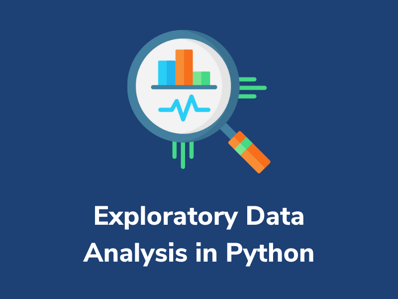
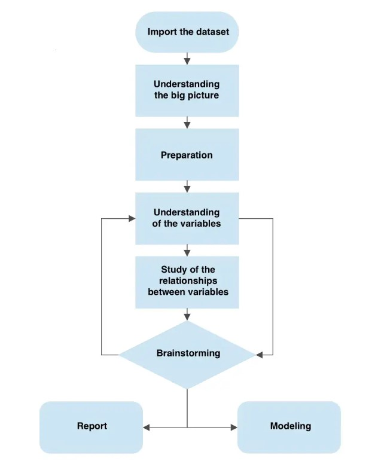
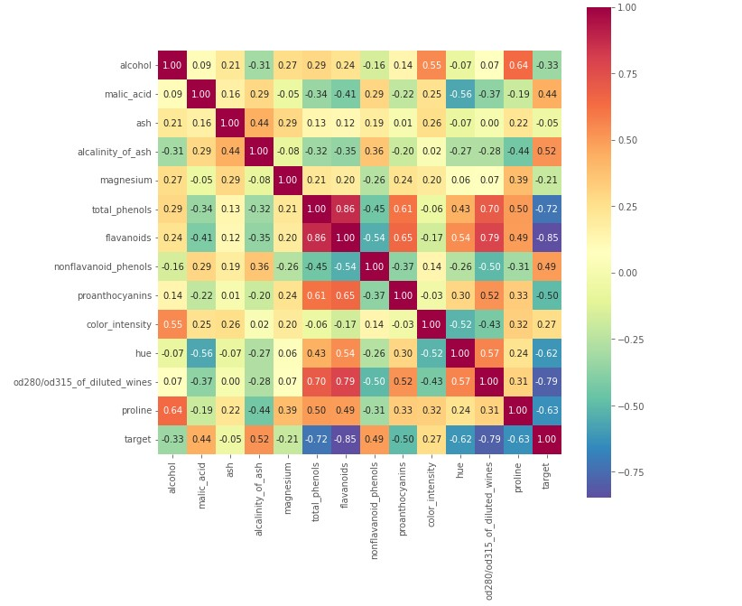

# Introduction
## What is exploratory analysis?
Exploratory data analysis (EDA) is a critical component of a data analyst's or data scientist's daily routine.

It allows for a thorough knowledge of the dataset, the definition or rejection of hypotheses, and the development of prediction models on a strong foundation.

It employs data manipulation techniques and a variety of statistical tools to define and comprehend the link between variables and their impact on business.

Indeed, it is thanks to EDA that we can ask ourselves important questions that have a business consequence.

The process consists of several steps:

- Importing a dataset
- Understanding the big picture
- Preparation
- Understanding of variables
- Study of the relationships between variables
- Brainstorming

it's the outcome of several iterations and helps me to pose meaningful questions to myself about the facts in front of me. We will be able to combine a business report or proceed with the data modelling step at the end of the process.

##### This procedure explains how we can proceed to ask new questions until we are satisfied.

# Motivation
The EDA process becomes highly powerful if we are able to explore the data and ask the proper questions. A talented analyst can develop a profession only by combining data visualisation capabilities. You don't even have to be a model.

A good approach to EDA allows us to contribute value to various business situations, particularly when our customer / boss is having difficulty interpreting or accessing data.

# Pre-Requisites
Before we begin, there are several prerequisites for this micro-byte that you must have in order to completely comprehend and perform the tasks. I'm using a Windows machine here; for Linux and Mac, Check the technology documentation.

1. Install Python 3+

    https://www.python.org/downloads/

2. You should have a Python code editor such as Pycharm, Vscode, and so on.
I'm going to use a jupyter notebook inside of jupyter lab because it's a little more interactive and easier to work with, but as always, you can use whatever Development environment you're most comfortable with. 

# Activities

# Activity 1: Importing Required Libraries and working dataset

The import or construction of a functioning dataset kicks off the data analysis workflow. Following that, the exploratory analysis phase begins.
In this Activity we learn how to import the libraries and load the Dataset.

In this Activity, we will import the wine dataset using Sklearn for convenience. 

Copy the file from **[A Step-by-Step Approach to Exploratory Data Analysis in Python](./src/A_Step-by-Step_Approach_to_Exploratory_Data_Analysis_in_Python.ipynb)** 

- Use the run button in Jupyter Notebook or the keys **Ctrl + Enter** to run the file.

### Micro-Challenge
There is One Small Challenge for you to Solve.

## Activity 2 - Understanding the big picture

 
In this Activity, We attempt to comprehend the problem at hand by considering the full dataset as well as the significance of the variables.

This phase may be slow and even boring at times, but it will allow us to form an opinion on our dataset.

### Micro-Challenge
There is One Small Challenge for you to Solve.

## Activity 3 - Preparation

 
In this Activity, we want to begin cleaning our dataset in order to proceed with the analysis. 

Some of the questions we will ask ourselves in this Byte.

### Micro-Challenge
There is One Small Challenge for you to Solve.

## Activity 4 - Understanding of the variables

 
So we attempt to precisely explain all of the factors that we are interested in. As a result, this step is also known as univariate analysis.

- We will discuss about Categorical variable and Numerical Variable
and plotting the Data using ***matplotlib*** and ***seaborn***.

- We will Study the Relation ship between Variables.

##### HeatMap: It decribes how one variable depends on another

### Micro-Challenge
There is One Small Challenge for you to Solve.

## Activity 5 - Brainstorming

 
We gathered a large amount of evidence in this Activity and know what we can do with that information.

### Micro-Challenge
There is One Challenge for you to Solve.

# Conclusion
So far, the procedure has been described as iterative. The exploratory analysis will continue until we have answered all of the business questions. However, I can express to the students the significance of creating a Byte like the following in order to be efficient in the analysis.

# Reference
- [Exploratory Data Analysis on Geolocational Data](https://github.com/AKG1301/Exploratory-Data-Analysis-on-Geolocational-Data)

- https://www.digitalocean.com/community/tutorials/exploratory-data-analysis-python
