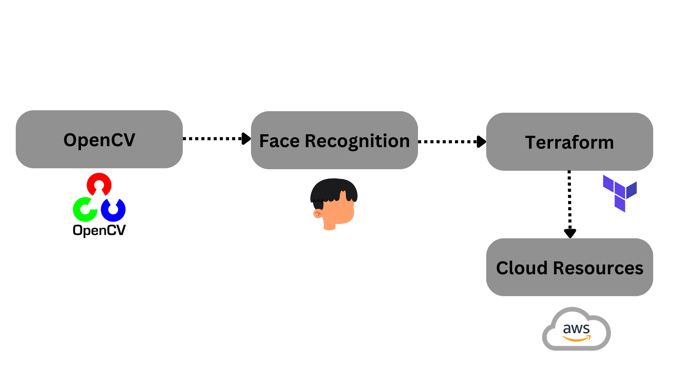

# Introduction

Cloud computing is the on-demand availability of computing resources as services over the internet. You might be thinking `what are computing resources?` resources that are required in processing the data like **Memory**, **Storage** and **CPU**. To use these resources in the cloud we need to use a couple of services like **EC2(Elastic Compute Cloud)**, **EBS(Elastic Block Store)**, etc. These services are present in **AWS(Amazon Web Service)**,   `what is AWS?` Good question!  AWS is a cloud platform that provides the facility of cloud computing.


To make use of cloud computing resources we need to go to the AWS platform and we need to launch the services manually,  it's quite tedious. `So why not automate this process?` Yes, we can automate this process with the help of **OpenCV** and **Terraform**.

#### What is OpenCV?
> OpenCV is a library that works with almost all programming languages therefor known as cross-platform library which is mainly used for Image Processing that is used in Computer Vision. OpenCV is used for image processing, Video analyses with feature like face detection and Object detection.

#### What is Terraform?
> Terraform is an Infrastructure as code tool that let's us build, change and version cloud. It let's us define both cloud and on-prem resources in human readable configuration files that we can reuse and share.

#### What OpenCV and Terraform will do?
- OpenCV will allow us to detect our face and as soon as our face is detected Terraform configuration file will get executed which will launch the AWS services.




In this Micro-byte, we will learn to create a Face Recognition program, and how to create Terraform configuration file so that we can automate AWS to launch the services.


# Pre-Requisites

Before we start, there are some pre-requisite to this micro-byte that you must have so, that you can fully understand and perform the activities, Here I'm using a Linux machine, for windows and mac you can check out the documentation of the technologies.

1. Install **Python3**
> sudo apt install python3

2. You should have an account on **AWS**
>You can create [free tier AWS account](https://aws.amazon.com/free/?all-free-tier.sort-by=item.additionalFields.SortRank&all-free-tier.sort-order=asc&awsf.Free%20Tier%20Types=*all&awsf.Free%20Tier%20Categories=*all) for performing the activities

3. Install **Terraform**
> wget -O- https://apt.releases.hashicorp.com/gpg | gpg --dearmor | sudo tee /usr/share/keyrings/hashicorp-archive-keyring.gpg

> echo "deb [signed-by=/usr/share/keyrings/hashicorp-archive-keyring.gpg] https://apt.releases.hashicorp.com $(lsb_release -cs) main" | sudo tee /etc/apt/sources.list.d/hashicorp.list

> sudo apt update && sudo apt install terraform

4.  Install **OpenCV**
> pip3 install opencv-python

Note: Only after the installation of Python, you can install OpenCV


# Activities

### Activity 1 - Create a Dataset of face images

> Why we need to create Dataset?

- We need to create a Dataset of face images to train the face recognition machine-learning model

- Here we are going to use the **haarcascade_frontalface** model for face detection

To create the dataset use the code below, it will capture your face image 100 times and store it in a directory, which will be used by the model for face detection.

```Python
import cv2
import numpy as np

# Load HAAR face classifier
face_classifier = cv2.CascadeClassifier('haarcascade_frontalface_default.xml')

# Load functions
def face_extractor(img):
    # Function detects faces and returns the cropped face
    # If no face detected, it returns the input image

    gray = cv2.cvtColor(img,cv2.COLOR_BGR2GRAY)
    faces = face_classifier.detectMultiScale(gray, 1.3, 5)

    if faces is ():
        return None

    # Crop all faces found
    for (x,y,w,h) in faces:
        cropped_face = img[y:y+h, x:x+w]

    return cropped_face

# Initialize Webcam
cap = cv2.VideoCapture(0)
count = 0
# Collect 100 samples of your face from webcam input
while True:

    ret, frame = cap.read()
    if face_extractor(frame) is not None:
        count += 1
        face = cv2.resize(face_extractor(frame), (200, 200))
        face = cv2.cvtColor(face, cv2.COLOR_BGR2GRAY)

        # Save file in specified directory with unique name
        #path
        file_name_path = 'Path_of_dir/' + str(count) + '.jpg'
        cv2.imwrite(file_name_path, face)

        # Put count on images and display live count
        cv2.putText(face, str(count), (50, 50), cv2.FONT_HERSHEY_COMPLEX, 1, (0,255,0), 2)
        cv2.imshow('Face Cropper', face)

    else:
        print("Face not found")
        pass

    if cv2.waitKey(1) == 13 or count == 100: #13 is the Enter Key
        break

cap.release()


cv2.destroyAllWindows()

```
#### Activity 1.1

- Add your directory path
- Instead of capturing 100 images, capture 500 for better model training

**Note:** You can download code from the **/src** directory of this repository

<details>
<summary>Micro-Challenge</summary>
Instead of using a laptop or external webcam for face detection try to use your phone camera i.e connect your phone to the program for face detection 

> Hint: IP Webcam android application
</details>


**output:** 


> Instead of my face you will see your face captured and stored in the directory

### Activity 2 - Train the Model

To train the model we will use the dataset that we have created in **Activity-1**

The code below will help us to train the model 


