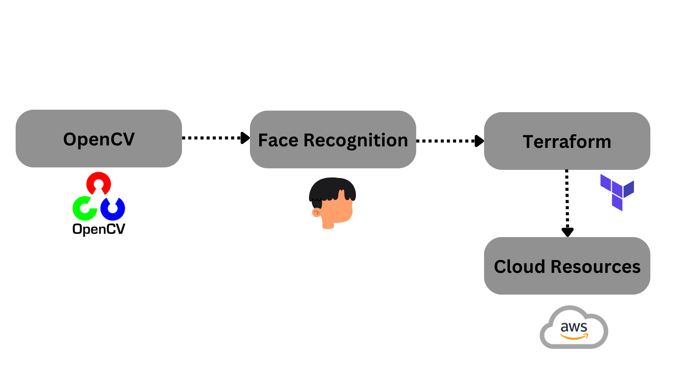
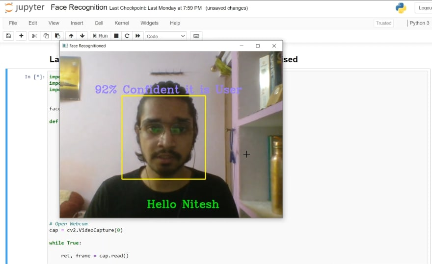
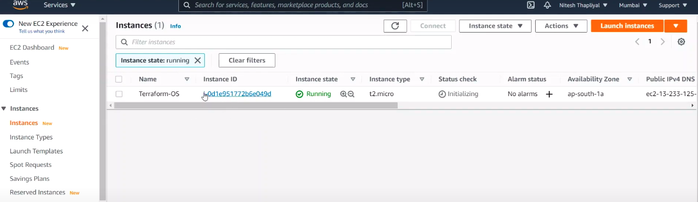
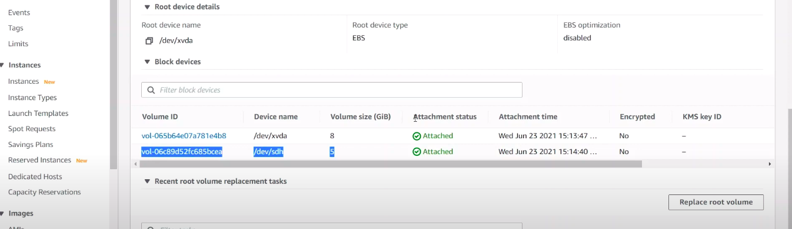

# Introduction

Cloud computing is the on-demand availability of computing resources as services over the internet. You might be thinking `what are computing resources?` resources that are required in processing the data like **Memory**, **Storage** and **CPU**. To use these resources in the cloud we need to use a couple of services like **EC2(Elastic Compute Cloud)**, **EBS(Elastic Block Store)**, etc. These services are present in **AWS(Amazon Web Service)**,   `what is AWS?` Good question!  AWS is a cloud platform that provides the facility of cloud computing.


To make use of cloud computing resources we need to go to the AWS platform and we need to launch the services manually,  it's quite tedious. `So why not automate this process?` Yes, we can automate this process with the help of **OpenCV** and **Terraform**.

#### What is OpenCV?
> OpenCV is a library that works with almost all programming languages therefor known as cross-platform library which is mainly used for Image Processing that is used in Computer Vision. OpenCV is used for image processing, Video analyses with feature like face detection and Object detection.

#### What is Terraform?
> Terraform is an Infrastructure as code tool that let's us build, change and version cloud. It let's us define both cloud and on-prem resources in human readable configuration files that we can reuse and share.

#### What OpenCV and Terraform will do?
- OpenCV will allow us to detect our face and as soon as our face is detected Terraform configuration file will get executed which will launch the AWS services.




In this Micro-byte, we will learn to create a Face Recognition program, and how to create Terraform configuration file so that we can automate AWS to launch the services.


# Pre-Requisites

Before we start, there are some pre-requisite to this micro-byte that you must have so, that you can fully understand and perform the activities, Here I'm using a Linux machine, for windows and mac you can check out the documentation of the technologies.

1. Install **Python3**
> sudo apt install python3

2. You should have an account on **AWS** and basic knowledge of it.
>You can create [free tier AWS account](https://aws.amazon.com/free/?all-free-tier.sort-by=item.additionalFields.SortRank&all-free-tier.sort-order=asc&awsf.Free%20Tier%20Types=*all&awsf.Free%20Tier%20Categories=*all) for performing the activities

3. Install **Terraform** and have some basic knowledge about it.
> wget -O- https://apt.releases.hashicorp.com/gpg | gpg --dearmor | sudo tee /usr/share/keyrings/hashicorp-archive-keyring.gpg

> echo "deb [signed-by=/usr/share/keyrings/hashicorp-archive-keyring.gpg] https://apt.releases.hashicorp.com $(lsb_release -cs) main" | sudo tee /etc/apt/sources.list.d/hashicorp.list

> sudo apt update && sudo apt install terraform

4.  Install **OpenCV**
> pip3 install opencv-python

**Note:** Only after the installation of Python, you can install OpenCV


# Activities

---
## Activity 1 - Create a Dataset of face images
---

> Why we need to create Dataset?

- We need to create a Dataset of face images to train the face recognition machine-learning model

- Here we are going to use the **haarcascade_frontalface** model for face detection

To create the dataset we will make use of OpenCV, it will capture your face image 100 times and store it in a directory, which will be used by the model for face detection.

> copy the file from `/Src/Activity-1/create_dataset.ipynb` and fill the required data as mentioned

- Add your directory path

### Activity 1 - Task

- Instead of capturing 100 images, capture 500 for better model training


<details>
<summary>Micro-Challenge</summary>
Instead of using a laptop or external webcam for face detection try to use your phone camera i.e connect your phone to the program for face detection 

> Hint: IP Webcam android application
</details>


**output:** 


> Instead of my face you will see your face captured and stored in the directory

<br>

---
## Activity 2 - Train the Model
---
In this activity, we are going to train the face recognition model so that it can recognize our face as soon as the web camera turns on

To train the model we will use the dataset that we have created in **Activity-1**

**Now to train the model:** 

> Copy the file from  `Src/Activity-2/model_training.ipynb` to your jupyter notebook and fill the required data as mentioned.

- Add your dataset path

**Output:**


### Activity 2 - Task

- Install the required modules used in the code using `pip3 install <module_name>`
- Read about **Numpy**

<br>

---
## Activity 3 - Get the details from AWS
--- 
 Before we start creating the configuration file, we should know the following things:

- Make sure **Terraform** is installed in your system, if not install it by following the step in **Pre-Requisite**
- The **region** where you are going to launch the service, in this case, **EC2** service
- The **AMI-id** of the instance which you will be using


**If you are not able to find the region name in AWS then:**
> refer to Images/Activity-3/region.png

**For getting the AMI-id, follow the following steps:**

- Login to your AWS account
- Go to the **EC2** service
- Click on **Launch Instance** button
>refer to Images/Activity-3/launch_instance.png

- Select the **AMI** that you want to work on and you will find the AMI-id just below the AMI
>refer to Images/ACtivity-3/ami.png `the highlited one in the image is the ami-id`

*Now we have the required information, we can add these details to our terraform configuration file*

### Activity 3 - Task
- Read about the Security group in AWS and try to create one

<br>

---
## Activity 4 - Create Terraform Configuration file
---
With the help of Terraform Configuration file, you can launch the resources in the cloud platform and also attach the resource like EBS volume to the EC2, with the help of it you can launch the resources in the multiple cloud platform at once like you can launch resources in AWS(Amazon Web Service), GCP(Google Cloud Platform), etc.

- To create the Terraform file to launch the AWS resources:
> Copy the file from `Src/Activity-4/terraform.tf` and add the detail as mentioned
- Add your region name
- Add your ami-id
- Add your instance name 
- Add your Security group name that you have created in **Activity-3 Task**
- Add your EBS volume name

**Note:** We don't have to run the terraform file now because we need to integrate the terraform file with the face recognition program in the next activity

### Activity 4 -  Task

- Try to Create an EBS volume of size 10 GB
- Read about the syntax of terraform file

<br>

---
### Activity 5 - Integrate Terraform file with the Face Recognition Program
---
In this activity, we are going to integrate the terraform configuration file with the face recognition program so that our terraform file gets executed as soon as our face gets recognized.

 To perform the activity:
 >Copy the file from `Src/Activity-5/automate.ipynb` and paste it to the location where your terraform file is present

- Execute the file by using the command **ctrl + enter**

As soon as the file gets executed you will see that your WebCam  get opened your face gets recognized as shown below



- Now as soon as our face gets recognized, the terraform configuration file gets executed and you will see the output as below

```
aws_instance.os1: Refreshing state... [id=i-07c3d200a11ce50e0]
aws_ebs_volume.st1: Refreshing state... [id=vol-0e4577c488a197d1f]
aws_volume_attachment.ebs_att: Refreshing state... [id=vai-991301012]
aws_ebs_volume.st1: Destroying... [id=vol-0e4577c488a197d1f]
aws_ebs_volume.st1: Destruction complete after 0s
aws_instance.os1: Creating...
aws_instance.os1: Still creating... [10s elapsed]
aws_instance.os1: Still creating... [20s elapsed]
aws_instance.os1: Still creating... [30s elapsed]
aws_instance.os1: Creation complete after 33s [id=i-0d1e951772b6e049d]
aws_ebs_volume.st1: Creating...
aws_ebs_volume.st1: Still creating... [10s elapsed]
aws_ebs_volume.st1: Creation complete after 11s [id=vol-06c89d52fc685bcea]
aws_volume_attachment.ebs_att: Creating...
aws_volume_attachment.ebs_att: Still creating... [10s elapsed]
aws_volume_attachment.ebs_att: Still creating... [20s elapsed]
aws_volume_attachment.ebs_att: Creation complete after 21s [id=vai-977186061]

Apply complete! Resources: 3 added, 0 changed, 1 destroyed.

```

- Now you can check in the AWS that the resources that we have mentioned in the terraform configuration file are launched successfully

> Instance launched successfully



> EBS volume of 5 GB as mentioned launched successfully



<br>

### Micro-Challenge:-

- Try to launch an S3 bucket to store the images in the AWS using Terraform


# Conclusion

Congratulations! You have completed all the activities. I hope it was fun and you learned something new. Now you can automate any cloud computing platform using Terraform and can play with OpenCV

# References

1. [Terraform Documentation](https://developer.hashicorp.com/terraform/intro)
2. [AWS Documentation](https://docs.aws.amazon.com/?nc2=h_ql_doc_do)
3. [Face Detection with OpenCV](https://realpython.com/face-recognition-with-python/)
