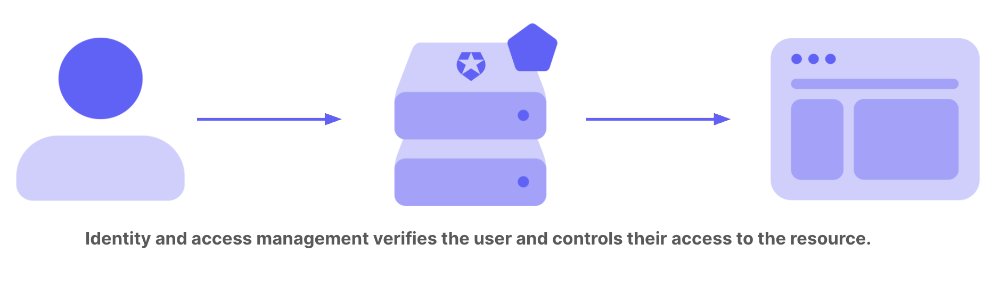
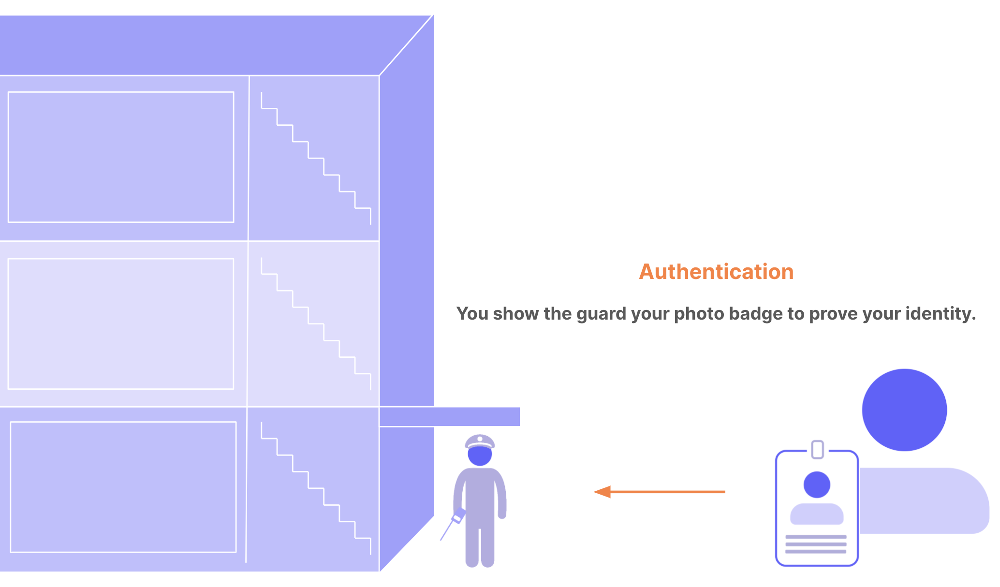
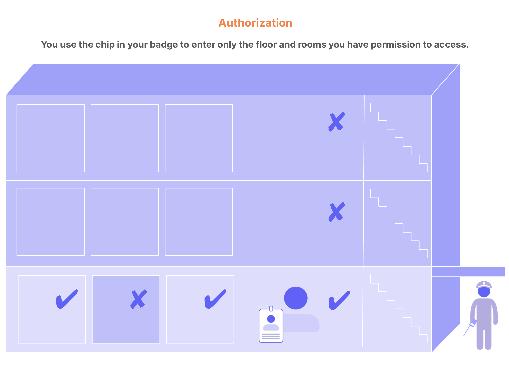

# **Prerequisites**
**Knowledge Prerequisite**  
Some software application development experience will be a great base for this micro-byte but some programming expereience is sufficient.

**Software Prerequisites**  
1. Any IDE which supports C# and .NET (Recommended: Visual Studio 2022).
2. .NET SDK

Both software prerequisites are available for free from Microsoft.

No C# or .NET experience is required.

**Note**  
All or most of the concepts in this micro-byte might be new and it might be overwhelming for new learners to understand and use them. This micro-byte is only an introduction. A great way to gain a good understanding on these concepts is to learn by using them practicallys. #LearnByDoing

# **Introduction**
This microbyte is about identity and access management using OAuth and OpenID. 

**What is identity and access management (IAM)?**  
Identity and access management provides control over user validation and resource access. Commonly known as IAM, this technology ensures that the right people access the right digital resources at the right time and for the right reasons. 

## **IAM Basic Concepts**
To understand IAM, one must be familiar with some fundamental concepts:

A **digital resource** is any combination of applications and data in a computer system. Examples of digital resources include web applications, APIs, platforms, devices, or databases.

The core of IAM is **identity**. Someone wants access to your resource. It could be a customer, employee, member, participant, and so on. In IAM, a user account is a digital identity. User accounts can also represent non-humans, such as software, Internet of Things devices, or robotics.

**Authentication** is the verification of a digital identity. Someone (or something) authenticates to prove that they're the user they claim to be.

**Authorization** is the process of determining what resources a user can access.

## **What is the Difference Between Authentication and Authorization?**
It's common to confuse authentication and authorization because they seem like a single experience to users. They are two separate processes: authentication proves a user's identity, while authorization grants or denies the user's access to certain resources.

You can think of authentication and authorization as the security system for an office building. Users are the people who want to enter the building. Resources that people want to access are areas in the building: floors, rooms, and so on.

## **Authentication**

When you enter the building, you must show your photo ID badge to the security guard. The guard compares the photo on the badge to your face. If they match, the guard lets you through the door to try to access different areas of the building. The guard doesn't tell you what rooms you can access; they only get proof that you are who you claim to be. This is authentication: confirming user identity.

## **Authorization**

In this scenario, imagine the elevators and doorways in the building have key sensors for access. The chip in your badge gives you access only to the first floor, which your company occupies. If you swipe your badge to enter any other floor, your access is denied. You can access your private office but not those belonging to your colleagues. You can enter the supply room but not the server room. This is authorization: granting and denying access to different resources based on identity.

## **Why use an IAM platform?**

Why do so many developers choose to build on an identity and access management platform instead of building their own solution from the ground up?

User expectations, customer requirements, and compliance standards introduce significant technical challenges. With multiple user sources, authentication factors, and open industry standards, the amount of knowledge and work required to build a typical IAM system can be enormous. A strong IAM platform has built-in support for all identity providers and authentication factors, offers APIs for easy integration with your software, and relies on the most secure industry standards for authentication and authorization.

## **Task**
Please go through the original document and other supporting documents in Identity Fundamentals by Auth0 for a comprehensive introduction.

# **OAuth 2.0 and OpenID Connect**
## **OAuth 2.0**
OAuth 2.0 is a delegation protocol for accessing APIs and is the industry-standard protocol for IAM. An open authorization protocol, OAuth 2.0 lets an app access resources hosted by other web apps on behalf of a user without ever sharing the user's credentials. It's the standard that allows third-party developers to rely on large social platforms like Facebook, Google, and Twitter for login.

## **OpenID Connect**
A simple identity layer that sits on top of OAuth 2.0, OpenID Connect (OIDC) makes it easy to verify a user's identity and obtain basic profile information from the identity provider. OIDC is another open standard protocol.

## **OAuth 2.0 Authorization Framework**
The OAuth 2.0 authorization framework is a protocol that allows a user to grant a third-party web site or application access to the user's protected resources, without necessarily revealing their long-term credentials or even their identity.

OAuth introduces an authorization layer and separates the role of the client from that of the resource owner. In OAuth, the client requests access to resources controlled by the resource owner and hosted by the resource server and is issued a different set of credentials than those of the resource owner. Instead of using the resource owner's credentials to access protected resources, the client obtains an Access Token--a string denoting a specific scope, lifetime, and other access attributes. Access tokens are issued to third-party clients by an authorization server with the approval of the resource owner. Then the client uses the access token to access the protected resources hosted by the resource server

### **Roles**
An OAuth 2.0 flow has the following roles:

**Resource Owner**: Entity that can grant access to a protected resource. Typically, this is the end-user.

**Resource Server**: Server hosting the protected resources. This is the API you want to access.

**Client**: Application requesting access to a protected resource on behalf of the Resource Owner.

**Authorization Server**: Server that authenticates the Resource Owner and issues access tokens after getting proper authorization.

### **Grant Types**
OAuth 2.0 defines four flows to get an access token. These flows are called grant types. Deciding which one is suited for your case depends mostly on your application type.

**Authorization Code Flow**: used by Web Apps executing on a server. This is also used by mobile apps, using the Proof Key for Code Exchange (PKCE) technique.

**Implicit Flow with Form Post**: used by JavaScript-centric apps (Single-Page Applications) executing on the user's browser.

**Resource Owner Password Flow**: used by highly-trusted apps.

**Client Credentials Flow**: used for machine-to-machine communication.

In this micro-byte we will learn and use authorization code flow using Auth0 as the identity provider.

### **Authorization Code Flow**
Regular web apps are server-side apps where the source code is not publicly exposed, they can use the Authorization Code Flow, which exchanges an Authorization Code for a token.

Authorization code flow with Auto0 as the identity provider:

1. The user clicks Login within the regular web application.

2. Auth0's SDK redirects the user to the Auth0 Authorization Server (
/authorize
endpoint).

3. Your Auth0 Authorization Server redirects the user to the login and authorization prompt.

4. The user authenticates using one of the configured login options and may see a consent page listing the permissions Auth0 will give to the regular web application.

5. Your Auth0 Authorization Server redirects the user back to the application with an authorization code, which is good for one use.

6. Auth0's SDK sends this code to the Auth0 Authorization Server (
/oauth/token
endpoint) along with the application's Client ID and Client Secret.

7. Your Auth0 Authorization Server verifies the code, Client ID, and Client Secret.

8. Your Auth0 Authorization Server responds with an ID Token and Access Token (and optionally, a Refresh Token).

9. Your application can use the Access Token to call an API to access information about the user.

10. The API responds with requested data.

**Note:**  
Client secrets are only used for private clients like backend servers and not for public clients like web apps and mobile apps.

# **Activity**
A sample web application based on .NET framework which uses Auth0 as the identity provider has been provided in this repository. In this activity one can setup the sample application, setup an Auth0 tenant and use it as the identity provider for the sample application.

**Note: No coding is required to complete this activity.**  

## **Setup Sample App**
To access the application:
1. Clone this git repo.
2. Install Visual Studio 2022 from Microsoft (Import .vsconfig file in src folder into the installer).
3. Open the SampleMvcApp in Visual Studio 2022 by clicking on the SampleMvcApp.sln file in SampleMvcApp folder in this repo.

### **Task**  
Explore the project. One can navigate through the varioud files in the project using the Solution Explorer (On the right by default).

**Note**
If you are familiar with MVC(Model-View-Controller) design pattern you will find that the project follows it.

## **Setup Auth0**
1. [Signup for Auth0](https://auth0.com/signup?place=header&type=button&text=sign%20up)
2. Setup a application in Auth0 by following these steps after signup:  
    1. Go to Dashboard > Applications > Applications.
    2. Click Create Application.
    3. Choose **Regular Web Applications** in the available application type options.
    4. Click create.
    5. Click on ASP.NET Core v3.0 option in techonology options.

### **Task**  
Explore the various tabs available in the application page and explore the options available to the user.

## **Main Task**  
**Goal**: The goal of this task is to run the application, get to the homepage, then try signingup, logining in and loging out. 

Try running the application in debug mode by selecting debug as the option and pressing the green triangle in top menu bar in Visual Studio 2022.

A new browser window which redirects to the sample application's page should open after the build is completed.

Is the app working? Does the webpage show an error? Try to figure out what the issue is based on the error message.

**Note**:  
The default callback URL for the sample application is https://localhost:5001/callback  
The logout URL of the sample application is https://localhost:5001  
Client secret is not required as this is a public web app.

Hint 1

Have you looked at appsetting.json file of the project? It is the file used to specify the configuration of the application.

Hint 2

Have you figured out what's missing but don't know where to find it? The settings tab of your Auth0 application might have the answer.

Hint 3

If you have figured out the other two hints then this is the hint for you: The application knows the required Auth0 endpoints but what about Auth0?

Solution

The application neither knows the domain of the Auth0 tenant nor the client id of the registered app. The application tried to read the values from it's configuration file which is appsettings.json but couldn't find any value so it throws an error.

Copy and paste the domain and the client id from the auth0 app settings page into their corresponding fields in appsettings.json.

The authentication part still won't work after this because Auth0 doesn't know the callback and logout URLs of the application. 

Set callback URL and logout URL of the app in the Auth0 app's settings.

Run the app and perform all the actions.

# **References**
[Introduction to Identity and Access Management (IAM) by Auth0](https://auth0.com/docs/get-started/identity-fundamentals/identity-and-access-management#what-is-identity-and-access-management-iam-)  
[OAuth 2.0 Authorization Framework by Auth0](https://auth0.com/docs/authenticate/protocols/oauth)  
[.NET Quickstart Sample](https://github.com/auth0-samples/auth0-aspnetcore-mvc-samples/tree/master/Quickstart/Sample)
