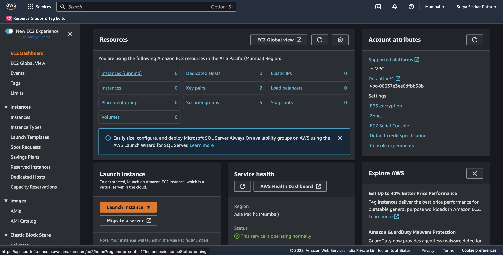
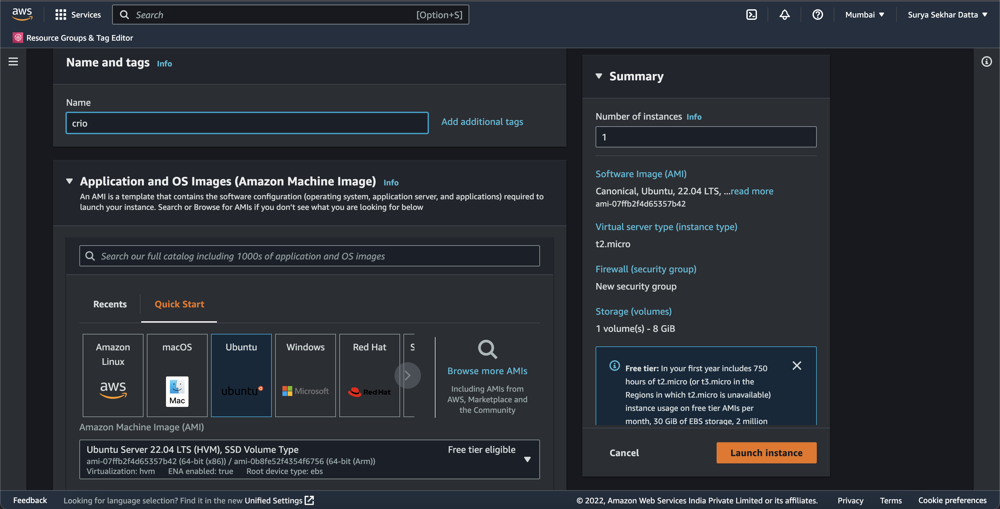
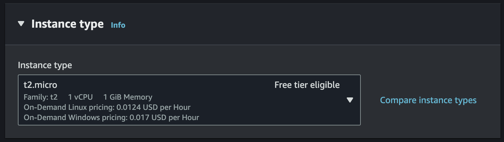
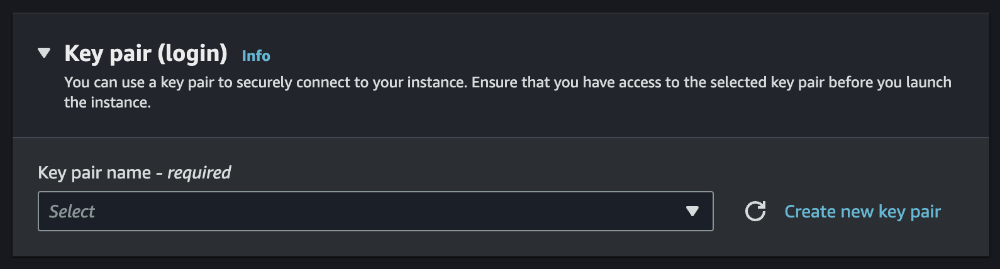
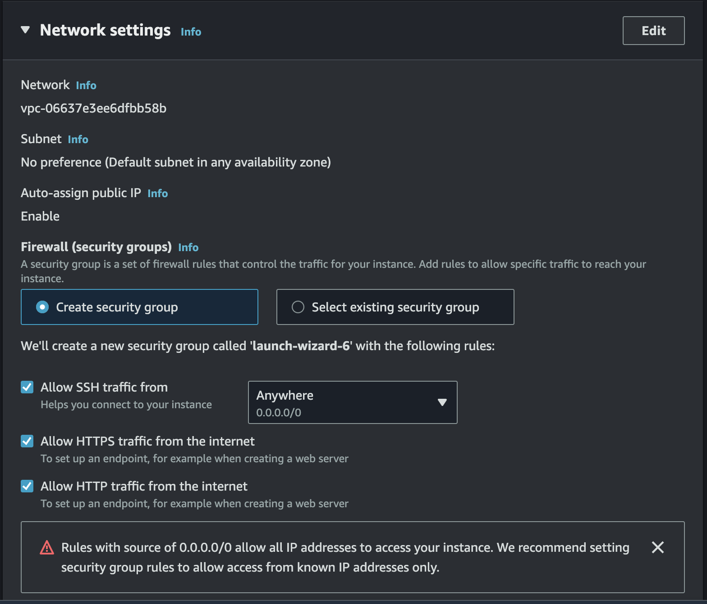
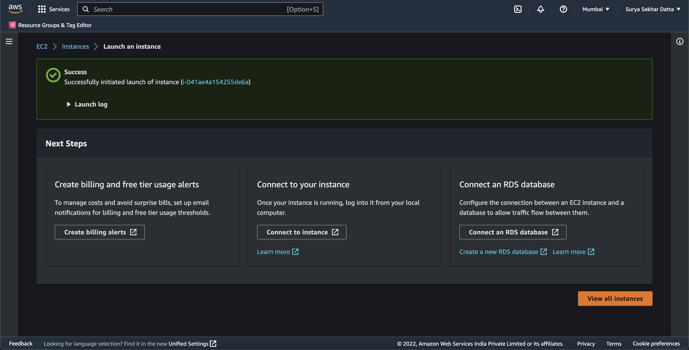
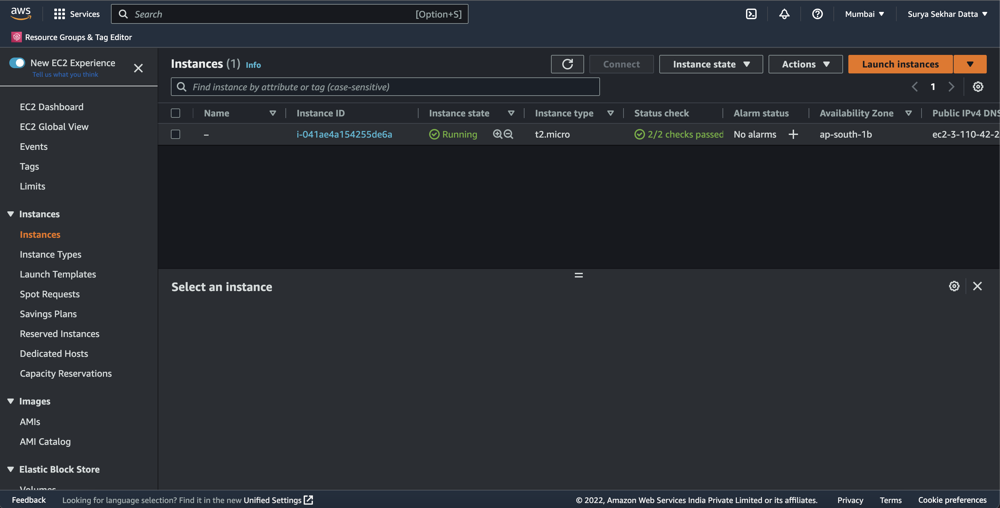
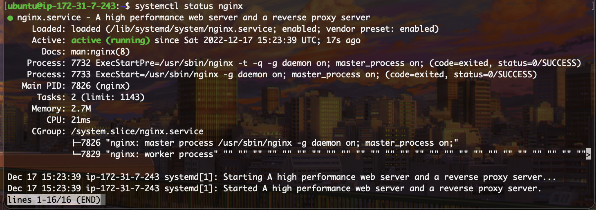
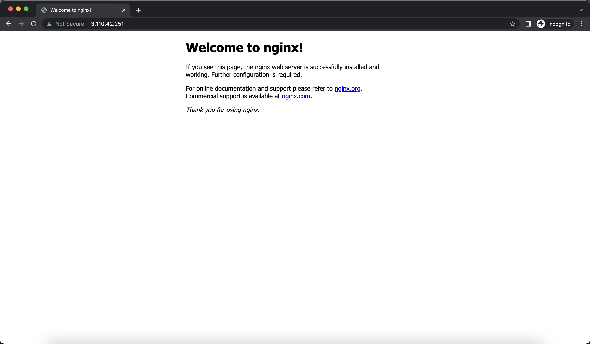

# Basics of NGINX

## Table of Content
1. Introduction
2. What is NGINX
3. Benefits of NGINX
4. Creating and Deploying an EC2 instance and SSH-ing into it
5. Installing and deploying NGINX
6. Accessing the public IP
7. Serve static HTML document using NGINX
8. Summary

### 1. Introduction
In thos Byte, we

### 2. What is NGINX
NGINX (pronounced "engine x") is a high-performance web server and reverse proxy software that is widely used to deliver static and dynamic content on the web. It was originally developed to solve the C10K problem, which refers to the challenge of serving 10,000 concurrent connections on a single server. NGINX is known for its ability to handle a large number of connections and requests efficiently, with a low memory footprint and minimal impact on the underlying system resources.

Here are some of the key features of NGINX:

**High performance**: NGINX can handle a large number of connections and requests concurrently, making it suitable for high-traffic websites and applications. It is designed to be lightweight and efficient, with a minimal impact on system resources.

**Reverse proxy**: NGINX can act as a reverse proxy, which means it can forward incoming requests to one or more servers and return the response to the client. This can be useful for distributing traffic across multiple servers, improving the performance and availability of applications.

**Load balancing**: NGINX can also act as a load balancer, which means it can distribute incoming requests across multiple servers to improve performance and availability.

**HTTP and HTTPS support**: NGINX can handle HTTP and HTTPS requests, and it supports various features such as SSL termination, HTTP/2, and TLS 1.3.

**Modularity**: NGINX is designed with a modular architecture, which means it can be extended with additional functionality through the use of third-party modules.

NGINX is used in a wide range of applications, including web hosting, content delivery networks (CDNs), and microservices architectures. It is known for its reliability and performance, and it is often used as an alternative to other web servers such as Apache.

### 3. Benefits of NGINX
There are several benefits and advantages to using NGINX as a web server or reverse proxy:

1. Performance: NGINX is known for its high performance and ability to handle a large number of concurrent connections and requests efficiently. It is designed to be lightweight and have a minimal impact on system resources.
2. Scalability: NGINX can be used to distribute traffic across multiple servers, which can improve the scalability and availability of applications. It can also handle a large number of connections and requests concurrently, making it suitable for high-traffic websites and applications.
3. Reverse proxy: NGINX can act as a reverse proxy, which means it can forward incoming requests to one or more servers and return the response to the client. This can be useful for distributing traffic across multiple servers, improving the performance and availability of applications.
4. Load balancing: NGINX can also act as a load balancer, which means it can distribute incoming requests across multiple servers to improve performance and availability.
5. HTTP and HTTPS support: NGINX can handle HTTP and HTTPS requests, and it supports various features such as SSL termination, HTTP/2, and TLS 1.3.
6. Modularity: NGINX is designed with a modular architecture, which means it can be extended with additional functionality through the use of third-party modules.
7. Reliability: NGINX is known for its reliability and is often used as an alternative to other web servers such as Apache.

Overall, NGINX is a popular choice for web servers and reverse proxies due to its high performance, scalability, and reliability. It is widely used in a variety of applications, including web hosting, content delivery networks (CDNs), and microservices architectures.

### 4. Creating and Deploying an EC2 instance and SSH-ing into it
Create an AWS Account, and once you log into the dashboard, follow these steps to create a new instance:

1. Click on the 'Search Bar' and search for EC2. After clicking, you will reach tehe EC2 Dasboard. Click on 'Launch instance'

2. Give your instance a Name. For example, 'Crio'.
3. Choose Ubuntu as the OS, this will automatically default to the latest Long Term Support (LTS) version of Ubuntu, which currently is 22.04. Note that the architecture is set to 64-bit by default. Do not change that.

4. Select the instance type as 't2.micro'. This is one of the free tier offerings from AWS. If you choose anything else, you might e charged. 

5. Now click on "Create a new Key-Pair", name the KeyPair and download it carefully as you cannot dowload it again. This is what you will use to SSH to the machine over the internet.

6. Under Network Settings, choose create a new Security Group, and allow both HTTP and HTTPS traffic to the machine. This while allow raffic on port 80 and 443, connecting the machine to the internet. 

7. Keep the rest of the settings at default, and click on "Launch Instance". You will get redirected to this page where it will say that the launch was succesful. Now click on "View all Instances" to see your instance.

8. Now you will be redirected to the instances page where you have to wait for 5 minutes for your instance to launch. Upon a succesful launch, the screen would look like this:


Your EC2 instance is now up and running. How to SSH into it, Windows users have to download PuTTY (https://www.putty.org/)

SSH (Secure Shell) is a network protocol that allows secure communication between two devices over an insecure network. It is often used to remotely access and control a computer or device over the Internet.

When you use SSH to connect to a remote device, you can run commands on that device as if you were sitting in front of it, even if you are physically located somewhere else. This is useful for tasks such as remotely managing a server, transferring files between devices, or accessing a device that is behind a firewall.

```
# Go to the downloads folder, give read permission to the .pem file and SSH to the server
$ cd ~/Downloads/
$ chmod 400 crio.pem
$ ssh -i crio.pem ubuntu@<Your-EC2-Public-DNS>

# Example
$ ssh -i crio.pem ubuntu@ec2-3-110-42-251.ap-south-1.compute.amazonaws.com
```

You can also use the Public IP Address instead of the Public DNS. You have now succesfully SSH'ed into the server!


### 5. Installing and deploying NGINX
Before installing NGINX, we need to update the server. To do that, run the command:
```sudo apt update -y && sudo apt upgrade -y```

Until that happens, lets learn about NGINX. It is a web server that is used to serve and proxy HTTP requests. It is known for its high performance and low resource utilization, making it a popular choice for web servers and reverse proxies.

NGINX is often used to handle static content such as images and HTML files, as well as to proxy requests to other servers or applications. It can also be used as a load balancer to distribute incoming requests across multiple servers or to serve as an HTTP cache to improve the performance of a website.

One of the key features of NGINX is its ability to handle a large number of concurrent connections efficiently. This makes it a good choice for high-traffic websites and applications that need to handle a large number of requests simultaneously.

NGINX is open-source software and is available for free under the terms of the 2-clause BSD license. It is widely used by organizations of all sizes, from small startups to large enterprises.

Wait for some time until your machine gets updated. Now we have to install the NGINX package. For that, enter the command:
``` sudo apt install nginx -y```
Again wait for the command to finish, and viola! NGINX is now installed!

To confirm the installation, type the command 
```systemctl status nginx```
The output should be similar to:


### 6. Accessing the public IP
Now we have to access the public IP of the server. To do that, go to the EC2 Dashboard and click on the instance. You will be redirected to the instance details page. Copy the Public IP Address and paste it in your browser. You should see the NGINX Welcome page.



### 7. Serve static HTML document using NGINX
Now we have to serve a static HTML document using NGINX. To do that, we have to create a new file in the /var/www/html/ directory. For that, enter the command:
```sudo nano /var/www/html/index.html```

This will open a new file in the nano editor. Now copy the following code and paste it in the file:
```<html> <body> <h1> Hello World! </h1> </body> </html>```

Now press Ctrl+X to exit the editor. It will ask you to save the file. Press Y and then Enter to save the file. Now go to the browser and refresh the page. 

You will be greeted by the "Hello World" text.

### 8. Summary
This is how you can create an EC2 instance, SSH into it, install NGINX and serve a static HTML document using NGINX. 


