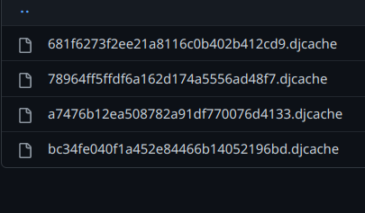

## Introduction
This microbyte includes detailed caching techniques and procedures in Django.

## Pre-requisites
- Django
- MVT (Model View Template) architecture in Django
- Caching fundamentals

## Table of Contents
- [What is caching?](#what-is-caching)
- [What is server-side caching](#what-is-server-side-caching)
- [Different caching techniques in Django](#different-caching-techniques-in-django)
- [Setting up cache in Django](#setting-up-cache-in-django)
    - [Setting up cache in Database](#setting-up-cache-in-database)
    - [Setting up cache in File-system](#setting-up-cache-in-file-system)
    - [Setting up cache in Memory](#setting-up-cache-in-memory)
- [Caching the entire site](#caching-the-entire-site)
- [Caching a view](#caching-a-view)
- [Caching a template-fragment](#caching-a-template-fragment)
- [Activities](#activities)
    - [Activity 1](#activity-1)
    - [Activity 2](#activity-2)
    - [Activity 3](#activity-3)
- [Conclusion](#conclusion)
- [References](#references)

## What is caching?
In computing, a **cache** is a high-speed data storage layer which stores a subset of data, typically transient in nature, so that future requests for that data are served up faster than is possible by accessing the data’s primary storage location. Caching allows you to efficiently reuse previously retrieved or computed data.

## What is server-side caching
Server-side caching is the temporary storing of web files and data on the origin server for reuse.

## Different caching techniques in Django
- Django comes with its own caching system that lets you save your dynamic pages so as to avoid calculating them again and again.
- The good point in Django Cache framework is that you can cache −
    - The output of a specific view. (**Per-view caching**)
    - A part of a template.(**Template-fragment caching**)
    - The entire site.(**Per-site caching**)
## Setting up Cache in Django
- One can store the cache in the database , in the file-system or in the memory. 
### Setting Up Cache in Database
- Firstly , one needs to create a cacheble table in the database. (*It can be of any type.*)
    - To do so run the `python manage.py createcachetable` command and create a table called `my_cache_table`.

- One needs to add the following in the project **settings.py** file −
```
CACHES = {
   'default': {
      'BACKEND': 'django.core.cache.backends.db.DatabaseCache',
      'LOCATION': 'my_cache_table',
   }
}
```
### Setting Up Cache in File-System
- Just add the following in the project **settings.py** file −

```
CACHES = {
   'default': {
      'BACKEND': 'django.core.cache.backends.filebased.FileBasedCache',
      'LOCATION': 'file_based_caching/cache_folder/',
   }
}
```
- One can see cache files like following created in the cache folder : \
    

### Setting Up Cache in Memory
- This is the most efficient way of caching to use it. 
- One can use one of the following options depending on the Python binding library you choose for the memory cache −
```
CACHES = {
   'default': {
      'BACKEND': 'django.core.cache.backends.memcached.MemcachedCache',
      'LOCATION': '127.0.0.1:11210',
   }
}
```
Or like
```
CACHES = {
   'default': {
      'BACKEND': 'django.core.cache.backends.memcached.MemcachedCache',
      'LOCATION': 'unix:/tmp/memcached.sock',
   }
}
```
## Caching the entire site
- To cache the entire site in Django one has to change the `Middleware` present in the **settings.py** file.
```
MIDDLEWARE = [
    'django.middleware.security.SecurityMiddleware',
    'django.contrib.sessions.middleware.SessionMiddleware',
    
    #for per-site middleware the next three lines are important to add
    'django.middleware.cache.UpdateCacheMiddleware',
    'django.middleware.common.CommonMiddleware',
    'django.middleware.cache.FetchFromCacheMiddleware',

    'django.middleware.csrf.CsrfViewMiddleware',
    'django.contrib.auth.middleware.AuthenticationMiddleware',
    'django.contrib.messages.middleware.MessageMiddleware',
    'django.middleware.clickjacking.XFrameOptionsMiddleware',
]
```
- The order in which the middleware is updated is important here.
- One can also add : \
`CACHE_MIDDLEWARE_ALIAS` – The cache alias to use for storage. \
`CACHE_MIDDLEWARE_SECONDS` – The number of seconds each page should be cached.


## Caching a view
- It may not always be necessary to cache the entire-site. So in that situation one can cache a view in particular.
- To do per-view caching one has to use the `cache_page` decorator.
```
from django.shortcuts import render
from django.views.decorators.cache import cache_page

@cache_page(30) 
def index(request):
    return render(request , 'enroll/course.html')
```

## Caching a template-fragment
- To cache a template one needs to add two parameters in the template : 
    - `load cache` - This tag is used to tell the template engine to load the cache (if present). 
    - `cache` - This tag is used to define the time you want the block to be cached (in seconds) and the name to be given to the cache fragment.

- A sample template is :
```
<!DOCTYPE html>

<html lang="en">
<head>
    <meta charset="UTF-8">
    <meta http-equiv="X-UA-Compatible" content="IE=edge">
    <meta name="viewport" content="width=device-width, initial-scale=1.0">
    <title>Document</title>
</head>
<body>
    <h1>Head 1</h1>
    <h1>Head 2</h1>

<!-- template is the name of the cache -->
    <h1>Head 3</h1>
    <h1>Head 4</h1>

</body>
</html>
```
## Activities
### Activity 1
- Add a template-based caching in which the time after which fresh image is cached in 20 minutes.
### Hint
- To have a template-based caching one has to use the `cache` tag in the template engine.
- One can refer to the official [django docs](https://docs.djangoproject.com/en/1.11/topics/cache/#template-fragment-caching) for assistance.

### Activity 2
- Set up a memory-based caching where the caching location is `127.0.0.1:11211`
### Hint
- To define memory-based caching one can use `CACHES` map in django.

### Activity 3
- Set up a view-based caching which refreshes every 15 minutes.
### Hint
- To define the time of caching one can use the `cache_page` decorator present in the `django.views.decorators.cache` package.
- To define the time of 15 minutes one can pass the time parameter in the `cache_page(15*60)` decorator.

## Conclusion
Learners will learn the use and latency that Django caching framework provides to developers.

## References
- https://aws.amazon.com/caching/
- https://docs.djangoproject.com/en/1.11/topics/cache/