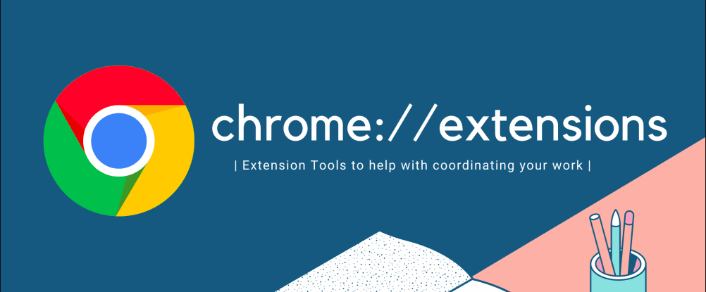
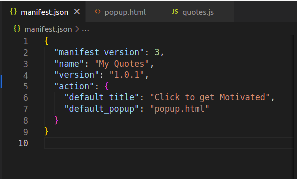
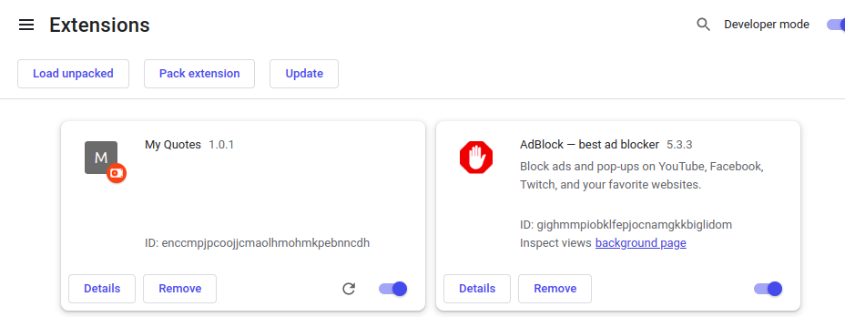
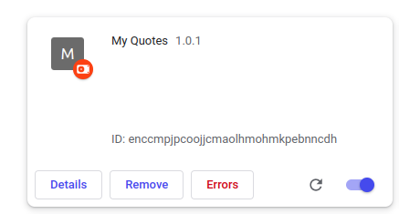
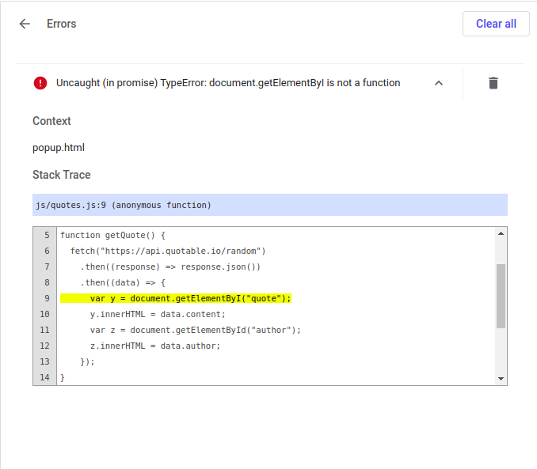
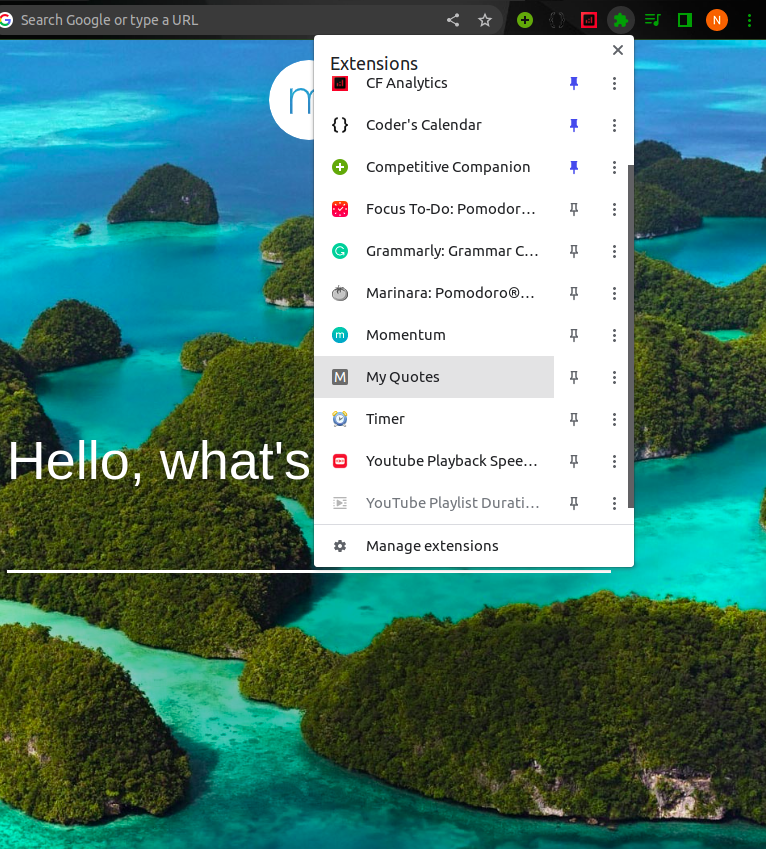
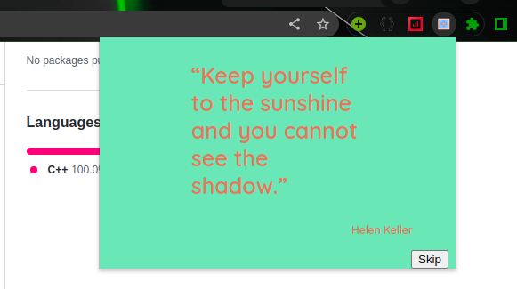

# Chrome Browser Extension.

## Objective

How to make your Chrome Extension .

## About Extension .



Extensions are small software that lets you personalize your browsing. They give users numerous options for customizing Browser's Behaviour and functionality, including :

- Tools which increases productivity.
- Information Aggregation.
- Fun & Games.

## Examples:

- Dark Reader
  - This eye-care extension enables night mode by creating dark themes for websites on the fly. Dark Reader inverts bright colours, making them high contrast and easy to read at night.
- BlockSite: Block Websites & Stay Focused
  - This extension help you in blocking all distracting and harmful websites.

You can find some more Amazing Extensions for Chrome Browser from [Chrome Web Store](https://chrome.google.com/webstore/category/extensions)

## Primary Goals

1. Understanding Manifest.json file .
2. Testing the Extension .

## Prerequisites

You can create you own extension if you are familiar with standard web technologies like :

- HTML
- CSS
- Javascript

Your Chrome Extension must meet the [Extension Quality Guidelines](https://developer.chrome.com/docs/webstore/program-policies/?csw=1#extensions)

## About Manifest.json .

Every extension needs a manifest.json file , which is a JSON-formatted file and contains essential information. The root directory of the extension must contain this manifest.json file.

> Refer to the `Manifest` diagram in the repo.
> 

Let's discuss them here :

1. manifest_version : It specifies the version of the manifest file format your package requires.
2. version , name , description, icons : These are the identifiers of your chrome Extension .
3. action : It specifies what has to be done when users click on the extension icon.

There are some more keys for manifest.json to add some more complex operations you can visit [Manifest](https://developer.chrome.com/docs/extensions/mv3/manifest/).

## Activities :

### Activity 1 - Create Your Manifest.json File

Create a Folder with your Extension Name and create a file name <mark>manifest.json</mark> inside the directory.

If you are in Linux , follow this command

```sh
mkdir EXTENSION_NAME
cd EXTENSION_NAME
touch manifest.json
```

Now open up this directory in you code Editor for better understanding , you can use VS code.

#### Activity 2 - Editing manifest.json

Open up the <mark>manifest.json</mark> file . <br>
Create keys such as :

| Keys             | Values                                             |
| ---------------- | -------------------------------------------------- |
| manifest_version | Your Manifest Version Number                       |
| name             | Name of your Extension                             |
| version          | version Number of your Extension                   |
| action           | what action it will perform when users click on it |

You will see similar to like this.

> Refer to the `Manifest` diagram in the repo.
> 

<details>
<summary>Curious Cat Questions ?</summary>

```
What if the 'manifest.json' is changed to 'Manifest.json'/ 'MANIFEST.json' ?
```

</details>

### Activity 3 - Debugging your manifest.json File

Open your Chrome Browser and type <mark>chrome://extensions</mark> in the URL bar.

Enable the <mark>Developer's mode</mark> from the right corner.

Click the <mark>LOAD UNPACKED</mark> button and select the extension directory

You can see your extension listed on the extensions dock.

> Refer to the `Extensions` diagram in the repo.
> 

If you see some error like below .

> Refer to the `Error1` diagram in the repo.
> 

Click on the error button to see detailed about the error and fix it.

> Refer to the `Error2` diagram in the repo.
> 

<details>
<summary>Curious Cat Questions ?</summary>

```
Does the ID assigned to the extension remains same for all devices ?

```

</details>

### Activity 4 - Creating HTML ,JS & CSS file

Here you will create the HTML file which will be displayed when you will click on the extension.

1. Creating HTML file.

- create a file <mark>popup.html</mark>
- write a basic HTML code and create quotes section where quotes will be displayed.
- Add a button which will change the quote .

Read about tags `<button>` , `<figure>` ,`<blockquote>` ,`<figcaption>` from [here](https://developer.mozilla.org/en-US/).

2. Creating CSS files.

- create a file <mark>style.css</mark>
- Write css codes for styling your webpage

3. Creating JS files.

- create a file <mark>quotes.js</mark>

- write Javascript function getQuote() which will fetch random quotes from an API and will change the DOM .

You can see some code examples here [HTML](https://github.com/nsachin08/IBD-2022-Master-Repository/blob/nsachin08/Chrome_Browser_Extension%7C%2310/Chrome%20Browser%20Extension/src/Quotes/popup.html) , [CSS](https://github.com/nsachin08/IBD-2022-Master-Repository/tree/nsachin08/Chrome_Browser_Extension%7C%2310/Chrome%20Browser%20Extension/src/Quotes/css) , [JS](https://github.com/nsachin08/IBD-2022-Master-Repository/blob/nsachin08/Chrome_Browser_Extension%7C%2310/Chrome%20Browser%20Extension/src/Quotes/js/quotes.js) .

<details>
<summary>Curious Cat Questions ?</summary>

```
1. Can you Display other webpage in your chrome Extension ?

2. Can you expand your pop-up window of the chrome Extension ?

3. Can you Store the data ?

4. Can you display something on the screen using JS ?

5. Can the webpage data be manipulated using Chrome Extension?

6. Can Extensions make requests ?

```

</details>

Read about :

1. [DOM](https://developer.mozilla.org/en-US/docs/Web/API/Document_Object_Model/Introduction) .

2. [Event Listener](https://developer.mozilla.org/en-US/docs/Web/API/EventTarget/addEventListener) .

3. [Onload](https://developer.mozilla.org/en-US/docs/Web/API/Window/load_event) .

4. [Content Script](https://developer.chrome.com/docs/extensions/mv3/content_scripts/)

5. [Background Script](https://developer.chrome.com/docs/extensions/mv2/background_pages/)

### Activity 5 - Adding icons to your extension.

Open you <mark>manifest.json</mark> file .

Add 'icons' key to your json object and mention the size & its value in the value section.

Example :

```
 "icons": {
    "16": "icon16.png"
  },

```

<details>
<summary>Curious Cat Questions ?</summary>

```
Which icon format & sizes do chrome Extension supports ?

```

</details>

### Activity 6 - Testing your Extension

Again reload your extension from <mark>chrome://extension</mark> .

Now you can see your icon .

If not , click on the extension icon to get more extensions loaded and pin it from there .

> Refer to the `Debug` diagram in the repo.
> 

After Pinning, Check whether if it is working by clicking on it .

> Refer to the `Click` diagram in the repo.
> 

<details>
<summary>Curious Cat Questions ?</summary>

```
Will this extension will work with every browser ?

```

</details>

## Summary .

```
Congrats !!! . You have created your own Chrome Extension and ready to use.

You can also publish you Chrome Extension to Chrome Web Store and share with your friends.

```

## References .

1. [Chrome Extension](https://developer.chrome.com/docs/extensions/).
2. [Web Dev](https://developer.mozilla.org/en-US/docs/Learn).
