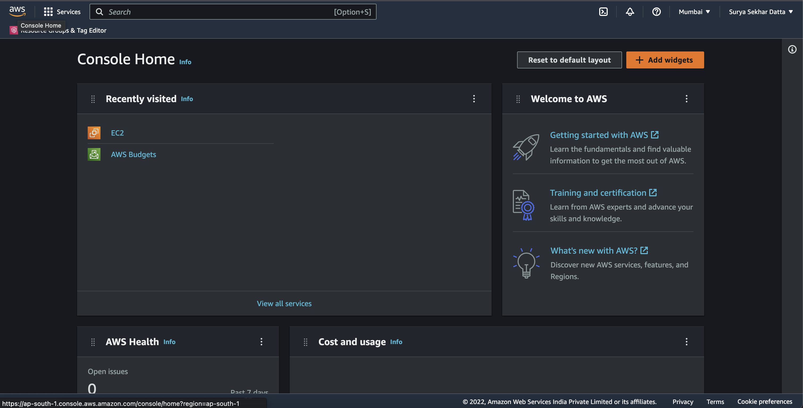
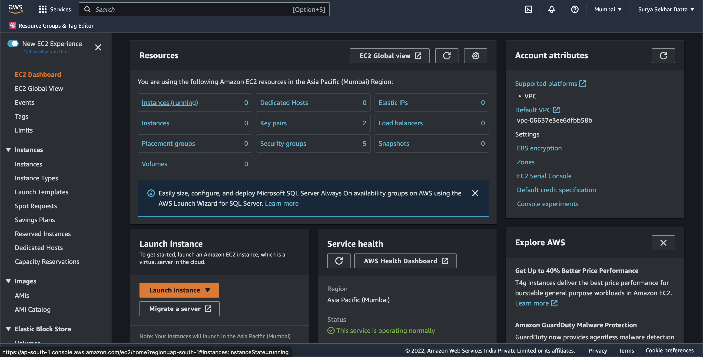
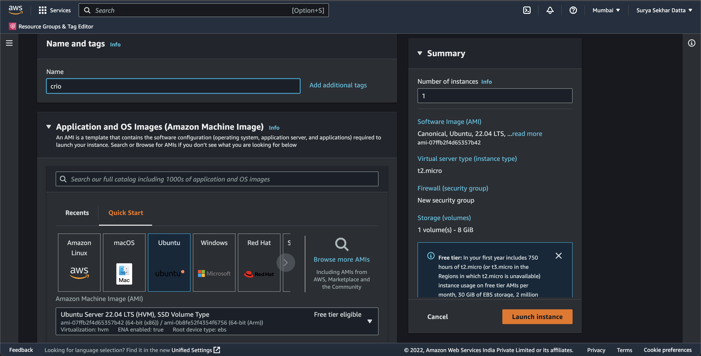
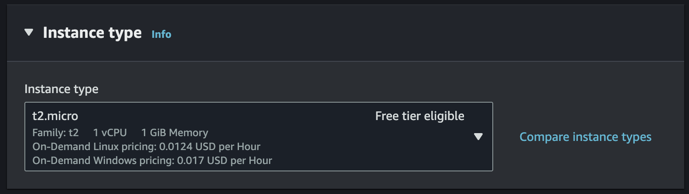
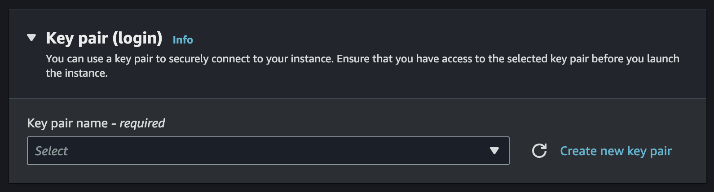
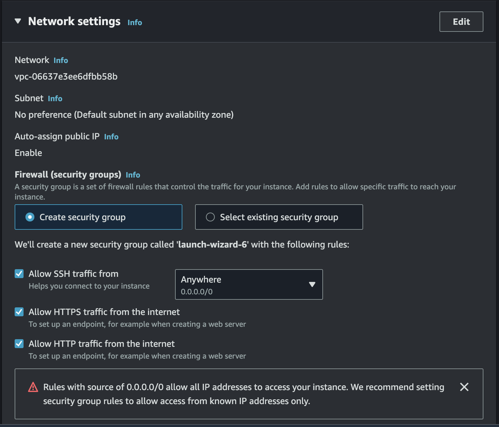
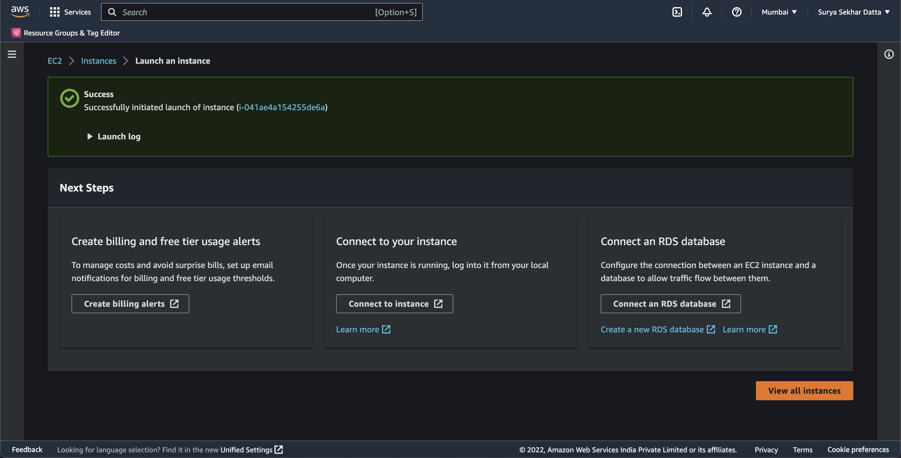
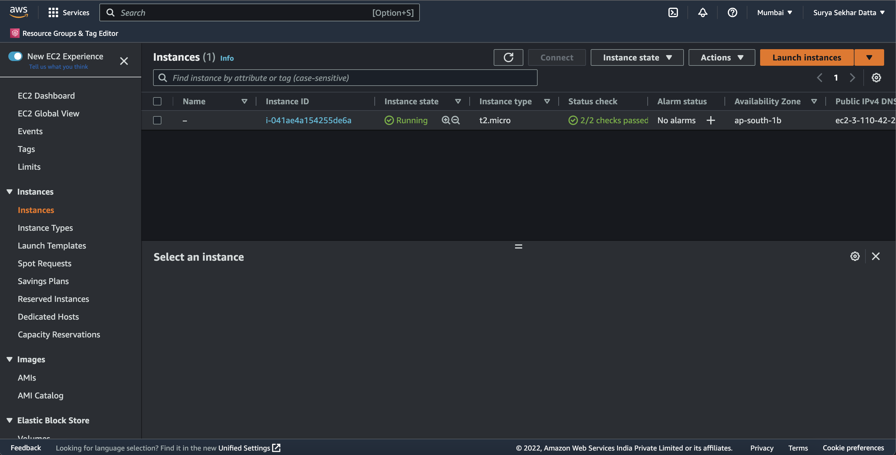
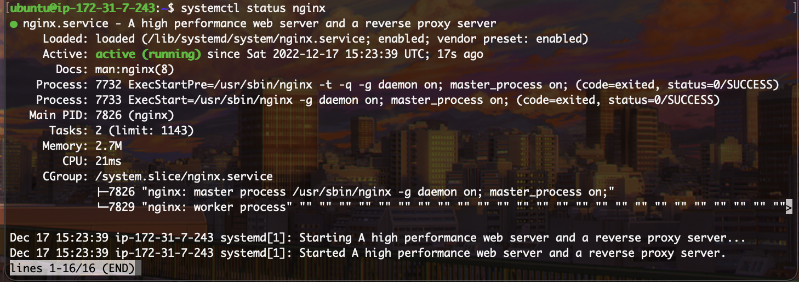
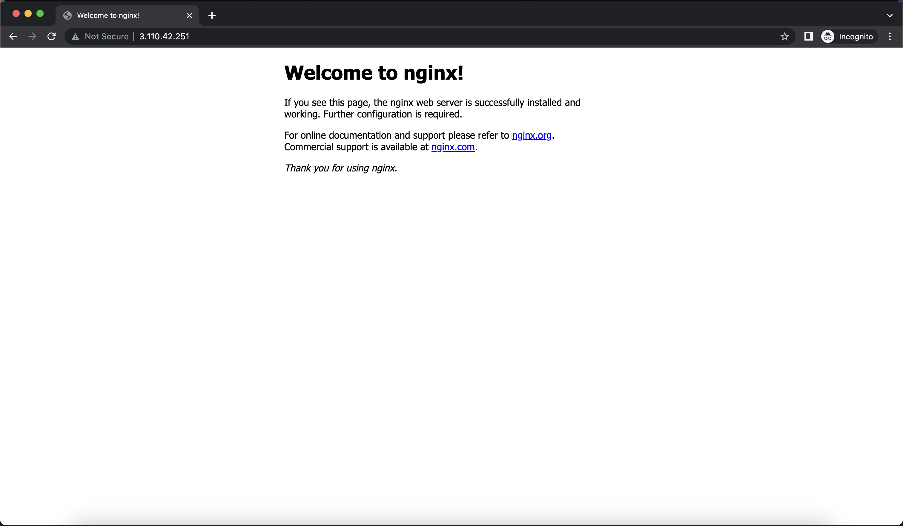

# Introduction to Cloud Computing

## Table of Content
1. Introduction
2. Creating an AWS Account
3. Creating an EC2 Instance
4. SSH into the Server
5. Install NGINX
6. Access the web server from the client
7. Summary

### 1. Introduction
Cloud computing is a model for delivering computing resources over the internet. It allows users to access and use computing resources, such as storage, processing power, and applications, on demand and without the need for physical infrastructure. Instead of installing and maintaining software or hardware on their own computers or servers, users can access these resources through a cloud provider's servers and infrastructure.

Our **Objective** today would be to spin up our own Cloud Computer and deploy a Web Server there using NGINX.

### Creating an AWS Account

Head over to [https://aws.amazon.com/](https://aws.amazon.com/) and follow the steps to create a new account. A Credit/Debit card will be required to create the account, and there will be a small deduction of INR 2, but it will soon be credited back.

After a succesful account creation, you will be greeted by something like this:



### Creating an EC2 Instance

After creating an account, we will be creating an EC2 instance. But you might be thinking, what is an EC2?

Amazon Elastic Compute Cloud (EC2) is a web service that provides resizable compute capacity in the cloud. It is a part of Amazon Web Services (AWS) and allows users to rent virtual computers on which to run their own computer applications.

EC2 instances are virtual machines that are created from Amazon Machine Images (AMIs), which are templates that contain the software and settings needed to launch an EC2 instance. Users can choose from a variety of pre-configured AMIs or create their own custom AMI. EC2 instances can be customized with different configurations of computing power, memory, and storage to meet the needs of different applications.

EC2 allows users to scale their computing resources up or down as needed, paying only for the resources they use. This makes it an attractive option for hosting web applications and other compute-intensive workloads. It also offers a range of security and compliance features to protect user data and applications.

Now that's out of the way, let's go over the steps:

1. Click on the 'Search Bar' and search for EC2. After clicking, you will reach tehe EC2 Dasboard. Click on 'Launch instance'

2. Give your instance a Name. For example, 'Crio'.
3. Choose Ubuntu as the OS, this will automatically default to the latest Long Term Support (LTS) version of Ubuntu, which currently is 22.04. Note that the architecture is set to 64-bit by default. Do not change that.

4. Select the instance type as 't2.micro'. This is one of the free tier offerings from AWS. If you choose anything else, you might e charged. 

5. Now click on "Create a new Key-Pair", name the KeyPair and download it carefully as you cannot dowload it again. This is what you will use to SSH to the machine over the internet.

6. Under Network Settings, choose create a new Security Group, and allow both HTTP and HTTPS traffic to the machine. This while allow raffic on port 80 and 443, connecting the machine to the internet. 

7. Keep the rest of the settings at default, and click on "Launch Instance". You will get redirected to this page where it will say that the launch was succesful. Now click on "View all Instances" to see your instance.

8. Now you will be redirected to the instances page where you have to wait for 5 minutes for your instance to launch. Upon a succesful launch, the screen would look like this:



Congratulations, you have now succesfully created a Cloud Computer!

### 4. SSH into the instance
Windows users have to download PuTTY (https://www.putty.org/)

SSH (Secure Shell) is a network protocol that allows secure communication between two devices over an insecure network. It is often used to remotely access and control a computer or device over the Internet.

When you use SSH to connect to a remote device, you can run commands on that device as if you were sitting in front of it, even if you are physically located somewhere else. This is useful for tasks such as remotely managing a server, transferring files between devices, or accessing a device that is behind a firewall.

```
# Go to the downloads folder, give read permission to the .pem file and SSH to the server
$ cd ~/Downloads/
$ chmod 400 crio.pem
$ ssh -i crio.pem ubuntu@<Your-EC2-Public-DNS>

# Example
$ ssh -i crio.pem ubuntu@ec2-3-110-42-251.ap-south-1.compute.amazonaws.com
```

You can also use the Public IP Address instead of the Public DNS. You have now succesfully SSH'ed into the server!

### Install NGINX
Before installing NGINX, we need to update the server. To do that, run the command:
```sudo apt update -y && sudo apt upgrade -y```

Until that happens, lets learn about NGINX. It is a web server that is used to serve and proxy HTTP requests. It is known for its high performance and low resource utilization, making it a popular choice for web servers and reverse proxies.

NGINX is often used to handle static content such as images and HTML files, as well as to proxy requests to other servers or applications. It can also be used as a load balancer to distribute incoming requests across multiple servers or to serve as an HTTP cache to improve the performance of a website.

One of the key features of NGINX is its ability to handle a large number of concurrent connections efficiently. This makes it a good choice for high-traffic websites and applications that need to handle a large number of requests simultaneously.

NGINX is open-source software and is available for free under the terms of the 2-clause BSD license. It is widely used by organizations of all sizes, from small startups to large enterprises.

Wait for some time until your machine gets updated. Now we have to install the NGINX package. For that, enter the command:
``` sudo apt install nginx -y```
Again wait for the command to finish, and viola! NGINX is now installed!

To confirm the installation, type the command 
```systemctl status nginx```
The output should be similar to:


### 6. Access the Web Server from the client 
Congratulations on your new Web Server. Now let's access it as a client. Open an incognito window, and type the machine IP in the serach bar and hit enter. The result should look something similar to this:




### 7. Summary
It works! Time to send the IP to your friends and flex about your new Web Server I guess? Enjoy!


