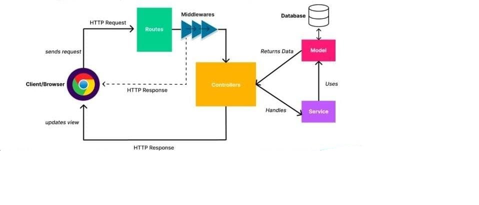
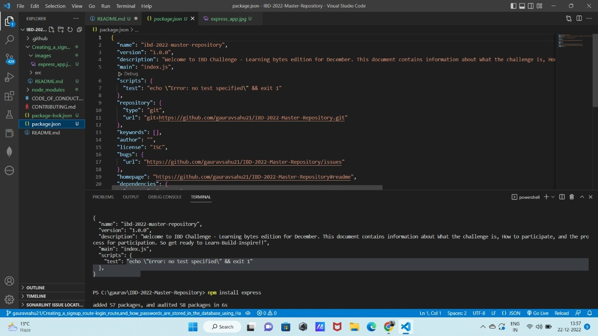
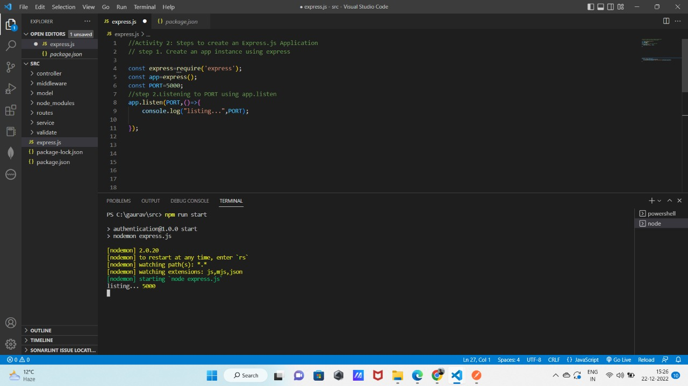
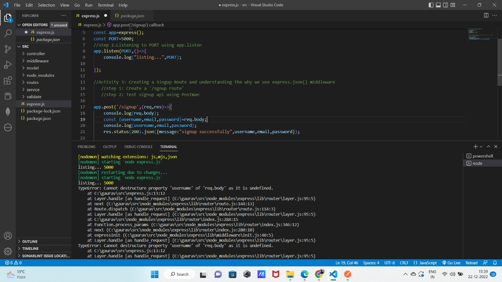
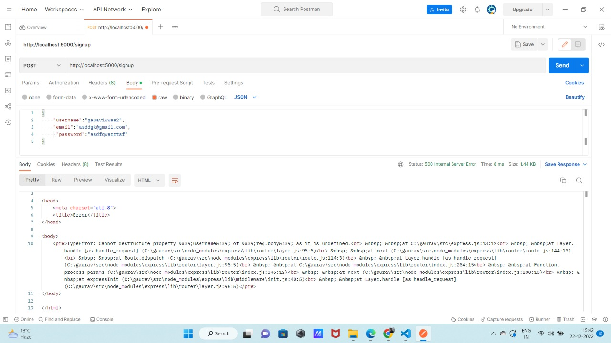
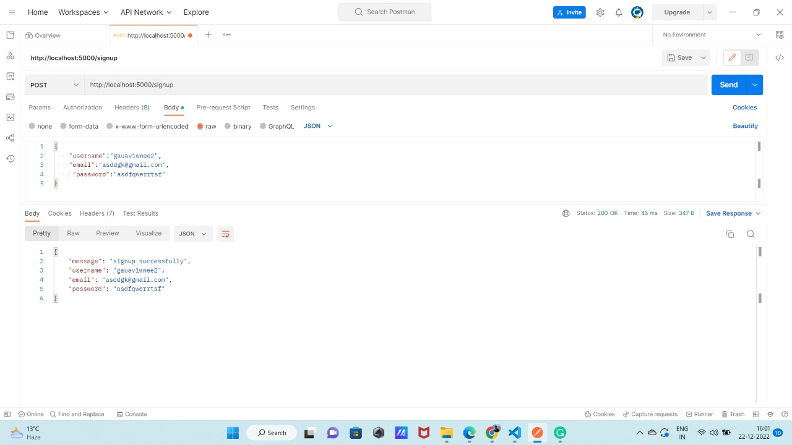
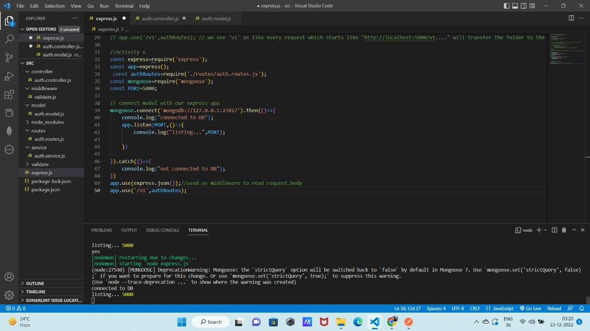
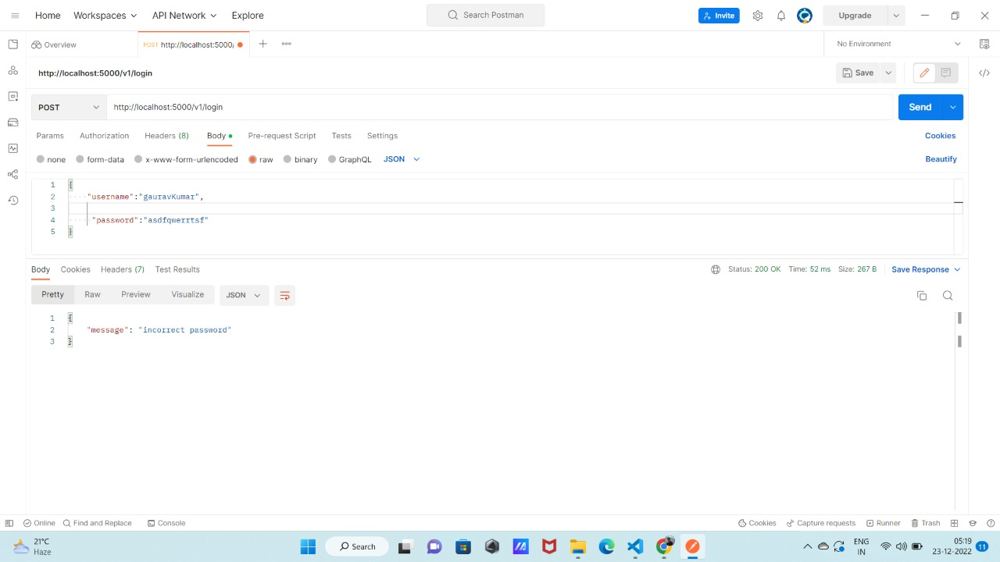
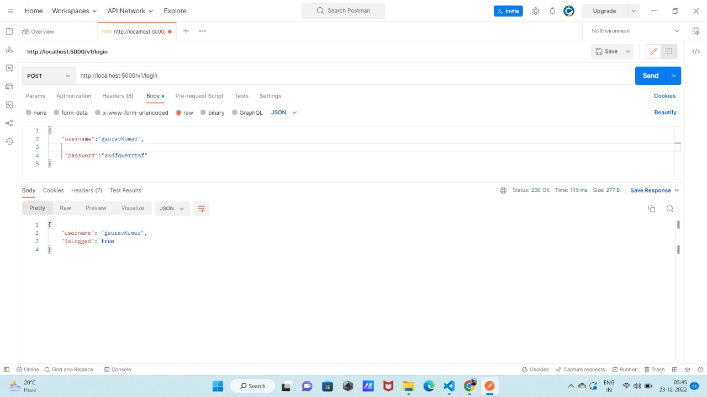

# Creating a signup route, login route, and how passwords are stored in the database using Hashing
### Prerequisite : 
#### 1) NodeJS 
#### 2) ExpressJS
#### 3)MongoDB
---
## To get a better understanding of the code that is in the src folder and to understand the flow of an API request in ExpressJS.
### We have an Final Architecure of our express app.
#### The folders we have created - services, routes, controllers, models, and validators serve as different layers of our application.
#### The request passes through each layer in order.
#### So with this model we can identify which part of our application is causing a problem, by log statements to check where the request reached.


#### The Client/Browser sends the request and it goes to the Routes folder  and then it goes to Middleware if Something is wrong or data is not valid it directly gives back the response to the browser and if everything is right it goes to the Controllers and then Service layer and then to model and then to Database and comes back to Service Layer and then to Controller and It rexponse back to the Client/Browser.If Something is wrong like(data is invalid , wrong request etc) then it stops there and we can log the statement .

### Question1) Which layer is responsible for responding to the request?
### Ans- Controller Layer 

## Let's start our Activity
   ## Activity 1: Start a new project 
    step 1. Move to the terminal tab and type  "npm init -y"
    This will create a new package.json file
    step 2. Now type "npm install express" in  your terminal
    step 3. Now type "npm install nodemon --save-dev"
    

 
 ## package.json file
    ->Stores configuration of project
    ->The packages we install using npm for our project are called dependencies.

 ## Q.Why we install nodemon?
    ->Nodemon is a command-line tool that helps with the speedy development of Node. js applications. It monitors your project directory and automatically restarts your node application when it detects any changes. This means that you do not have to stop and restart your applications in order for your changes to take effect.

## Q.What about the "scripts" key?
    ->Defines different commands we can use to start,test and build a project
    ->These are defined under a key called "scripts"
    ->We can use these commands with npm like npm run <script-key>   

  ## Activity 2: Steps to create an Express.js Application
    Create a file in src folder named as "express.js" This will create a new package.json file
    step 1. Create an app instance using express
```js
const express=require('express');
const app=express();
const PORT=5000;
  ```
    step 2. Listening to PORT using app.listen
  ```js
app.listen(PORT,()=>{
    console.log("listing...",PORT);

});
 
  ```

   It starts listening to the connection on the specified path, the default host is localhost, and our default path for the local machine is the localhost:5000, here 5000 is the port which we have set earlier. The callback function gets executed either on the successful start of the server and on terminal we can its listing.

 

 ## Now our server is started and runing and 

   ## Activity 3: Creating a Singup Route and understanding the why we use express.json() middleware
     step 1: Create a '/sgnup route' 
     step 2: Test signup api using Postman and send data in json format ({username,email,password})
```js
app.post('/signup',(req,res)=>{
    console.log(req.body);//req.body is the data we receive from Browser 
    const {username,email,password}=req.body;
    console.log(username,email,password);
    res.status(200).json({message:"signup successfully",username,email,password});
    //res is used to send the response back to the client with appropriate status and message or data.
 ```
 
 
 
 

    Note- You can that  "TypeError: Cannot destructure property 'username' of 'req.body' as it is undefined." Because our app is not able to read the response it receives from the Postman

    Q.How to solve this problem?
    answer- We use "express.json()" as middleware which allows us to read data in express app.The "express.json()" function is a built-in middleware function in Express. It parses incoming requests with JSON payloads and is based on body-parser.
 ```js
 app.use(express.json());/// acts as middleware to read data 
app.post('/signup',(req,res)=>{
    console.log(req.body);//req.body is the data we receive from Browser 
    const {username,email,password}=req.body;
    console.log(username,email,password);
    res.status(200).json({message:"signup successfully",username,email,password});
    //res is used to send the response back to the client with appropriate status and message or data.
 ```
 

### Q)Is it a good practice to create a route this way? 
    No, because now we have a single route so it's easy to maintain and debug but when we have 100s of routes then it becomes very hard to maintain and debug. So to solve this problem we divide our routes into different files.

  ## Activity 4: Creating a Singup Route in a structured way 
     step 1: Create a 'routes' folder and inside it create 'auth.routes.js' file.
  ```js
  const router=require('express').Router();//The express.Router() function is used to create a new router object
  const {postSignup}=require('../controller/auth.controller.js'); // postSignup is a callback function which is being imported from controller file which we will discuss in the controller file
  router.post('/signup',postSignup);// it will receive a post request and then call a "postSignup" function
  module.exports=router;//  module.exports in Node.js is used to export any literal, function or object as a module
  ```
### Note- The main function of route folder is to read the type of request and match the request  then pass the control to the controller function

###  Q.Why we use require to import file from different folder and not use export?

### Q.why we use "express.Router()" in express file?
 
  answer-The express. Router() function is used to create a new router object. This function is used when you want to create a new router object in your program to handle requests. Multiple requests can be easily differentiated with the help of the Router() function in Express.04

    step 2:Create a "controller" folder  and inside it create a file "auth.controller.js"
```js

const postSignup=async(req,res)=>{
    try{ console.log("yes");
       
        res.status(200).json({message:"signup successfull",...req.body}); //we are sending back the data which we received and a message as " signup successfully"
    }
    catch(err){
      res.status(422).json(err);// if error happens we are sending 422 status code and a error message
    }

}
module.exports={
    postSignup:postSignup,
} 
// postSingup is  a method that receives two parameters as req and res. The main function of the postSignup function is to return the response to the client/Browser
```  
    Step 3:Now connect "routes" folder to the "express.js" file to receive the request from client/Browser and then from express.js file it call the routes file and then to controller file.
    Refer to the below code 
```js
const express=require('express');
const app=express();
const PORT=5000;
 const authRoutes=require('./routes/auth.routes.js');
//step 2.Listening to PORT using app.listen
app.listen(PORT,()=>{
    console.log("listing...",PORT);

});
//Activity 4
app.use(express.json()); // acts as middleware to read data 
app.use('/v1',authRoutes);// we use 'v1' as like every request which starts like "http://localhost:5000/v1...." will transfer the folder to the authRoutes which we imported from auth.routes.js file 
```    
    step 4:Now call the postman and verify if our api works or not?
  

    Explanation- Here we call the API from the postman and  then it goes to the express.js file from where "app.use('v1',authRoutes)" directs it  to the "auth.routes.js" file and from there it goes to "postSingup" function in the controller file  and  from the controller it response back to the client/Browser.

## What are the Problems we have in our code?
### Hint-What about storage where can we store the data about the users which we receive from the client/Browser?
     MongoDB
     To store the data of users we use MongoDB.

## Q.What is MongoDB and why it is used?
    MongoDB is an open source NoSQL database management program. NoSQL is used as an alternative to traditional relational databases. NoSQL databases are quite useful for working with large sets of distributed data. MongoDB is a tool that can manage document-oriented information, store or retrieve information.

  ## Activity 5: Creating a model and storing user data
     step 1: Create  a folder "model" and inside it create file "auth.model.js"
     step 2: Type "npm install mongoose" library
     step 3: Create a schema and then model and export it.
    Refer code below and how we need to write it in "auth.model.js" file.
```js
const mongoose=require('mongoose');

const authSchema=mongoose.Schema({
    username:{type:String,required:true,maxLength:50,unique:true},
    email:{type:String,required:true,unique:true},
    password:{type:String,required:true}
})
const authModel=mongoose.model('auth',authSchema);
module.exports=authModel;
```
## What is mongoose library?
    Mongoose is an Object Data Modeling (ODM) library for MongoDB and Node. js. It manages relationships between data, provides schema validation, and is used to translate between objects in code and the representation of those objects in MongoDB. 
## What is schema in Mongoose?
    In mongoose, a schema represents the structure of a particular document, either completely or just a portion of the document.    
  
### Note -If there is any problem understanding the code pls refer to the src folder.

 ## Activity 6:Connect our express app with the model we just created in  Activity 5
     step 1: Import "mongoose " in express.js file
     step 2: Connect model wih our express app using "mongoose.connect()" method(promise)
```js
//Activity 6 : Create a model and connect it with express app
const express=require('express');
const app=express();
 const authRoutes=require('./routes/auth.routes.js');
const mongoose=require('mongoose');
const PORT=5000;

// connect model with our express app
mongoose.connect('mongodb://127.0.0.1:27017').then(()=>{
    console.log("connected to DB");
    app.listen(PORT,()=>{
        console.log("listing...",PORT);
    
    })
    
}).catch(()=>{
    console.log("not connected to DB");
})
app.use(express.json());//used as middleware to read request.body
app.use('/v1',authRoutes);
```     

  
  Here we can see that our termial shows that "connected to DB, listing... 5000"

    step 3: Now we create a "service" folder and inside it we create a "auth.service.js" file.
    step 4: Import the model from model file to the "auth.service.js" file
    step 5: In "auth.serive.js" file write a function "signup" which create a new user using the model we imported.
    step 6: Connect the "auth.controller.js" file to the "auth.service.js" file such that controller uses a "signup" function to store the data in the DataBase.
```js
const authModel=require('../model/auth.model.js');
const signup=async(body)=>{
    console.log("body",body);
    const newUser= new authModel(body);//create new user using new keyword
    console.log("1",newUser)
    const result=await newUser.save();// saves the user in the DataBase.
 // we are using asyn-await as newUser.save() returns a promise
    console.log("result",result);
    return result;// return the result to the controller
}
module.exports={
    signup:signup
}
```    
## We have an Final Architecure of our express app.

## Activity 7:Storing Password as hashed password
    step 1: Call a signup API from Postman and see the response.
## You can notice that the response we receive in Postman is that our Password is saved as plain text that the user entered.So this is one of the big bug in our express app as anyone which has the access of the Database can easily steal other details or login.

## How to Solve this problem?
    Hashing Passwords
    ->Passwords(or other sensitive information ,like credit card numbers etc) are never saved directly without hashing.
    ->There are two parts to hashing a password
      1.We pass our password string through a Hashing Algorithm
      2.To make our password even more unbreakable we add a "salt" to it.
    ->Finally we store this salt-hashed password in the database. This way it stays secure.
    ->When user tries to log in ,we simply  take the password user has entered 
          step a) attach the salt
          step b) hash is again
          step c) and then compare it with the password in our DataBase(DB)  
    -> If they match,then the user can log in.

### Hashing Password in NodeJs
    ->We shall use a library called bcrypt that gives us utilities to salt,hash,and verify strings.
    ->Install the bcrypt library in our app
``` js
   npm install bcrypt
``` 
    Step 2: We will add another method inside "auth.service.js" file.
     ->bcrypt gives us a promise function to generate a salt named genSalt.
```js
const bcrypt=require('bcrypt');
const encryptPassword=async(password)=>{
    const salt=await bcrypt.genSalt();
    const hashedPassword=await bcrypt.hash(password,salt);
    return hashedPassword;
}
```
    step 3:Saving hashed passwords
     -> We will update our signup method in auth.service.js file to store hashed password instead of plain passwords.
```js
const signup=async(body)=>{
   try{ console.log("body",body);
    const {password}=body;
    const hashedPassword=await this.encryptPassword(password);
    const newUser=new authModel({...body,password:hashedPassword});
    const result=await newUser.save();
    return result;}
    catch(err)
    {
        throw error;
    }
}
```   
    Step 4: Testing it out in Postman
    Now again try sinup API call with a different email and username,since one user is already in our DB.
   

## Here we can see now our password is stored as hashed password not the same which is given by the Client/Browser.

 ## Activity 8:Creating Login Route ,Controller, and login method in service layer as we do for signup route and verify login
    step 1: We should create a login route to authenticate existing users.
      Similar to what we did for /v1/signup route
      ->create a route POST /v1/login for login as well
   ```js
      router.post('/login',postLogin);
   ```
      ->create a controller postLogin() as well
 ```js
      const postLogin=async(req,res)=>{
    try{
        const {username,password}=req.body;
     const result=await login(username,password);
     if(result)
     {  
        
     res.status(200).json({...result,isLogged:true});}
     else
     {
        res.json({message:"incorrect password"});
     }
    }catch(err)
    {
        res.json(err);
    }
}
  ```
       a) The controller use login() method of the "auth.service.js" and return an object with a boolean value isLoggedIn.
       b)Check this value in the controller to return an appropriate response
   ```js
   const login=async(username,password)=>{
    try{
     const user=await authModel.find({username});
     console.log("user",user);
     if(user.password===password)
     {
         return {
             isLogged:true,
         }
     }
     else
     { return null; }
    }
    catch(error)
    {
       throw error;
    }
 }
   ```    
     

    IMP-You can see on the screenshot that on the 'login' API call from Postman we are getting a response as  "message": "incorrect password".Even if we entered the correct password.
    This happens because password is stored as hashed password and we are comparing it with the password that the user has entered it is obvious that it  gives us a message as "incorrect password"

 ##   How to solve this issue now?
    We use  the compareSync() method which unlike the compare() function returns a Boolean value(true/false). Its first parameter is the unhashed password entered by the user in the login form and the second parameter is the hashed password stored in the db or a string.
 ```js
 const login=async(username,password)=>{
    try{
     const user=await authModel.find({username});
     console.log("user",user);
    
     const result=await bcrypt.compareSync(password,user[0].password)// its return true or false 
     if(result)
     {
         return {
             isLogged:true,   
         }
     }
     else
     {
         return null;
     }
    }
    catch(error)
    {
       throw error;
    }
 }
 ``` 
## Now again call login API with correct data then see the response on postman


##    Result
     Here now we can see it gives us a response as we are logged in  
       {
    "username": "gauravKumar",
    "isLogged": true
      }

## This is the end of our learning
## For any doubt abou the code pls see the src folder 

## Some Questions which is very important
    1.Difference between dependencies and dev-dependencies in package.json file
    2.Which layer is responsible for giving a response back to the client?
    3.What is module.exports?
    4.Why we use "require" to export file?
    5.What about the "scripts" key?


  
        


   
       
 

 

 
