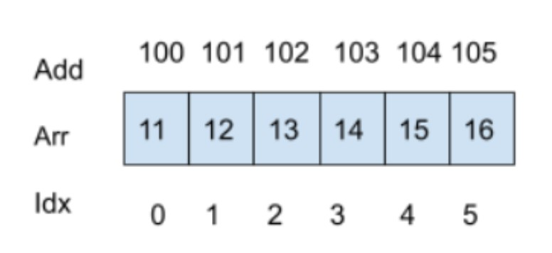
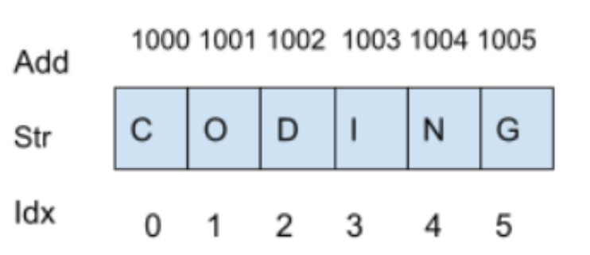
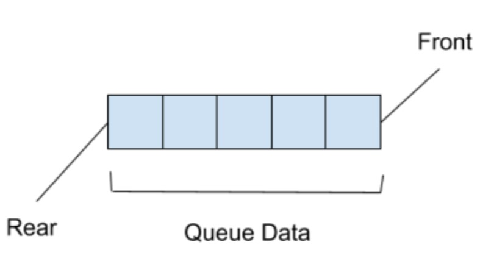
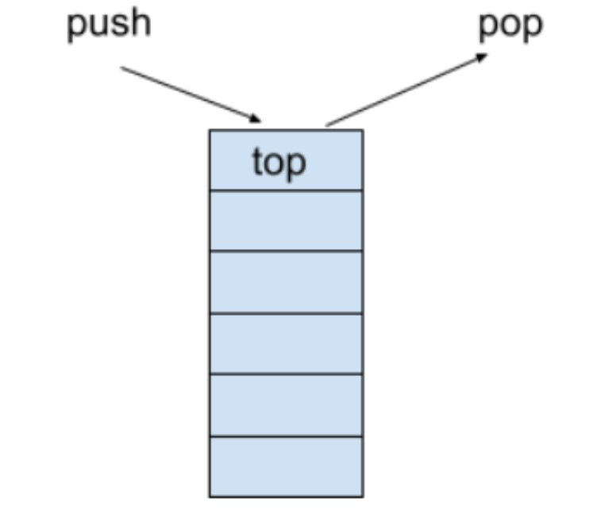
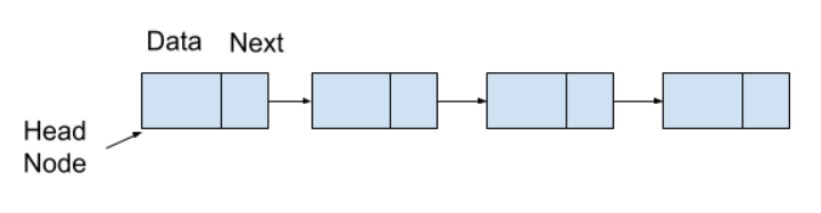
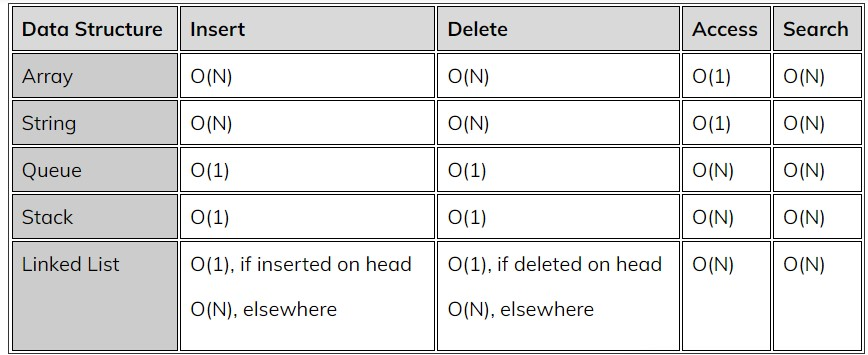
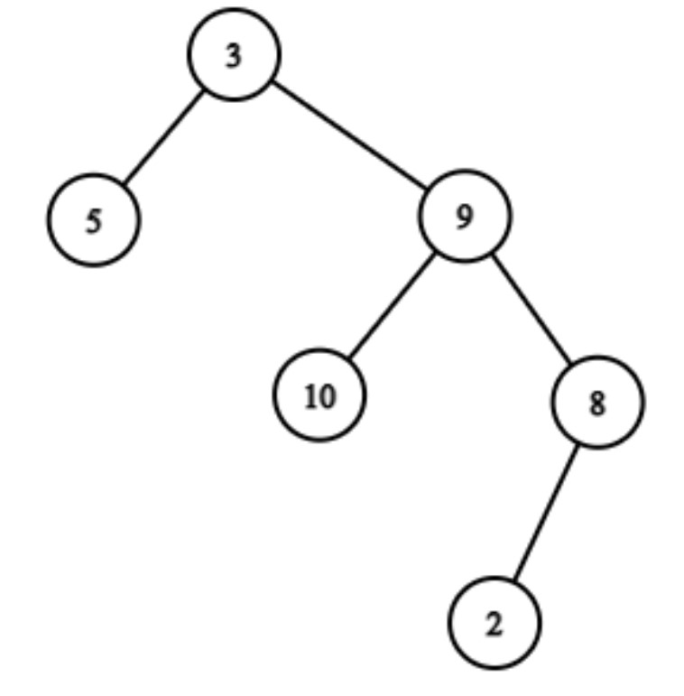
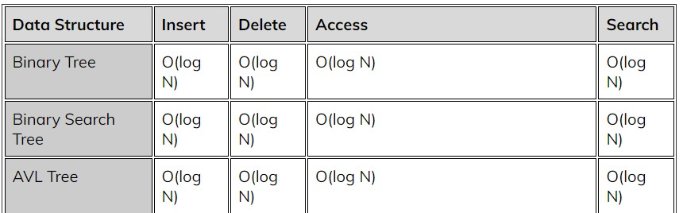
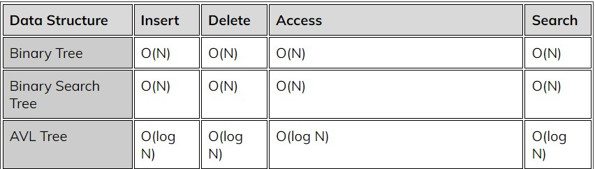

# Introduction
Data structures are the most significant element of product-based discussions. A data structure is a method of storing and arranging current data for later use. There are two types of data structures: 
- Linear Data Structures 
- non-linear Data Structures

# Time Complexity
Time complexity is a notion that quantifies the amount of time it takes an algorithm or code snippet to execute. 

# Space Complexity

The amount of memory space taken by a code snippet or method is referred to as its space complexity. 

# Linear Data Structure

## Array
An array is a data structure that stores comparable types of data in contiguous memory areas.

### ***Time Complexity in arrays of size 'N'***
- The 'i'th element in an array, 'ARR,' where the address of the first element is 'A' and the size of each member is 'S', ith  may be defined as 
    
    ARR[i] = A + (i - 1) * S.

    As its relative address can be computed in constant time, accessing an element at a certain memory location requires O(1) time.
- Similarly, altering any array element requires O(1) time.
- In arrays, inserting a new element at a specific index is only feasible if we skip all the elements before that position, which takes O(N) time.

- The deletion process requires O(N) time as well.
- Without a specialised technique, searching in arrays takes O(N) time since we must cycle and examine each element in the array.

### ***Space Complexity in Arrays***
Because none of the above actions require any more space, the space complexity of retrieving, editing, inserting, or deleting is constant, i.e., O (1). The only auxiliary space is the space used to form the array.

## String
In computer science, a string is a data structure that stores a succession of characters. Each character in the string is represented by a unique index. Its time and spatial complexity are shown below.

### ***Time Complexity of String containing ‘N’ characters***
- Reading or editing each character stored at a certain index takes O(1) time, as its relative index may also be determined in constant time, as with arrays.
- Inserting and removing every character at a certain position in strings requires O(N) time since we must skip all previous indices.

- Searching for any character in a string takes O(N) time since we look for every character in the string.

### ***Space Complexity in Arrays***

Because we do not require any more space to accomplish all of the aforementioned actions, the space complexity of reading, editing, adding, or deleting remains constant, i.e., O (1). The only auxiliary space is the space used to produce the string.

## Queue
A queue is a linear data structure that is basically a collection of items that are monitored in order, with the addition of entries occurring at one end of the queue and the removal of entries occurring at the other. Its arrangement is often known as first in, first out (FIFO).

### ***Time Complexity of String containing ‘N’ characters***
- The time required to access or alter each element placed in a queue is O(N), since in order to reach any single element, all the elements following it must be deleted.
- The searching method also takes O(N) time since accessing any given element requires popping the elements stored after it.

- In a queue, operations like as insertion and deletion require constant time, i.e., O (1). Only the front element may be withdrawn at a time, and only the back element can be inserted.

### ***Space Complexity in Arrays***
Because no extra space is required for any operation, the space complexity for each operation in a queue is O(1).

## Stack
A stack is a linear data structure that allows operations to be done in a specific order. Its arrangement is also known as LIFO (Last In First Out). Arrays and linked lists are used to implement stacks. Let's talk about its effectiveness in terms of time and space complexity.

### ***Time Complexity of String containing ‘N’ characters***
- The time required to access or alter each element stored in a stack is O(N), since in order to reach any given element, all the ones preceding it must be deleted.
- The searching method also takes O(N) time since reaching any given element requires popping the elements stored before it.

- In a stack, operations such as insertion and deletion require a fixed amount of time, i.e. O (1).

### ***Space Complexity in Arrays***
Each action in a stack has a space complexity of O(1) since no more space is required for any operation.

## Linked List
A linked list is a data structure that contains of nodes that hold data. Each node has a data field as well as a reference to the next node. A linked list's items are connected together via pointers. Unlike arrays, entries in Linked List are stored in distinct memory regions rather than contiguous memory locations.

### ***Time Complexity of String containing ‘N’ characters***
Insertion in the linked list has a temporal complexity of O(1) if done on the head and O(N) if done at any other point since we must traverse the linked list to get there.

The temporal complexity of deletion is O(1) if done on the head, and O(N) if done at any other point since we must traverse the linked list to get there.

The temporal complexity associated in looking for and accessing any items is O. (N).
### ***Space Complexity in Arrays***
Each action in a linked list has a space complexity of O(1) since no more space is required for any operation.

Where 'N' is the size of the respective data structure.

# Activity 1

1. Is the insertion and deletion difficulty of a linked list vary at various positions?

 Hint 

    Yes, in a linked list, the time complexity of insertion/deletion at the head is O(1), as opposed to O(2) for insertion/deletion at other points (N).

2. Is it feasible to reduce the time complexity of finding any element in an array?

 Hint 

    Yes, it is easy to reduce the temporal complexity of searching in an array using algorithms such as Binary Search, etc., but the array's items must be sorted. The temporal complexity of searching in an array with a Binary search method is O(log(N)).

3. Which of the following linear data structures is thought to be the most efficient?

 Hint 

    All of the data structures have been shown to be efficient in terms of the requirements. Because each data structure has its unique relevance, no one data structure can be deemed the greatest in terms of efficiency.
    
    When it comes to the most often used data structure, the array is a good choice.

# Non-Linear Data Structure

Non-Linear Data Structures are data structures in which data is not stored linearly or sequentially, and as a result, each element is not connected to the previous or next element in order for them to be retrieved in a single run. In comparison to linear data structures, non-linear data structures are more complicated and memory-efficient.

## Binary Tree

A Binary Tree is a tree in which all nodes have no more than two children.

### ***Time Complexity***
1. The time required to access any given node:
- Average Complexity: O(log N)
- Worst Complexity: O(N)
2. The time required to search for a certain node:
- Average Complexity: O(log N)
- Worst Complexity: O(N) 
3. The time required to insert each given node:
- Average Complexity: O(log N)
- Worst Complexity: O(N)
4. The time required to delete each given node:
- Average Complexity: O(log N)
- Worst Complexity: O(N)

### ***Space Complexity***
Because no more space is required for any of the activities, the space complexity will be O(1).

## Binary Search Trees
The first term in 'Binary Search Trees,' namely 'Binary,' indicates that each node in the tree can only have two children, the left and right child. The data of the right and left children must be more and smaller, respectively, than the data of the parent node.
### ***Time Complexity***
1. The time required to access any given node:
- Average Complexity: O(log N)
- Worst Complexity: O(N)
2. The time required to search for a certain node:
- Average Complexity: O(log N)
- Worst Complexity: O(N) 
3. The time required to insert each given node:
- Average Complexity: O(log N)
- Worst Complexity: O(N)
4. The time required to delete each given node:
- Average Complexity: O(log N)
- Worst Complexity: O(N)
### ***Space Complexity***
Because no more space is required for any of the activities, the space complexity will be O(1).

## AVL Trees
The AVL Tree is a height balanced binary search tree in which each node has a balancing factor that is computed by subtracting the height of its right sub-tree from the height of its left sub-tree.

If the balance factor of each node is between -1 and 1, the tree is said to be balanced; otherwise, the tree is imbalanced and must be balanced.
    
    Balance Factor (k) = height (left(k)) - height (right(k))

### ***Time Complexity***
1. The time required to access any given node:
- Average Complexity: O(log N)
- Worst Complexity: O(log N)
2. The time required to search for a certain node:
- Average Complexity: O(log N)
- Worst Complexity: O(log N) 
3. The time required to insert each given node:
- Average Complexity: O(log N)
- Worst Complexity: O(log N)
4. The time required to delete each given node:
- Average Complexity: O(log N)
- Worst Complexity: O(log N)
### ***Space Complexity***
Because no more space is required for any of the activities, the space complexity will be O(1).

## HashMap
### ***Time Complexity***
1. The time required to insert a value is
- Average Complexity: O(1)
- Worst Complexity: O(1)

2. The temporal complexity of removing a value is
- Average Complexity: O(1)
- Worst Complexity: O(1)

3. The time required to enlarge the map is
- Average Complexity: O(1)
- Worst Complexity: O(1)

4. The time required to hash a value is
- Average Complexity: O(1)
- Worst Complexity: O(1)
### ***Space Complexity***
Because no more space is required for any of the activities, the space complexity will be O(1).

## Average Time Complexity

## Worst Time Complexity

# Activity 2

1. Non-linear data structures: what are they?

 Hint 

    Data structures known as linear data structures allow for the sequential storage of data and connect each element to the one before or after it so that they can all be accessed at once. Arrays, stacks, queues, and other linear data structures are a few examples.

2. Which of the linear and non-linear data structures uses memory most effectively?

 Hint 

    Although non-linear data structures are more memory efficient than linear data structures, this efficiency also makes them more complex.

# Conclusion 

We gained knowledge of linear data structures and non-linear data structure's time and space complexity, which is a crucial idea to understand in order to prepare for the DSA-based interviews.