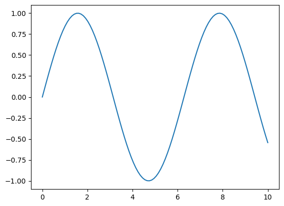
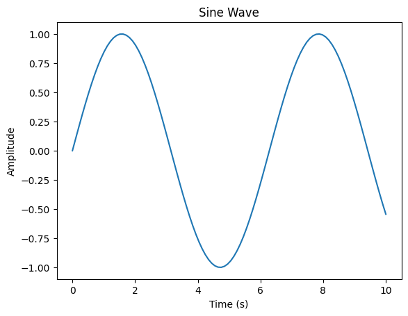
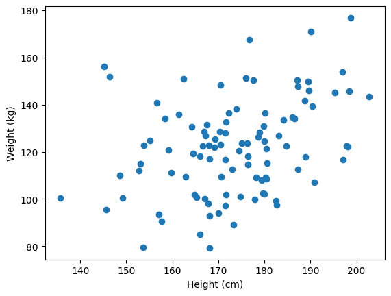
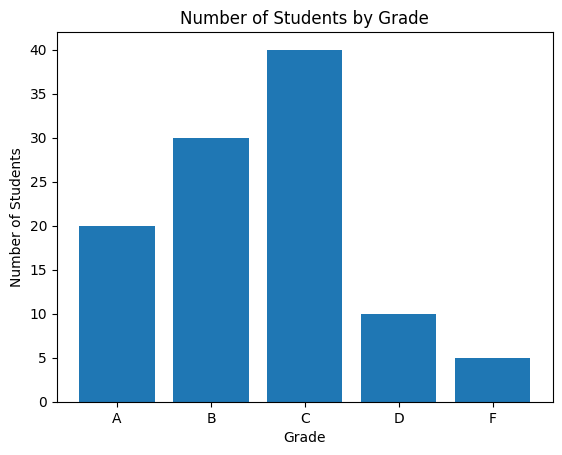

# Introduction
`Data visualization` is the process of creating and presenting graphical representations of data in order to facilitate understanding and analysis. Data visualization can help people to understand trends, patterns, and relationships in data by using visual elements like **charts**, **plots**, and **maps**.
`Python` is a popular programming language that has many libraries and tools for data visualization. 

To use these libraries to create data visualizations in Python, you will need to import the library into your code and use its functions to create the visualizations. 

In this Micro-byte, we will learn how to create a variety of different plots, customize their appearance, and use them to communicate your insights effectively.
<br>

# Pre-Requisites
Before we begin, you'll need to have Python installed on your computer, along with the following libraries:

#### 1. NumPy: A library for working with numerical data
#### 2. Pandas: A library for working with tabular data
#### 3. Matplotlib: A library for creating static plots
#### 4. Seaborn: A library for creating more advanced plots

`If you don't already have these libraries installed, you can install them using pip, the Python package manager. 
`
<br>

# Activities

---
## Activity 1 - Plotting a Line Graph
---

One of the most basic types of plots is the line graph, which shows how one or more variables change over time.
To create a line graph in Python, we can use the plot() function from the matplotlib.pyplot library.

First, let's create some fake data to plot. We'll use NumPy's linspace() function to 
generate an array of values from 0 to 10, and then use the sin() function to generate some sine wave data.
```
import numpy as np
import matplotlib.pyplot as plt

# Generate some data
x = np.linspace(0, 10, 100)
y = np.sin(x)
```
### Activity 1 - Task

- Plot the above data using the plot() function. 


<details>
<summary> <b>Micro-Challenge</b></summary>
Instead of using the random data use the real data and plot data from it .
You can download the dataset from Kaggle.
</details>

<br>

---
## Activity 2 - Customizing the Appearance of Plots

---


Of course, a plain line graph isn't very useful on its own. 
We can use a variety of options to customize the appearance of our plots and make them more informative.

For example, we can add labels to the x- and y-axes using the `xlabel()` and `ylabel()` functions:
```
plt.plot(x, y)
plt.xlabel("Time (s)")
plt.ylabel("Amplitude")
plt.show()
```
We can also add a title to the plot using the title() function:

```
plt.plot(x, y)
plt.xlabel("Time (s)")
plt.ylabel("Amplitude")
plt.title("Sine Wave")
plt.show()
```
There are many other options you can use to customize visulization.
<details>
<summary> <b>Micro-Challenge</b></summary>
Change appearance of your plots, 
such as changing the line style, color, and markers, and adding grid lines and legends.
</details>
</details>

<br>

---
## Activity 3 - Plotting Multiple Lines on the Same Plot
--- 

 Sometimes, you may want to plot multiple lines on the same plot to 
 compare them or show their relationship. To do this, simply call the plot() 
 function multiple times with different data.

For example, let's say we want to plot both a sine wave and a cosine
wave on the same plot. We can do this by calling plot() multiple times with different data:
```
import numpy as np
import matplotlib.pyplot as plt

# Generate some data
x = np.linspace(0, 10, 100)
y1 = np.sin(x)
y2 = np.cos(x)

# Plot both lines
plt.plot(x, y1, label="Sine")
plt.plot(x, y2, label="Cosine")

# Add a legend
plt.legend()

plt.show()
```
This will create a plot with two lines, one for the sine wave and one for the cosine wave. 
The legend() function adds a legend to the plot, which labels each line.

### Activity 3 - Task
- Use legend() function on more than one data .

<br>

---
## Activity 4 - Plotting a Scatter Plot
---


In addition to line graphs, Python also provides tools for creating scatter plots, 
which are useful for visualizing the relationship between two numerical variables. 
To create a scatter plot, we can use the `scatter()` function from the `matplotlib.pyplot` library.

For example, let's create some fake data that shows the relationship between height and weight:
```
import numpy as np
import matplotlib.pyplot as plt

# Generate some fake data
np.random.seed(42)
height = np.random.normal(175, 15, 100)
weight = height * 0.7 + np.random.normal(0, 20, 100)
```
Now, we can use the scatter() function to plot this data:
### Activity 4 -  Task

- Use the scatter() function to plot the data .

<br>

---
### Activity 5 - Plotting a Bar Chart
---


Bar charts are a useful tool for visualizing categorical data, or data that can be grouped into categories. 
To create a bar chart in Python, we can use the bar() function from the matplotlib.pyplot library.
For example, let's say we have data on the number of students in each grade at a school:
```
import numpy as np
import matplotlib.pyplot as plt

# Generate some fake data
grades = ["A", "B", "C", "D", "F"]
students = [20, 30, 40, 10, 5]
```
Now, we can use the bar() function to plot this data
```
plt.bar(grades, students)
plt.xlabel("Grade")
plt.ylabel("Number of Students")
plt.title("Number of Students by Grade")
plt.show()
```

### Micro-Challenge:-

- Create bar chart of the any data using the bar() function .

<br>

# Conclusion

Congratulations! You have completed all the activities. I hope it was fun and you learned something new. Now you can visulize the data  and can play with datasets using python .

<br>

# References

1. [Tableau](https://www.tableau.com/learn/articles/data-visualization)
2. [Geeks For Geeks](https://www.geeksforgeeks.org/data-visualization-with-python/)
3. [Simplilearn](https://www.simplilearn.com/tutorials/python-tutorial/data-visualization-in-python)
