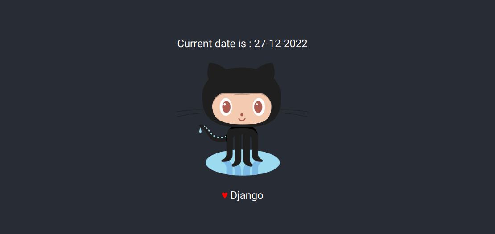

## Introduction
This mirobyte demonstrates the basics concepts of templates in Django.

## Pre-requisite
- Python
- Django MVT architecture
- Creating views in Django
## Table of Contents
- [Django Template Engine](#django-template-engine)
- [Django Template Language](#the-django-template-language)
- [Configuration of Templates in the Django Project](#configuration-of-templates-in-django)
- [Activities](#activities)
- [Conclusion](#conclusion)
- [References](#references)

## Django Template engine
- The most common approach to render HTML relies on templates. 
- A template contains the **static** parts of the desired HTML output as well as some special syntax describing how dynamic content will be inserted. 
- A Django project can be configured with **one or several** template engines (or even zero). 
- Django ships **built-in backends** for its own template system, which is also called the **Django template language (DTL)** (a popular alternative of **Jinja2**)
- Django defines a standard API for loading and rendering templates regardless of the backend. 

## The Django template language
- A Django template is a text document or a Python string marked-up using the Django template language. 
- Some constructs are recognized and interpreted by the template engine. (like variables and tags in templates)
- A template is rendered with a **context**. 
- Rendering replaces variables with their values, which are looked up in the context, and executes tags. Everything else is output as it is.
- The syntax of the Django template language involves four constructs.
    - Variables
    - Tags 
    - Filters
    - Comments
### Variables
- A variable outputs a value from the context, which is a dict-like object mapping keys to values.
- Variables are surrounded by **{{** and **}}** like this: 
`My name is {{first_name}}`
- With a context like : `{'first_name': 'John'}` . The output is : 
`My name is Sam`

### Tags
- Tags provide arbitrary logic in the rendering process.
- Tags are surrounded by **** like this:
- For example : a **if block** is defined as `Hello, {{ user.username }}.`
- Similarly one can define the If-Else block , the For block etc.

### Filters
- Filters transform the values of variables and tag arguments.
- Eg : for the context : {sample : "hello world!"} now for rendering the text in Title-case we are using the `title` filter : \
`{{ sample|title }}`
- The output is : **Hello World!**

### Comments
- Comments look like this: `{# this won't be rendered #}`
- A `` tag provides multi-line comments.

## Configuration of Templates in Django
- In order to configure templates a `TEMPLATES` list is initialised in the **settings.py** file.

```
TEMPLATES = [
    {
        'BACKEND': 'django.template.backends.django.DjangoTemplates',
        'DIRS': [],
        'APP_DIRS': True,
        'OPTIONS': {
            # ... some options here ...
        },
    },
]
```
where 
- `BACKEND` : Python path to a template engine class implementing Django’s template backend API. The built-in backends are **django.template.backends.django.DjangoTemplates** and **django.template.backends.jinja2.Jinja2**.
- `DIRS` : Defines a list of directories where the engine should look for template source files, in search order.
- `APP_DIRS` : Tells that whether the engine should look for templates inside installed applications. Each backend defines a conventional name for the subdirectory inside applications where its templates should be stored.
- `OPTIONS` : This key contains backend-specific settings.

## How to render a template?
- In order to render a template one as to define an API in the **views.py** file in django app.
- For example lets define an API endpoint named `home` in the views.py file . This function renders the template named `index.html`.

```
from django.shortcuts import render

def home(request):
    return render(request , 'index.html')
```
## Activities
### Activity 1
- Create a template named `index.html` in the directory named `templates` (and this directory redsides in the BASE_DIR folder)
### Hint
> In order to define a directory for template one has to update the value of the `DIRS` key in the map present in the `TEMPLATES` list.

### Activity 2
- Create a filer to render the current date in the **DD-MM-YYYY** format.
### Hint
> In order to change the format of the date one has to use the `date` filter in the Django template engine.
> One can get the current date using `date.today()` method of the `date` module in the `datetime` package.

Expected output : 

### Activity 3
- Create a template that uses the static files from the static files directory
### Hint
> In order to use static files one has to use `` tag in the template.

## Conclusion
Learners learnt how to create and configure templates in Django.

## References
- https://docs.djangoproject.com/en/4.1/topics/templates/
