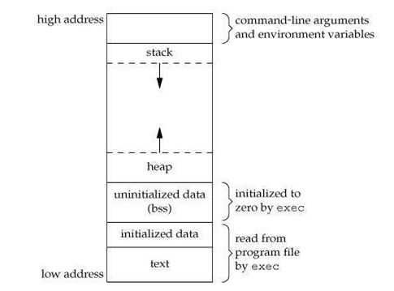
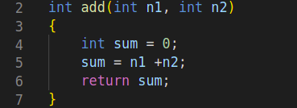
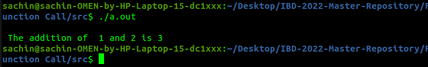
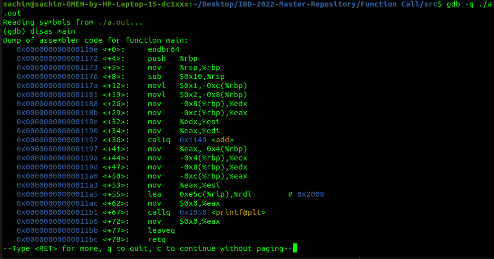
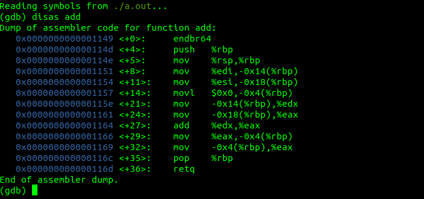
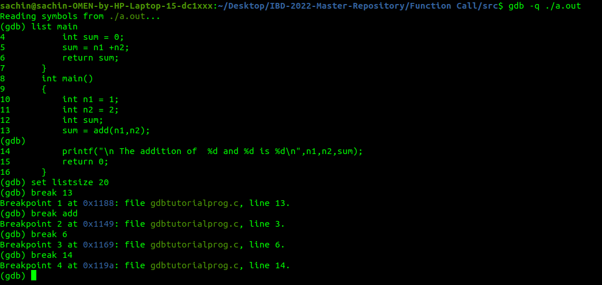
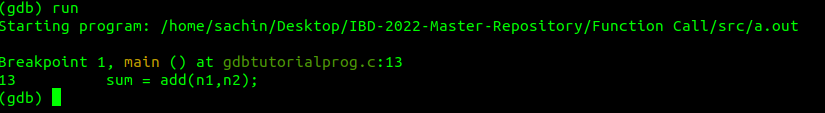
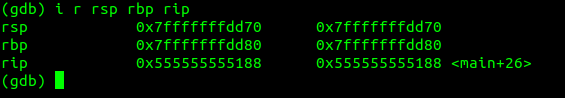
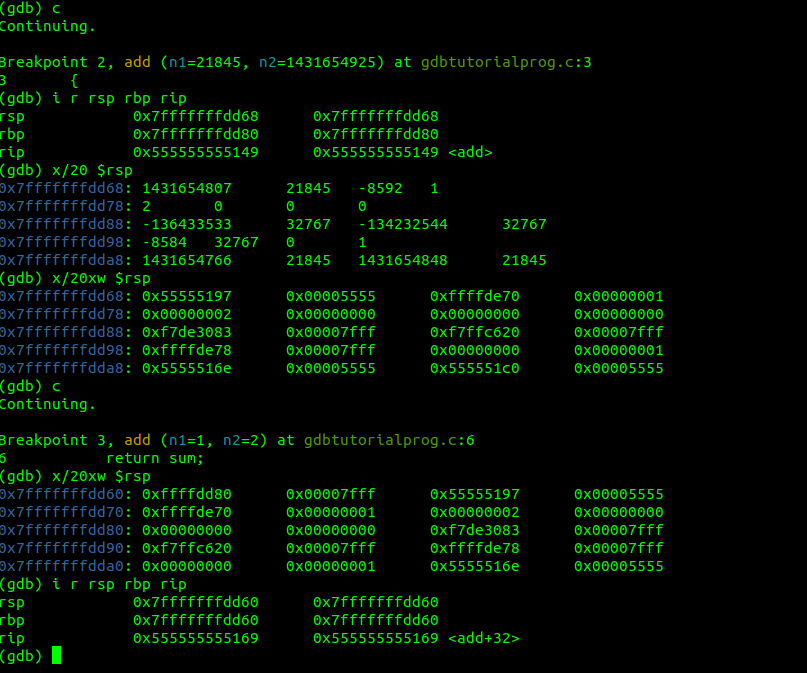

# Introduction

Understand how the function gets called from the main function and return back to the main function after completion.

## Background

Whenever a program is runnning ,it takes up some memory. Everytime we create a new variable ,our program is allocating more memory for us to store that variable.

> Refer to the `Memory_Layout.png` diagram in the repo.
> 

Each running program has its own memory Layout, separated from other programs . The Layout consists of a lot of segments, including:

1. Text Segment
2. Initialized data Segment
3. Uninitialized data Segment
4. Stack Segment
5. Heap Segment

## Text Segment

It is also known as a code segment or simply as text.It contains executable instructions.It may be placed below the heap or above the stack in order to prevent heaps and stack overflows from overwriting it. It is often read-only, to prevent a program from accidently modifying its instructions.

## Initialized Data Segment

It is also called simply the Data Segment. It is a portion of virtual address space of a program,which contains the global variables and static variables that are initialized by the programmer.It is not read-only , since the values of the variables can be altered at run time.
It is further classified into

- initialized read-only area
- initialized read-wite area.

## Uinitialized Data Segment

It is also called the "bss" segment. Data in this section is initialized by the kernel to arithmetic 0 before the program starts executing. Uninitialized data starts at the end of the data segment and contains all global variables and static variables that are initialized to zero or do not have explicit initialization in code.

## Stack Segment

Each time a function is called , the address of where to return to and certain information about the caller's environment , such as some of the machine registers, are saved on the stack. The newly called function then allocates room on the stack for its automatic and temporary variables.

Curious Cat Questions ?

> Each time a recursive function calls itself, a new stack frame is used, so one set of variables doesn't interfere with the variables from another instance of function.

## Heap Segment

Heap is the segment where dynamic memory allocation usually takes place.The heap area begins at the end of the BSS segment and grows to larger addresses from there. The heap area is shared by all shared libraries and dynamically loaded modules in a process.

## Prolog of a function call

Before the called function starts executing the following are done:

1. The parameters to the function are placed in reverse order on stack

2. The return address of the instruction to be executed in main is stored on stack .

3. The old base pointer is stored by pushing it on the stack.

4. The base pointer register is updated by copying th value of the stack pointer register to the base pointer .

5. In the new stack frame, the place for the local variables is reserved by sliding the stack pointer down according to the required memory size of all local variables.

Curious Cat Questions ?

> What if the stack pointer collides with the heap Segment ?

## Epilog - What happens after a function completes its action ?

Curios Cat questions ?

> What happens when a function call terminates ?

All the local variables need to be removed and the next instruction after the function in the main should be executed.

> Which stack operation will be used to remove the top values in a stack ?

Hint : Stack.pop();

## Primary Goals

1. Understand the basic structure of a process .

2. Understand the prolog and epilog of a function.

# Prerequisites

You would need a Linux machine with sudo access.
Have a gcc compiler to run simple c programs.

```
 gcc SampleProgram.cc -o SampleProgram
./SampleProgram

```

# Activities

## Activity 1 - Write a basic C program .

Write a basic C program which calls a function int add(int n1, int n2) and return the sum .

You would see something like this



> Refer to the file `gdbtutorialprog.c` in the repo

Compile the file with gcc .

```
gcc -ggdb gdbtutorialprog.c

```

The above code runs for x64 bit machine.

For x32 bit machine
write the following code.

```
gcc -m32 -gdb gdbtutorialprog.c

```

Compile and check whether the function runs properly.

Output :

> Refer to the file `output.png` in the repo.



## Activity 2 - Diassembly of the main function

Now let’s try to dissbale the executable and see what it contains.

```
gdb  -q ./a.out

```

Once you are in the gdb section . Write

```
disas main

```

> Refer to the `gdb_main.png` file in the repo.



This will disassemble the main function.

Identify the address where main function calls the `add(int n1,int n2)` .

##### Hint

- Look out for the `callq` command.

## Activity 3 - Disassembly of the function.

Once your are done , type `c` to get back to the gdb section.

Now , get the Dump for the add function.

```
(gdb) disas add

```

> Refer to the `gdb_add.png` in the repo.
> 

Prolog of the Function Call .

1. The old base pointer is stored by pushing it on the stack.

2. The base pointer register updated by copying the value of
   the stack pointer register to the base pointer.

3. Stack place for the local variables is reserved by sliding the stack pointer down according to the required memory size of all local varibles.

Challenge :

> Identify which instruction does the above operations ?

### Further exploration

- How much space does a variables takes in memory?

## Activity 4 - Identify the Epilog in dump

> Refer to the `gdb_add.png` in the repo.
> 

Epilog of a function call:

1. Copy the value of the base pointer into the stack pointer, thus discarding the local variables of the function.

2. Copy the saved value of the base pointer location of the calling function back into the Base Pointer(done by a pop instruction, since Stack Pointer now points to the stack address holding this value )

3. Copy the return address by doing another pop operation.

Challenge :

> Fint out this Epilog instructions from dump.

##### Hint

- Look out for the instructions after the `add` operation around the last section .

## Activity 5 - Analyzing with Breakpoints.

Open up the gdb section. And use the following command

```
(gdb) list main
```

This will list the all commands in the `*.c` file.

Set the List size.

```
set listsize 20

```

> Make the list command display count source lines (unless the list argument explicitly specifies some other number). Setting count to unlimited or 0 means there’s no limit.

Add Breakpoints by using `break` command .

```
(gdb) break 13
(gdb) break add
(gdb) break 6
(gdb) break 14

```

> Refer `Breakpoint.png` file in the repo
> 

These numbers 13,6,14 are line number. The number will vary according to the instructions in the program.

Run the program till Breakpoint 1.

```
(gdb) run

```

> Refer to the `Breakpoint1.png` file in the repo.
> 

Here, check the values of registers .

##### Hint

Look out for the names of registers : stack pointer , base pointer , Instruction pointer.

```
(gdb) info registers # to get all the values of registers.
```

But we want only few

> Refer to the `Register.png` file in the repo.
> 

Run the program again for another breakpoint check the values again.

> Refer to the `Breakpoint_after.png` file in the repo.
> 

See how the values in the register is changing.

Challenge:

> Write the add() function which takes more argument and see the dump of the code.

> Write a program which ask users to provide a name and call another function name_print() which takes name as parameter and print in the screen and return to the main.

> Analyze the state of stack and related registers at the following breakpoints:
>
> - At the time of calling
> - After the prolog of the function called
> - At the return statement of the called function
> - At the execution of the last statement in main.

# Summary

After analysing the dump of the codes. You know how stacks are updated. What happens when you call a function . How the values of the register changes.

# Further Reading

Read about:

1. Format String Vulnerability.
2. Buffer Overflow Vulnerability.

# References

1. https://www.cs.cmu.edu/afs/cs/academic/class/15213-m19/www/activities/213_lecture5-sol.pdf

2. https://www.geeksforgeeks.org/memory-layout-of-c-program/

3. https://courses.engr.illinois.edu/cs225/fa2022/resources/stack-heap/
