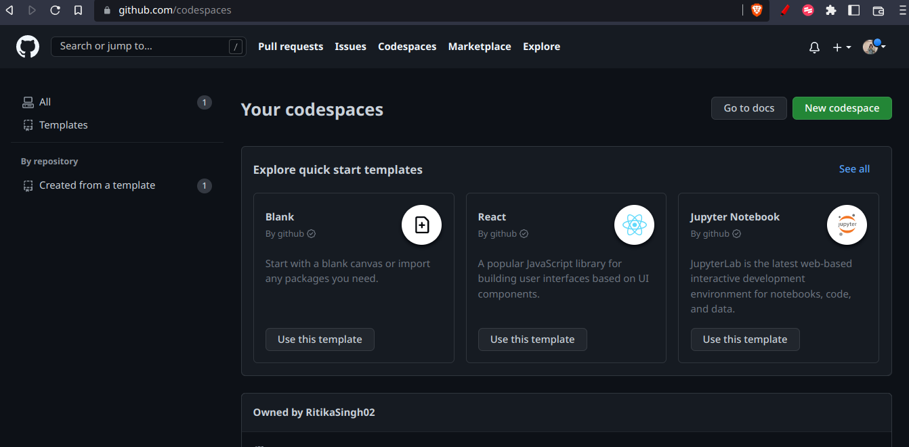
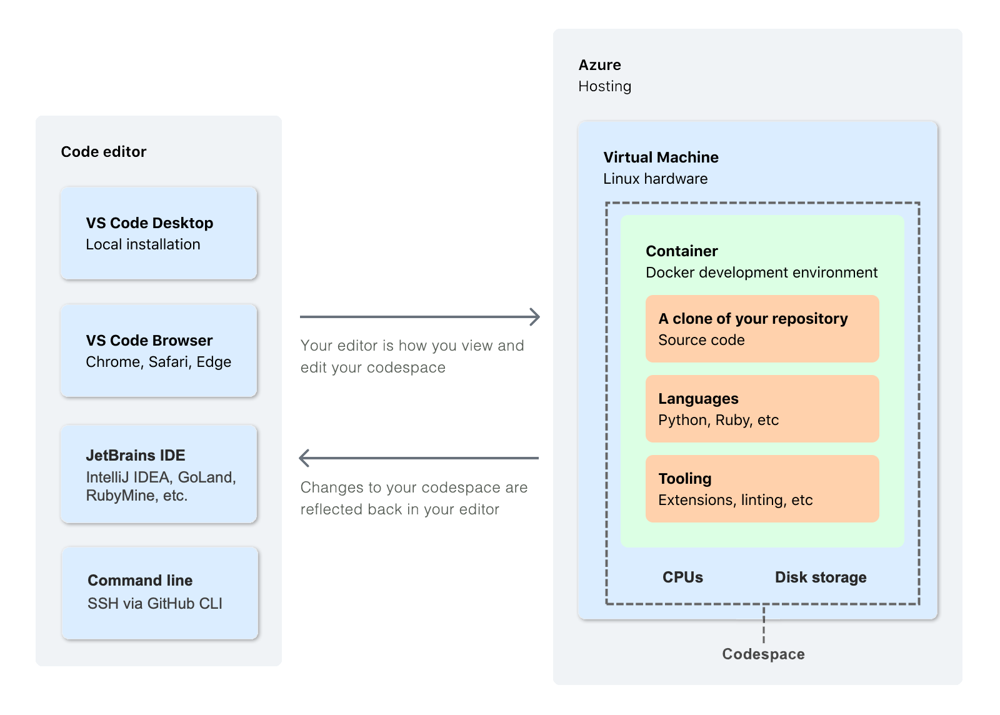
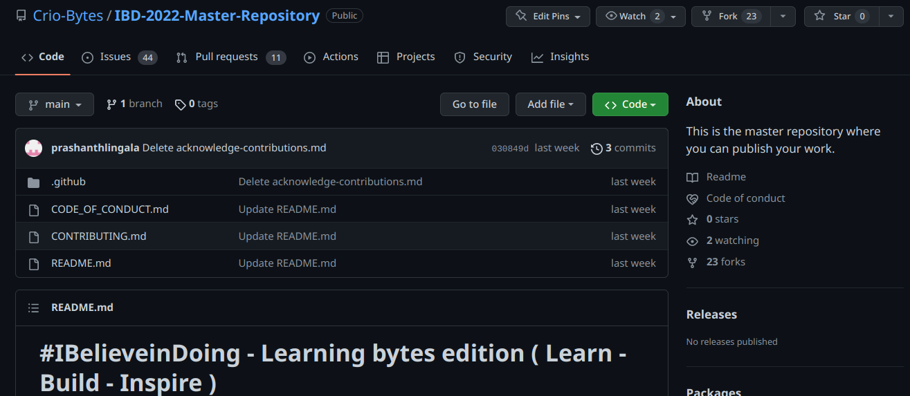
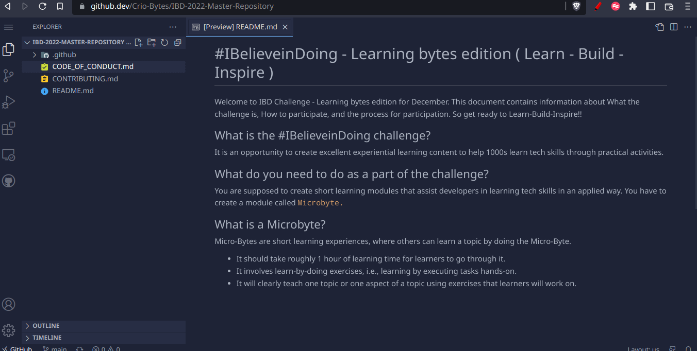
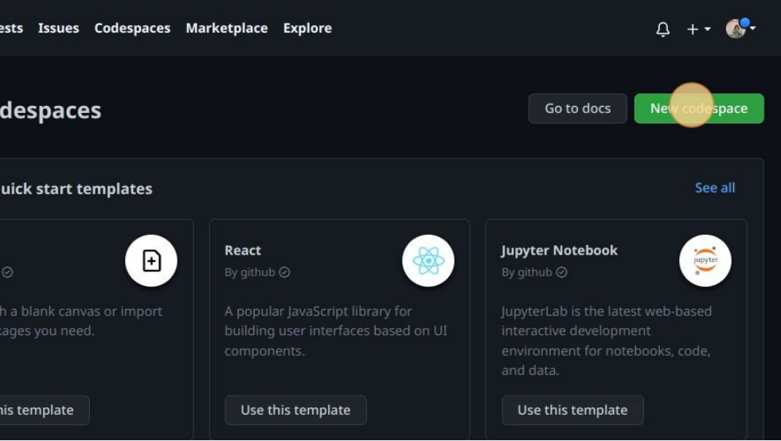
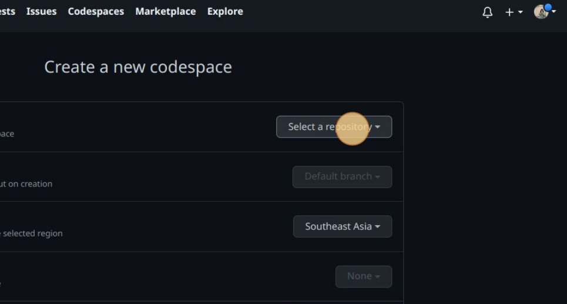
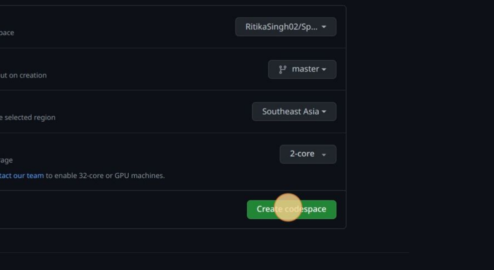

## INTRODUCTION
This microbyte contains how to create and use a GitHub Codespace.

## PRE-REQUISITE
* Knowledge about Git , Github and VScode.

## TABLE OF CONTENT
* [Introduction to GitHub Codespaces](#introduction-to-github-codespaces)
* [Where to find GitHub Codespaces?](#where-to-find-github-codespaces)
* [Where does a CodeSpace run?​](#where-does-a-codespace-run​)
* [Why to use GitHub CodeSpaces](#why-to-use-github-codespaces)
* [What is GitHub.dev?](#what-is-githubdev)
* [Difference between GitHub.dev and GitHub CodeSpaces](#difference-between-githubdev-and-github-codespaces)
* [Creating a CodeSpace](#creating-a-codespace)
* [Activities](#activities)
* [Summary](#summary)
* [References](#references)

## Introduction to GitHub Codespaces
* GitHub codespaces are **development environments** that are hosted in the **cloud.**
* One can customize your project for GitHub Codespaces by committing configuration files to one's repository (often known as Configuration-as-Code), which creates a repeatable codespace configuration for all users of your project.

## Where to find GitHub Codespaces?
One can find Codespaces at : https://github.com/codespaces 

## Where does a CodeSpace run?​
* CodeSpaces run in docker containers. (*A container is an isolated environment containing the resources, software and sometimes the start-up instructions that an application needs to run.​*)
* These containers reside on a **virtual machine** which is hosted in **Azure Cloud storage.​**
* When you create a codespace , Github runs your codespace in a default container using a default configuration.(*one can also change these configurations*)
* The default codespaces have many languages and runtime env like node.js , JS , TS , NPM , YARN , OPENSSH , nano etc.​

 

## Why to use GitHub CodeSpaces
CodeSpaces provide the following advantages to developers :
* One can generate a public URL for stakeholders to follow up with the progress of your application at any point in the development process. ​
* A common working environment for all the developers. (Imagine having the same environment, with the same settings and pre-installed dependencies, for every contributor to a GitHub repository!)​
* Blazing fast cloud developer environments​.
* Uses the full power of Visual Studio Code.​
* One can change the configuration of resources as per the need.​

## What is GitHub.dev?
The github.dev web-based editor is a lightweight editing experience that runs entirely in your browser.\
One can navigate files and source code repositories from GitHub, and make and commit code changes. \
In order to use GitHub.dev follow the below steps:
1. Go to the repository where you want to make changes.

2. Click on the "."  (dot key) on the keyboard.
3. A code-editor opens like the below : 

## Difference between GitHub.dev and GitHub CodeSpaces
* In GitHub.dev the changes are immediately discarded once the tab is closed.​
* GitHub.dev was made for the developers to make quick edits to the GitHub Repository.​
* GitHub.dev does not comes with collaborative development facility , deployment etc.​
* You can't sync your Github.dev environment with your local VSC code editor.​
* For developers you need to have an organisation and then you can use Github Codespaces.​ But GitHub.dev is free to use for all. ([more-Info](https://docs.github.com/en/codespaces/managing-codespaces-for-your-organization/enabling-github-codespaces-for-your-organization))

## Creating a CodeSpace
1. Go to : https://github.com/codespaces
2. Click on "New Codespace":

3. Select any repository where you want to create a codespace :

4. Select the branch of the repository.
5. Select the region where you want to the codespace to be deployed in the Azure cloud.
6. Select the type of machine you want to use, depending on the resources you need. (eg  2-core processor, 4 GB of RAM, and 32 GB of storage )
7. Click on "Create codepspace" button.

8. One can also connect to your codespaces from your :​
* Browser​
* From VSCode​
* Via Github CLI etc

## Activities
### Activity 1 
* Create a codepsace and pull the "mcr.microsoft.com/devcontainers/universal:2" container registery image for the container configurations.

### Hint
* To define configurations for a codespace one has to create a **.devcontainer** folder.
* In the **.devcontainer** folder one has to create a **devcontainer.json** file. In this file one can define the configurations like : configurations for building the project , the extensions one wants to install , etc.
* To pull a image one can use the `image` key to define the container image

### Activity 2
* Create a codespace and add a `8000` forwarding port.

### Hint
* Port forwarding gives you access to **TCP ports** running within your codespace. For example, if you're running a web application on a particular port in your codespace, you can forward that port. This allows you to access the application from the browser on your local machine for testing and debugging.
* To create a forwarding port one can add `forwardPorts` key to the devcontainer.json file. Wherein one can map this key to the list of forwarding ports like : [4000 , 3000] 

## Summary
Learners will learn the use and ease that GitHub codespaces provide to developers while working in teams.

## References
* https://docs.github.com/en/codespaces