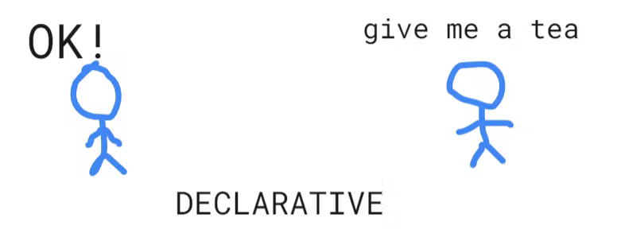
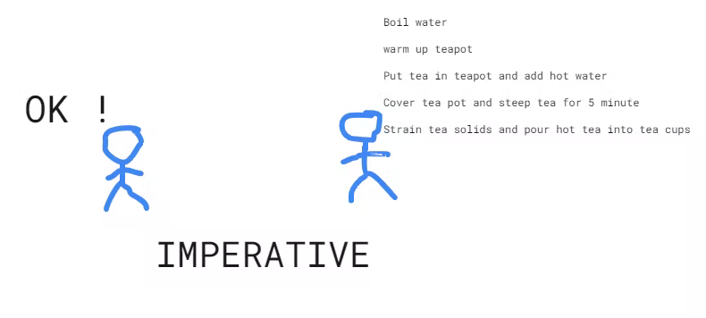
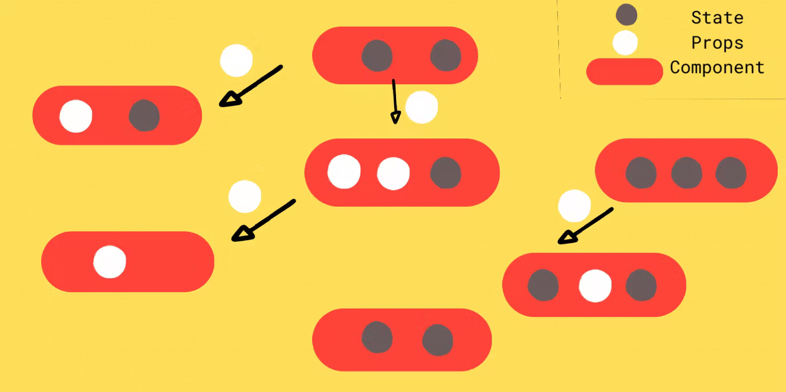
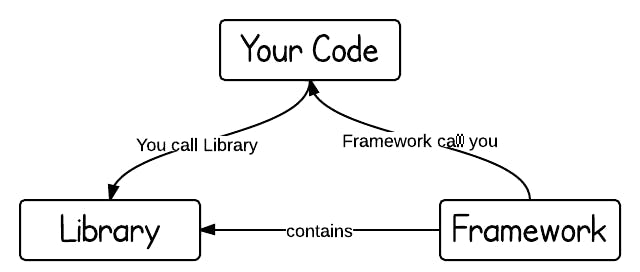
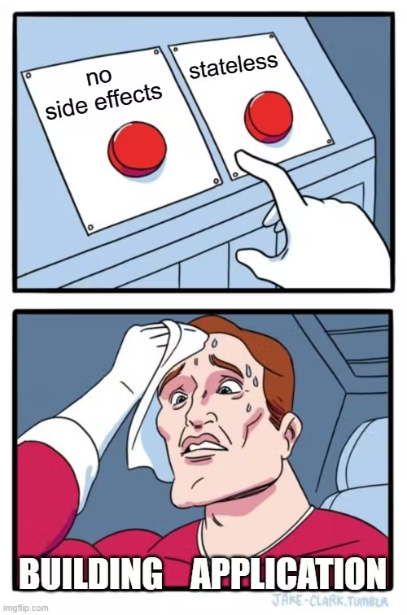
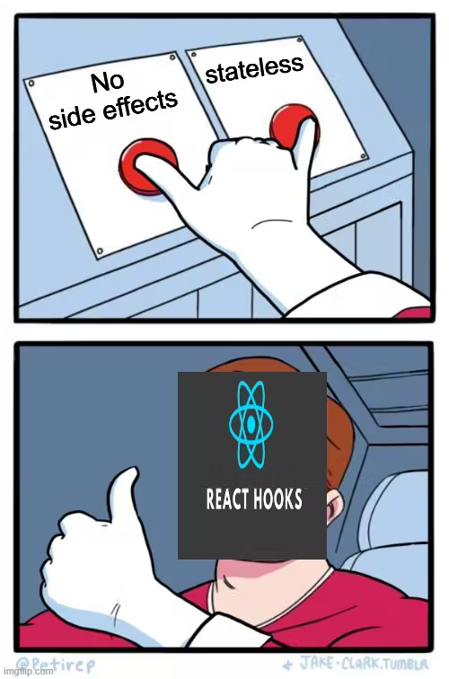

# Introduction

Understand what React is, what Problems it is solving and how.

## What Is React ⚛

- A Open source JavaScript library for building user interfaces.
- It is maintained by Meta and a community of individual developers and companies

## 3 Keys of React

- [x] Declarative
- [x] Component Based
- [x] Reusability
       
       
       
  > ## 1) Declarative
  >
  >  

_Declarative is telling what to do instead of how to do it_

In Vanilla JS, we need to do querySelector / getElementById and where to put the Id. But in React, we say This is my Browser. I want this UI , your job is to do it.

Lets Deep dive into it !

- You just tell React what do you want the DOM to look like, and just let React handle it from there

- This means we never interact with DOM, the UI is updated when we change the state.

- You describe the UI and someone else React implements it.

- We describe the solution instead of procedure.

_Benefits_

_More Readable_

_Easy to Debug_
 

  
  

 
 

> ## 2) Component Based
>
>  

We create independent component that are reusable , self contained and isolated.

In React.js, components can be Class Based or Function Based.

_Component is Javascript Function, which can take argument and always return JSX, has Private data as states and when has to interact with other components, it passes props (pass from top to down)_

**State** : like local variable to a function through a component

**Props** : pass as an argument to another component so that you can exchange data

_Props = Pass + Top to Down_

_Component should be Pure Function (for same input should produce same output)_

 

  

 
 

_How to Identify A Component_ ?

- Always return JSX
- Has Private data as State
- Has shared data with other component as props
   
   

> ## 3) Reusability
>
>  

- A reusable component is a piece of UI that can be used in various parts of an application to build more than one UI instance

- Save time by ensuring less code is written, development is faster, codebase is simpler, and maintenance is stress-free.

- example - button component display with different colors in several parts of our application.

 

> ## Library vs Framework

 

Library Refers to reusable code written by someone else that helps you perform some common tasks.

React can be easily plugged into an existing technology stack - and that’s the definition of a library.

The purpose of the library is to control the flow of the application. The purpose of the framework is to be in charge of the flow.

_Another reason for React to be a library and not a framework is the amount of flexibility it provides to users. It provides much more flexibility to users compared to a framework._

 

  

 
 

> ## Side Effects
 

*The Process of avoiding Pure Function. side effects change the phenomena of function from being Pure Function.*

- Each of the component as much as possible should be like Stateless / Pure Function (Should not have side effects)

- But, When we buillding an application, side effects is must. For Example: If you want to Click on button and want to change something with that click or If you want to make Network call, and change something

- So, without side effects, we won't be able to build something And also *we need to follow Paradigm of Stateless/Pure components*

 

>## Hooks

 

*We can move the stateful logic to another component and that thing is called Hooks*

*React Hooks are simple Javascript Function that we can use to separate out the reusable part from the functional component.*

It can be stateful and can manage side effects !

Hooks are reusable

Hooks are plain Javascript Function

With Hooks, we can take out component state management side effects everything into that so that your component can be stateless as much as possible

Hooks have access to react specific thing for managing state and side effects.

 

  

 

 

  

 

> ## State Updates should be Pure 

 

*The state updates should be immutable. It should create copy.* 

- [x] Do not change the original value.

- [x] Do not Change the arguments

- [x] Input and Output should always be fixed

- [x] At least one argument should have return value

- [x] Should not use or refer to global variables

 
 

> ## DOM Manipulation is Expensive 

 

If React had to update the whole DOM tree on every state change, then displaying 1000 elements would require about one billion comparisons.

To Solve this Problem, Reconcillation came up

 
 

> ## Virtual DOM  

 

A new Virtual DOM tree will be created whenever the element's state changes. 

In React, for every DOM object, there will be a corresponding in-memory copy created. This copy is called the *Virtual DOM*.

React performs Diffing Algorithm to calculate the update.

- First, React creates a copy of the Original DOM, known as the Virtual DOM. Each of the Virtual DOM nodes represents an element and the whole DOM is in a tree-like structure. For now, let’s call this Vtree1.

- Next, if there is a state update of an element, a new Virtual DOM is created. Let’s call this Vtree2.

- The diffing algorithm identifies the difference between Vtree1 and Vtree2. In this case, a subtree from the changed node has been identified as the diff. 
  
- Lastly, React updates the Original DOM with only these particular changes to keep it in sync.

 

>## Reconciliation 

 

This mechanism to differentiate one tree from another, to determine which part / parts need to be changed, and to update the original DOM is known as *Reconciliation*.

- React implements a heuristic algorithm for Diffing and it is based on two assumptions:

- Root elements of different types will produce different trees. But if the type of both the root element is the same then only the concerned child element is updated.
  
- By using a key prop, the developer can hint that which child elements may be stable across different renders.