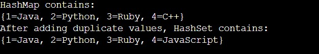

# Introduction
In Java, the most used Collection classes are HashMap and HashSet. 

# HashMap in JAVA

Both are used in the data structure.
The Java HashMap class implements the Map interface, which allows us to store key-value pairs with unique keys. If you try to insert the duplicate key, it will replace the associated key's element. The key index makes it simple to conduct actions such as updating, deleting, and so on. The java.util package contains the HashMap class.

In Java, HashMap is similar to the classic Hashtable class, however it is not synced. It also allows us to store null elements, however there should only be one null key. Since Java 5, it has been denoted as HashMap<K,V>, where K represents the key and V represents the value. It derives from AbstractMap and implements the Map interface.

## Remember the following:
- The Java HashMap stores values based on the key.

- Java HashMap contains only unique keys.
- Java HashMap can have one or more null keys and values.
- Java HashMap does not support sync.
- Java HashMap does not keep track of order.

## HashMap class declaration
```public class HashMap<K,V> extends AbstractMap<K,V> implements Map<K,V>, Cloneable, Serializable ``` 

- K: It is the type of keys stored by this map.
- V: It refers to the type of mapped values.

## Example Code
```
import java.util.*;  
public class Main{  
 public static void main(String args[]){  
   HashMap<Integer,String> map=new HashMap<Integer,String>();//Creating HashMap    
   map.put(1,"BMW");  //Put elements in Map  
   map.put(2,"Mercedes");    
   map.put(3,"Maruti");   
   map.put(4,"Amaze");   
       
   System.out.println("Iterating Hashmap...");  
   for(Map.Entry m : map.entrySet()){    
    System.out.println(m.getKey()+" "+m.getValue());    
   }  
 }  
}  
```
## Output


The elements in the map are inserted using the put() method.

To obtain the key and value elements, use the getKey() and getValue() methods. The getKey() and getValue() functions are part of the 'Map.Entry' interface. To obtain a Map object, we must use the Map interface's entrySet() method. Entry.
HashMap does not support the storage of duplicate keys. 

If you try to store a duplicate key with a different value, it will overwrite the value.

HashMap has a variety of Other Topics. These are available for reading.

- https://www.javatpoint.com/java-hashmap
- https://www.geeksforgeeks.org/java-util-hashmap-in-java-with-examples/?ref=gcse

# Activity 1

Please read the Problem Statement:

Given an array of integers nums, return the number of good pairs.

A pair (i, j) is called good if nums[i] == nums[j] and i < j.

### Example 1:

Input: nums = [1,2,3,1,1,3]

Output: 4

Explanation: There are 4 good pairs (0,3), (0,4), (3,4), (2,5) 0-indexed.

### Example 2:

Input: nums = [1,1,1,1]

Output: 6

Explanation: Each pair in the array are good.
### Example 3:

Input: nums = [1,2,3]

Output: 0
 
## Constraints:

1 <= nums.length <= 100

1 <= nums[i] <= 100

<details>
<summary> Hint </summary>
 
    for each i, finds all j where, j < i && nums[j] == nums[i];
</details>

<details>
<summary> Solution </summary>

 ```
public int numIdenticalPairs(int[] nums) {
        int res = 0;
        Map<Integer, Integer> map = new HashMap<>();
        for (int n : nums) {
            map.put(n, map.getOrDefault(n, 0) + 1);
            res += map.get(n) - 1;  // addtional pair can be formed btw n and all previous v == n;
        }
        return res;
    }
```
    Time Complexity:O(n)
 </details>
 
<hr />

# HashSet

The Java HashSet class is used to create a collection that stores data in a hash table. It derives from AbstractSet and implements the Set interface.

The following are the key features of the Java HashSet class:

- HashSet uses a process known as hashing to store the elements.
- HashSet only supports unique elements.
- HashSet accepts null values.
- The HashSet class does not support synchronisation.
- The insertion order is not preserved by HashSet. Elements are put here based on their hashcode.

- For search operations, HashSet is the ideal approach.4

## HashSet class declaration

```public class HashSet<E> extends AbstractSet<E> implements Set<E>, Cloneable, Serializable```  

## Sample Code
```
import java.util.*;  
class HashSet1{  
 public static void main(String args[]){  
  //Creating HashSet and adding elements  
    HashSet<String> set=new HashSet();  
           set.add("One");    
           set.add("Two");    
           set.add("Three");   
           set.add("Four");  
           set.add("Five");  
           Iterator<String> i=set.iterator();  
           while(i.hasNext())  
           {  
           System.out.println(i.next());  
           }  
    }  
}  
```
## Output


Duplicate elements are not permitted in HashSet.

## What does thread-safety mean in the context of hash sets?

Thread-safety indicates that the hash set can be utilised by several threads at the same time without causing any concurrency problems. This is significant because it implies you may securely utilise the hash set from many threads without fear of data corruption or race problems.

HashSet has a variety of Other Topics. These are available for reading.
- https://www.geeksforgeeks.org/hashset-in-java/#:~:text=The%20HashSet%20class%20implements%20the,class%20permits%20the%20null%20element.
- https://www.javatpoint.com/java-hashset

# Activity 2
1. How do you add a new hash set item?

<details>
<summary> Hint </summary>

    Using the add() method, you can add a new item to a hash set. This method will take as an argument the new item and add it to the set.
</details>
 
2. Can all items from one hash set be copied to another? If so, how so?
 
<details>
<summary> Hint </summary> 
 
    Yes,The addAll() method can be used to do this.
</details>
 
3. What is the most efficient approach to iterate through a hash set?

<details>
<summary> Hint </summary>
 
    The best approach to iterate over a hash set is to use an iterator. This allows you to go over each element in the set one at a time without worrying about the order in which they are stored.
 </details>

4. What happens if a duplicate element is added to a hash set?

<details>
<summary> Hint </summary>
    When you add a duplicate element to a hash set, it is simply ignored. Duplicate elements will not be stored in the hash set.
 </details>
 
 <hr/>
 
# HashMap VS HashSet
1. Hierarchy of Implementation

    The HashSet implements the Java Set interface, whereas the HashMap implements the Java Map interface. The Set interface extends the Collection interface, which is the Java Collection framework's top-level interface, whereas the Map interface does not extend any interface.

2. Storage of Data

    The HashSet stores data as objects, whereas the HashMap stores data as key-value pairs. We may obtain each value in HashMap by using the key.

    For example:

    ```
    HashSet<String> hs = new HashSet<String>();
    hs.add(“Crio”);
    ```
    ```
    HashMap<Integer, String> hm = new HashMap<Integer, String>();
    hm.put(1, “Crio”);
    ```

3. Identical Values

    HashSet does not enable you to add duplicate values. However, HasMap holds key-value pairs and supports duplicate keys but not duplicate values. When we add the duplicate key, it utilises the new value with that key.

4. Null Values

    HashSet supports a single null value; after inserting a null value, HashSet does not allow to add further null values. HashMap, on the other hand, supports various null values but only one null key.

5. Internal Implementation

    HashSet implements the HashMap internally, but HasMap does not implement a HashSet or other Set.

6. Elements Insertion Methods

    Both HashSet and HashMap include specified methods for storing and adding items. The put() function adds or stores elements in a HashMap, whereas the add() method adds or stores entries in a HashSet. While utilising the add method, we immediately supply the value in the form of an object.

    However, when using the put() function to add an element to a HashSet, we must give both the key and the value.

7. Elements Adding Mechanism

    To store the components, HashMap implements a hashing algorithm. On the other hand, the HashSet requires the HashMap object to store or add the components.

8. Performance

    HashSet's performance is slower than HashMap's. The HashMap is quicker than the HashSet because it utilises unique keys to retrieve the values. It associates each value with a key, and we can access these values more quickly by utilising keys throughout iteration.

    Because HashSet is entirely dependent on objects, retrieving values is slower.

9. Dummy Values

    As we know, HashSet adds components using the HashMap. In HashSet, we supply the items in the add(Object) function, and the parameter supplied in this method works as a key. Dummy values are used internally by Java for each value supplied to the add function.

## Example of HashMap
```
import java.util.HashMap;
public class Main {
  public static void main(String[] args) {
    // Creating a HashMap
    HashMap < Integer,
    String > hmap = new HashMap < Integer,
    String > ();

    //add elements to HashMap using put() method
    hmap.put(1, "Java");
    hmap.put(2, "Python");
    hmap.put(3, "Ruby");
    hmap.put(4, "C++");

    // Displaying HashMap elements
    System.out.println("HashMap contains:\n" + hmap);

    //Adding duplicate values to a HashMap
    hmap.put(4, "JavaScript");
    System.out.println("After adding duplicate values, HashSet contains:\n" + hmap);
  }
}
```
## Output


## Example of HashSet
```
import java.util.HashSet;
public class Main {
  public static void main(String[] args) {
    // Create a HashSet
    HashSet < String > hset = new HashSet < String > ();

    //add elements to HashSet using add() method
    hset.add("Java");
    hset.add("Python");
    hset.add("Ruby");
    hset.add("C++");

    // Displaying HashSet elements
    System.out.println("HashSet contains:\n" + hset);
    //Adding duplicate values
    hset.add("Java");
    hset.add("Ruby");
    System.out.println("After adding duplicate values, HashSet contains:\n" + hset);
    //Adding null values to HashSet
    hset.add(null);
    System.out.println("After adding null values for the first time, HashSet contains:\n" + hset);
    hset.add(null);
    System.out.println("After adding null values for the second time, HashSet contains:\n" + hset);
  }
}
```
## Output


## When should you use HashSet and HashMap in Java?

When we wish to keep the Collection object's uniqueness, we should use HashSet rather than Hashmap. In all other circumstances, we should prefer HashMap over HashSet as its performance is superior than HashSet.

# Activity 3
Go through these links Once:
- https://www.javatpoint.com/difference-between-hashset-and-hashmap
- https://www.geeksforgeeks.org/difference-between-hashmap-and-hashset/?ref=gcse
# Conclusion
We utilise both of these as a Collection class in Java.
HashSet implements the Set interface and functions internally similarly to HashMap, whereas HashMap implements the Map interface.

The HashMap should be always chosen to employ unless there is a requirement to protect the uniqueness of entries in the Collection.
