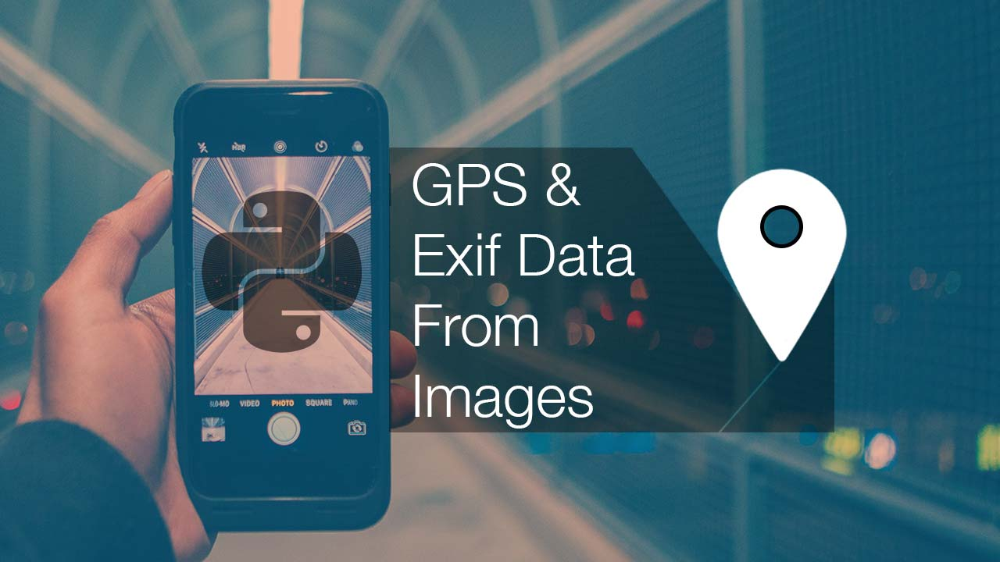
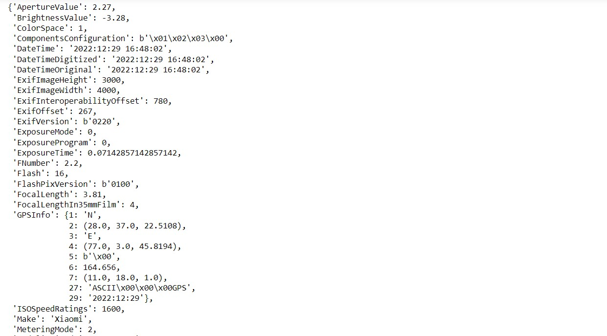
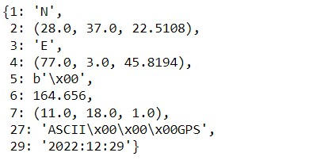
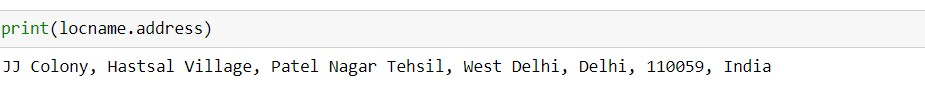
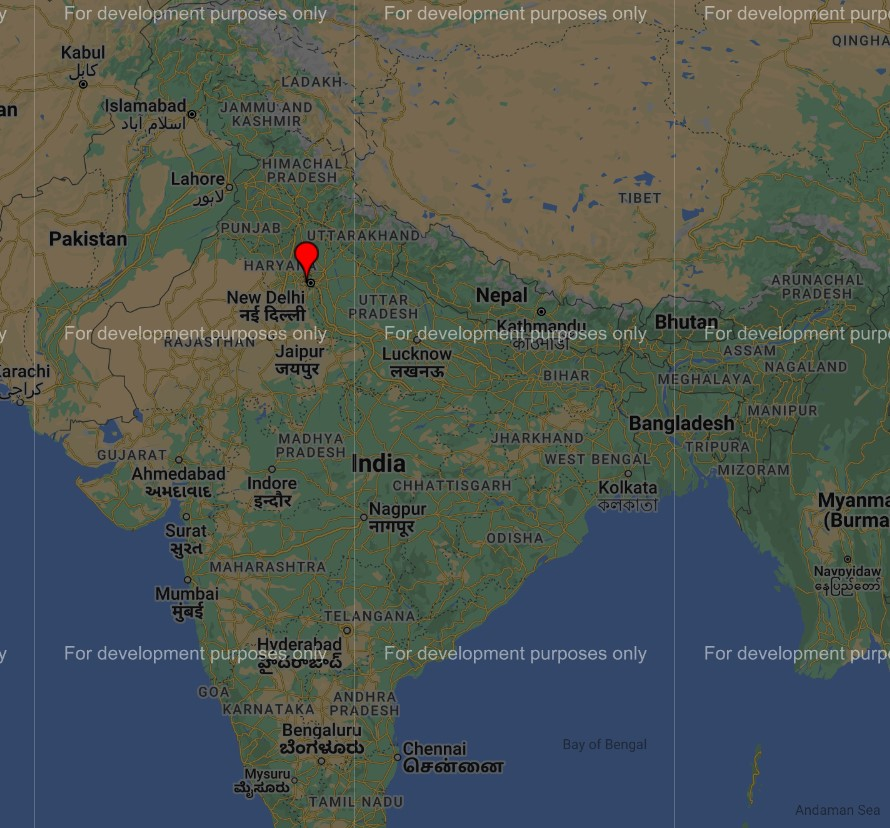

# Introduction

In this Byte, We'll see how to use Python to display GPS data extracted from an image's metadata.

# Pre-Requisites

Before we begin, there are several prerequisites for this micro-byte that you must have in order to completely comprehend and perform the tasks. I'm using a Windows machine here; for Linux and Mac, Check the technology documentation.

1. Install Python 3+

    https://www.python.org/downloads/

2. You should have a Python code editor such as Pycharm, Vscode, and so on.
I'm going to use a jupyter notebook inside of jupyter lab because it's a little more interactive and easier to work with, but as always, you can use whatever Development environment you're most comfortable with. 

# Knowledge Section
If you take an image with your phone most likely it will have a gps location tag.

Most of your photographs on your phone will have this if you have your phone set to default settings and haven't changed any gps tagging settings. If you capture a photograph with your phone, it will normally add a location tag to that image, so that your phone can tell you when you were in Spain for a week, for example.

We now have GPS data. We have to look at the metadata inside that image that we can't see right away, but this gps position tells us exactly where this image was taken, and it's not a special image. 

One thing I should mention is that when you upload an image like this one to Instagram, Facebook, or even Whatsapp or any messenger, the image goes through an algorithm that usually compresses the image, changes the image, and so on, so that when you send that image to someone, they don't receive the exact same image with the metadata.

# Activities

# Activity 1: Import python libraries and Load the Image

We're going to need a couple of python libraries: 

We'll need ***pillow, geopy, gmplot, pprint***.

### Why we use these Libraries here?
1. ***Pillow*** is used to load the image and obtain the metadata.

    Run the following command in **cmd** or **command prompt** to install pillow:
            
            pip install pillow

2. ***Geopy*** to get the actual address once we get the GPS location.

    Run the following command in **cmd** or **command prompt** to install geopy:
        
        pip install geopy

3. ***Gmplot*** is using to mark this place on a map and save it as an html file. 

    Run the following command in **cmd** or **command prompt** to install gmplot:
        
        pip install gmplot

4. **pprint** module allows you to **"pretty-print"** arbitrary Python data structures in a more understandable and well-formatted manner!

    Run the following command in **cmd** or **command prompt** to install pprint:
        
        pip install pprint

### You also need to know some Terminologies here:
1. ***Exif***
    - **EXIF stands for 'Exchangeable Image File Format'**, and it refers to the basic metadata that your camera generates and stores whenever you take a photo.
    - In photography, EXIF data is commonly used to refer to a photograph's aperture, shutter speed, ISO, metering, white balance, camera model, lens specifications, and so on.
    - EXIF data and other important information is stored in modern cameras and mobile phones.

2. ***Nominatim*** geocoder for OpenStreetMap data.

## What we intend to do?
We'll import the libraries listed above and load the Image in this Activity.

`We're going to use the image taken with the smartphone. Your phone's camera is set to default settings, and no GPS tagging settings have been altered.`

- Copy the file from 

    [How to use Python to Extract GPS data from Photos](./src/How_to_use_Python_to_Extract_GPS_data_from_Photos.ipynb) 
- fill in the necessary data.

### Micro Byte Challenge:
There are some minor challenges in each activity in the Python notebook, as stated in the notebook.

# Activity 2: Obtaining Metadata

We are fetching the information from the image and convert it into dictionary.

GPS data is saved in a dictionary and can be accessed via the key "GPSInfo" from the dictionary "exif".

&nbsp;
### **OUTPUT**: When you Execute *exif['GPSInfo'].

&nbsp;

The above GPS information is depicted in the image. We're looking for the coordinates of the location.

The coordinates of the location are in ***"exif['GPSInfo']"***

# Activity 3: Getting Coordinates

In this Activity, we are going to fetch the latitute and longitude of the "GPSInfo" and convert it into Degrees.

&nbsp;
### **OUTPUT**: When you Execute *exif['GPSInfo'].

&nbsp;

**2** and **4** are given in degrees, seconds, and minutes. For charting, this must be translated to degrees.

**1** and **3** specifies the location's direction. It is possible to use N for North and S for South. If **1** is S, a negative latitude value must be used.
Similarly, if **3** is W, a negative longitude value is to be utilised.

# Activity 4: Getting the Actual Address of the Image

Using reverse lookup, we may obtain the Address of a particular location.
For reverse lookup, the OpenStreetMap Nominatim API is used.

&nbsp;

### **OUTPUT**: Obtain the Address of a particular location.

&nbsp;

# Activity 5: Visualize the location on map

This is the last Activity of our Byte.
In this activity, we are gonna visualize the location on the map.
we are using gmplot to mark the location on map and save it as an html file.

&nbsp;

### **OUTPUT**: Obtain the Address of a particular location on Map in location.html.

&nbsp;

# Conclusion
Location attributes extracted from photos and supplementary metadata can aid in geospatial data analysis and modelling. 

This Byte will show you how to use the EXIF Python module to extract coordinates from photos.
# Reference
- https://python-visualization.github.io/folium/
- https://pillow.readthedocs.io/en/stable/
- https://nominatim.org/release-docs/latest/