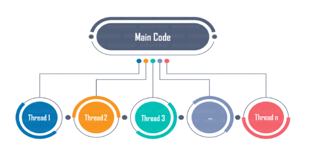
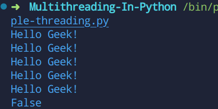
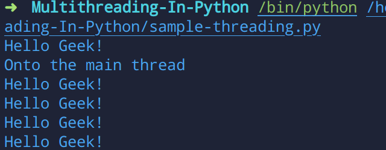
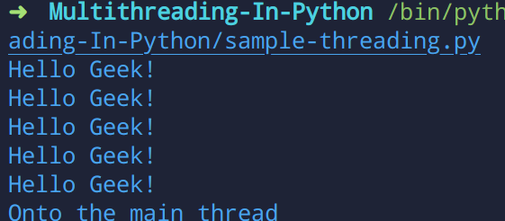

## Introduction
This microbyte demonstrates the basic concepts of threading in Python.
## Pre-requisites
- Python basic datastructures
## Table of contents
 - [What is Multi-threading](#what-is-multi-threading)
    - [Thread](#thread)
 - [Why to use Multi-threading](#why-to-use-multi-threading)
 - [Multithreading in Python](#multithreading-in-python)
    - [Thread class in Python](#thread-class-in-python)
    - [Creating a thread using run()](#creating-a-thread-by-calling-the-run-method)
    - [Creating a thread by overriding the __init__() method](#creating-a-thread-by-overriding-the-init-method)
 - [Difference between start() and run()](#difference-between-start-and-run)
 - [Activities](#activities)
 - [Conclusion](#conclusion)
 - [References](#references)
## What is Multi-threading
- It is a way of achieving multitasking by using threads.

### Thread
- A  thread is the smallest unit of execution.
- It is a sequence of instructions in a particular **program** which are independent of each other.
- A thread contains all this information in a **Thread Control Block (TCB)**:
    - Thread Identifier: Unique id (TID) is assigned to every new thread
    - Stack pointer: Points to thread’s stack in the process. Stack contains the local variables under thread’s scope.
    - Program counter: a register which stores the address of the instruction currently being executed by thread.
    - Thread state: can be running, ready, waiting, start or done.
    - Thread’s register set: registers assigned to thread for computations.
    - Parent process Pointer: A pointer to the Process control block (PCB) of the process that the thread lives on.
- Hence in Multi-threading a process is divided into several threads where each thread is executed concurrentle and contains its own register , local variables (that are stored in stack). All these threads share global variables (which are stored in heap) and the program code.

## Why to use Multi-threading

- The main reason for incorporating threads into an application is to improve its **performance**. 
- Multithreading is also less resource-intensive than running multiple processes at the same time. 

## Multithreading in Python
- To use multi-threading in python one has to import the `threading` module in python.
```
import threading as th
```
- The threading module functions on the objects of the [Thread](#thread-class-in-python) class.


### Thread class in Python
- The Thread class represents an **activity** that is run in a separate thread of control. 
- There are two ways to specify the activity:
    - By passing a callable object to the constructor.( or override the __init__() method of the `Thread` class )
    - By overriding the run() method in a subclass.
- Once an object of the `Thread` class is created a call to the start() method is sent. 
- The start() method the calls the run() method.
- Some common methods of the `Thread` class are : 
    - run() − The run() method is the entry point for a thread.
    - start() − The start() method starts a thread by calling the run method.
    - join([time]) − The join() waits for threads to terminate.
    - isAlive() − The isAlive() method checks whether a thread is still executing.
    - getName() − The getName() method returns the name of a thread.
    - setName() − The setName() method sets the name of a thread.

#### Creating a thread by calling the run() method 
```
from threading import Thread
from time import sleep

# function to create threads
def print_func(arg):
	for i in range(arg):
		print("Hello Geek!")
		sleep(1)

if __name__ == "__main__":
    thread  = Thread(target = print_func , args=(5,))
    thread.run()
    print(thread.is_alive()) 
```

Output of the above code: \


- One can see that as soon as the `run()` method stopped executing the thread became dead.
#### Creating a thread by overriding the __init__() method
```
import threading as th

# creating a child class of the Thread class 
class thread(th.Thread): 
    # overriding the init method of the Thread class
	def __init__(self, thread_name, thread_ID):
		th.Thread.__init__(self)
		self.thread_name = thread_name
		self.thread_ID = thread_ID
	def run(self):
		print(str(self.thread_name) +" "+ str(self.thread_ID))

thread1 = thread("thread-1", 1000)
thread2 = thread("thread-2", 2000);

thread1.start()
thread2.start()

print("End of program")

```
Output of the above program : 
```
thread-1 1000
thread-2 2000
End of program
```
## Difference between start() and run()

- Main difference is that when program calls `start()` method a **new** Thread is created and code inside `run()` method is executed in new Thread whereas in calling the `run()` method no new thread is created and the code inside the run() method will executed on the current thread.
- If one wants to perform a time-consuming task then always call the `start()` method otherwise your main thread will be **stuck** while performing a time-consuming task if you call `run()` method directly. 
- Let's create a thread using `start()` method:
```
from threading import Thread
from time import sleep

# function to create threads
def print_func(arg):
    for i in range(arg):
        print("Hello Geek!")
        sleep(1)
if __name__ == "__main__":
    thread  = Thread(target = print_func , args=(5,))
    thread.start()
    print("Onto the main thread")

```

Output : \

\
**One can see that as soon as the thread named `thread` sleeps for 1 second the `main` thread resumes running.** This prevents the code to stuck infinitely with the custom made thread.
- Let's run the same thread by using `run()` method : 
```
from threading import Thread
from time import sleep

# function to create threads
def print_func(arg):
    for i in range(arg):
        print("Hello Geek!")
        sleep(1)
if __name__ == "__main__":
    thread  = Thread(target = print_func , args=(5,))
    thread.run()
    print("Onto the main thread")

```
Output : \


**One can see that the main thread is only triggered once the execution of the previous thread finished.** Hence because of this reason it is a good practice to create new thread using the `start()` method
- Another difference is that for a thread the `start()` method can only be called once else will raise a `RuntimeError` if called more than once on the same thread object.
- A `run()` method can be called many times.
## Activities
### Activity 1 
- Print **Hello world** 10 times using multithreading in python
### Hint
> One can use the `target` and the `args` callable objects of the Thread class.

### Activity 2
- Create a thread in python as terminate the thread using join() method.

### Hint
> Create a new thread using the `start()` method then use the `join()` method.

### Activity 3
- Create a class in Python named `CustomThread`. This class overrides the __init__() method of the `Thread` class and sets the name of the threads which are created.

### Hint
> In order to override any method in a class one has to inherit the parent class first.
> For eg : class Child(Parent) and then override the method you want.

The following sets the `thread_name` property of the threads created.
```
def __init__(self, thread_name):
    threading.Thread.__init__(self)
 	self.thread_name = thread_name
```
### Activity 4
- Write a Python program to calculate the number of active threads.

### Hint
> In order to calculate the number of active threads one can use the `active_count` callable function in the `threading` module in python.
### Activity 5
- Write a program to calculate the cube and square of a particular number using two different threads.

### Hint
> Refer to https://www.geeksforgeeks.org/multithreading-python-set-1/

## Conclusion
Leaners learnt how to create and execute threads concurrently using multithreading in Python.

## References
- https://docs.python.org/3/library/threading.html
- https://www.geeksforgeeks.org/multithreading-python-set-1/
