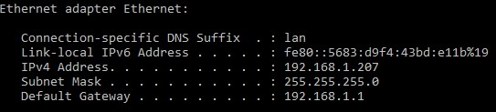
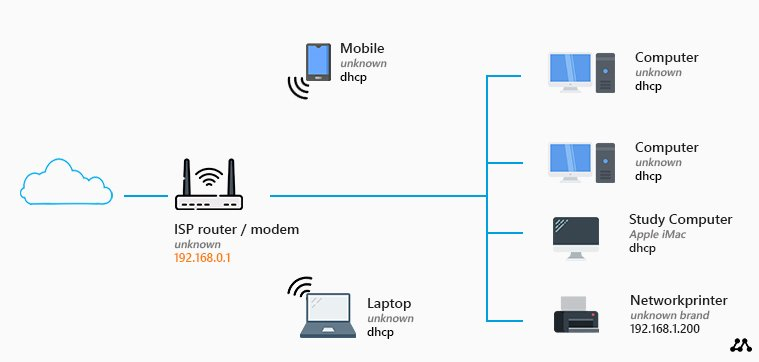
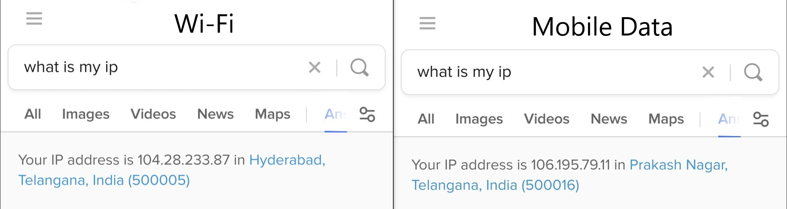
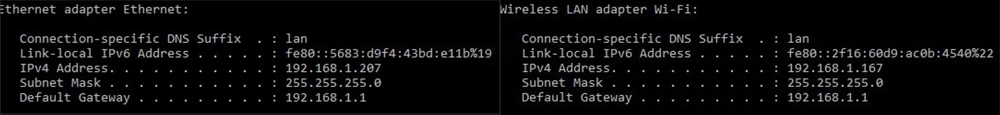
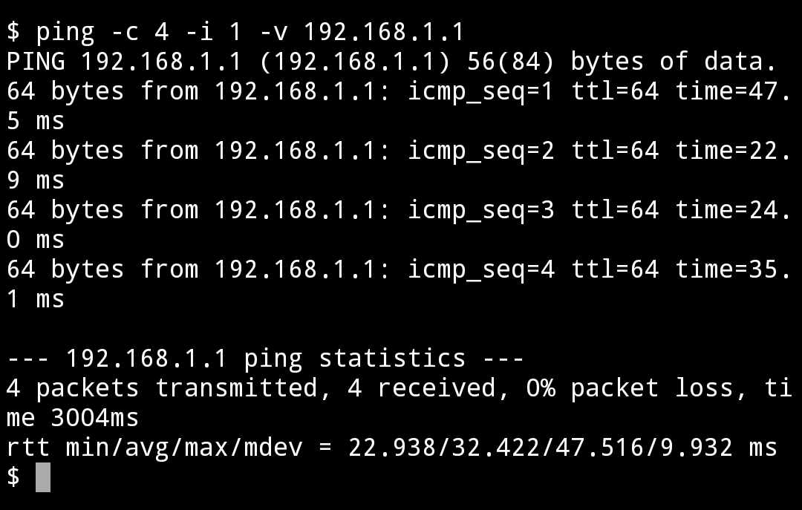
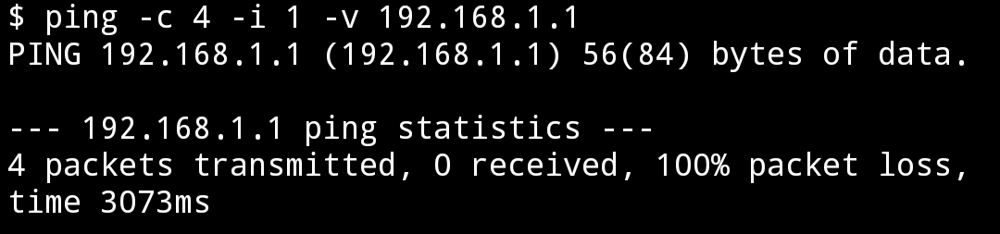

# **Introduction**

## **What is an IP addrress?**
An IP address (Internet Protocol address) is a unique numerical label assigned to each device connected to a computer network that uses the Internet Protocol for communication. It serves two main functions: host or network interface identification and location addressing. It is used to identify and locate devices on the network, and to route data to and from those devices.

## **What are the different types of IP addresses?**
There are two main versions of IP addresses in use today: **IPv4** and **IPv6**.

**IPv4** addresses are 32-bit numbers that are written in the a dotted decimal notation form as `a.b.c.d`, where each "a", "b", "c", and "d" is a number between 0 and 255. For example, the IP address "192.168.1.1" belongs to a network with the network identifier "192.168.1" and the host identifier "1". 

**IPv6** addresses are 128-bit numbers that are represented in hexadecimal notation as `a:b:c:d:e:f:g:h`, where each "a", "b", "c", "d", "e", "f", "g", and "h" is a hexadecimal number. For example, the IPv6 address "2001:0db8:85a3:0000:0000:8a2e:0370:7334" belongs to a network with the network identifier "2001:0db8:85a3" and the host identifier "0000:0000:8a2e:0370:7334".

In addition to these two types of IP addresses, there are also several special types of IP addresses that serve specific purposes. These include:

**Loopback addresses**: These are IP addresses that are used to refer to the local host, or the device itself. In IPv4, the loopback address is 127.0.0.1, and in IPv6, it is ::1.

**Private addresses**: These are IP addresses that are used on private networks and are not routable on the public internet. Private addresses are used to assign IP addresses to devices within a home, business, or other private network. There are three ranges of private addresses that are reserved for use on private networks: 10.0.0.0 to 10.255.255.255 (10.0.0.0/8), 172.16.0.0 to 172.31.255.255 (172.16.0.0/12) and 192.168.0.0 to 192.168.255.255 (192.168.0.0/16). In IPv6, private addresses are assigned from the following ranges: fc00::/7 and fd00::/8.

**Public addresses**: These are IP addresses that are used to connect devices to the public internet. Public addresses are assigned to devices by internet service providers (ISPs) and are used to route traffic to and from the device over the internet.

**Multicast addresses**: These are IP addresses that are used to send messages to multiple devices at the same time. Multicast addresses are used for applications that require the ability to send messages to multiple recipients simultaneously, such as video streaming and online gaming. In IPv4, multicast addresses are in the range 224.0.0.0 to 239.255.255.255. In IPv6, multicast addresses are in the range ff00::/8.

**Anycast addresses**: These are IP addresses that are used to send messages to the nearest of a group of devices. Anycast addresses are used for applications that require the ability to send messages to multiple recipients, but only need to send them to the nearest device in the group.

# **Activities**

## **Do you know your device's IP address?**
Modern search engines are really good at answering our queries, maybe they can answer this one too!

### **Activity 1**
Go to [DuckDuckGo](https://duckduckgo.com) and search "What is my IP address?"

Sample output:

**Question**: Is the IP address in the output a public IP address or a private IP address? 

Private IP Address

It is not a private IP address. IP addreses such as the one shown in the image above are public IP addresses. We can say this because it's not in any other type of IP address range.

Public IP Address

It is a public IP address. IP addreses such as the one shown in the image above are public IP addresses. We can say this because it's not in any other type of IP address range.

### **Activity 2**
Select your operating system below and follow the steps:

**Windows**:
* Open the Start menu and search for "cmd".
* In the search results, click on "Command Prompt" to open it.
* In the Command Prompt window, type the command ipconfig and press Enter.
* Look for the entry labeled "IPv4 Address" under the name of your network adapter. This is your IP address.

**macOS**:
* Open the Apple menu and click on "System Preferences".
* In the System Preferences window, click on the "Network" icon.
* In the Network window, select your network connection (e.g., Ethernet or Wi-Fi) from the left-hand side.
* On the right-hand side, you will see your private IP address under the "Status" heading.

**Linux**:  
* Open a terminal window.
* Type the command ip addr and press Enter.
* Look for the entry labeled "inet" under the name of your network interface (e.g., eth0 or wlan0). The number next to "inet" is your private IP address.

**Android**:
* Go to the "Settings" app on your Android device.
* Scroll down and tap on "Network & Internet".
* Tap on "Wi-Fi" to view the list of available Wi-Fi networks.
* Tap on the name of the Wi-Fi network you are currently connected to.
* Scroll down and tap on "Advanced options".
* Under the "IP address" heading, you will see your private IP address.

Sample output:

 

**Question**: Is the IP address in the output a public IP address or a private IP address?  

Private IP Address

It is a private IP address. IP addreses such as the one shown in the image above are private IP addresses. We can say this because it's in private IP address range.

Public IP Address

It is not a public IP address. IP addreses such as the one shown in the image above are private IP addresses. We can say this because it's in private IP address range.

## **Why is the IP address different even if the same device is being used?**
The IP address in the first activity is the public IP address of the network that your device is connected to (assigned to a rounter in a home network). When a device in a network makes a request to another device outside the network the request and response is handled by the router. As a result only the router is visible to the internet. This is Network Address Translation (NAT).

Network Address Translation (NAT) is a method of allowing multiple devices on a local network to share a single public IP address when accessing the internet. It works by assigning a unique private IP address to each device on the local network, and then translating the private IP addresses to the single public IP address when the devices make requests to the internet. NAT is typically used in home networks and small office networks to allow multiple devices to share a single internet connection without having to purchase multiple public IP addresses from an Internet Service Provider (ISP). NAT also provides a measure of security by hiding the private IP addresses of devices on the local network from external devices on the internet.

The IP address in the second activity is the private IP address assigned to your device by a router through the Dynamic Host Configuration Protocol (DHCP).

DHCP is a network management protocol used on Internet Protocol (IP) networks for automatically assigning IP addresses and other communication parameters to devices connected to the network using a client–server architecture. 

The following image shows a basic home network:

## **How to change the public IP address of device?**
Public IP addresses are typically dynamically assigned by ISPs (Internet Service Providers). Restarting the rounter might change the IP address which is assigned to it. One way to change the public IP address of a device is to connect to another network with a different public IP address.

### **Activity 3**
Check the public IP address of a network by using a search engine, then switch to another network and check the IP address again. You will observe that the IP address has changed. An easy way to switch on a mobile device would be to switch from Wi-Fi to mobile data.

Sample output:

The public IP address has changed after the switch from Wi-Fi to mobile data.

 

## **Can a private IP address be changed too?**
Typically private IP addresses are dynamic too so it is possible to change the private IP address of a device. Restarting the router will result in a change to the private IP address of the connected device after it reconnects.  

### **Activity 4**
Try restarting the router or change the made of connection from wired to wireless or vice versa (easier to do this with a laptop). You will observe that the private IP address of the device has changed.

Sample output:

The private IP address of the device has changed after the switch from wired (ethernet) connection to wireless (Wi-Fi) connection:

 

## **Introduction to Ping**
The ping command is a utility that is used to test the connectivity between two devices on a network. It works by sending a small data packet (information in ther internet is sent as data packets), called an "ICMP echo request," from one device to another, and then waiting for a response.

To use the ping command, you can open a command prompt or terminal window and type "ping" followed by the IP address or hostname of the device you want to test connectivity to. For example: ping 1.1.1.1

Sample output:

 

### **Activity 5**
Try pinging a device using it's internal IP address once from inside the network and once from outside the network. Observer the output.

Sample output:

Wi-Fi (In Network):

Mobile Data (Outside Network):

  

# **Summary**
Congratulations on completing this micro-byte. I hope this micro-byte has helped you understand a bit about the modern wonder that we call the internet.

# **References**
https://en.wikipedia.org/wiki/IP_address
