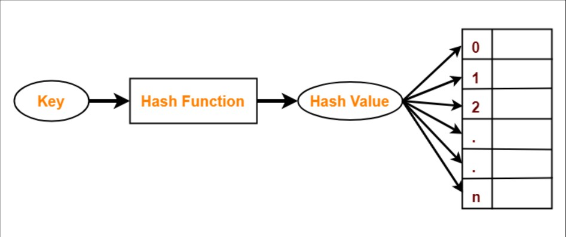
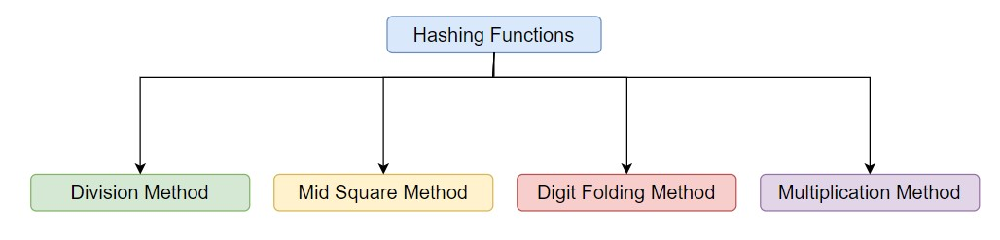
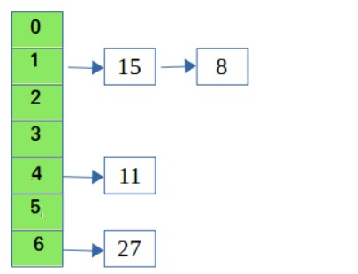

# Hashing

> **_Note:_** Before studying this topic you should have knowledge of basic programming of any OOP language, time and space complexity, arrays, strings and linked lists.

<br />

## **What is Hashing?**

`Hashing` is a technique through which data can be retrived and inserted quickly and easily. And the name of the data structure used to store the data using the hashing technique is called _`hash table`_ or _`hash map`_.

In hashing we store the data in the form of _`key`_ and _`value`_ pairs.

In `C++` and `Java` we can see the use of hashing in `Map` and in `Python` we can see the hashing used in `Dictionay`.

<br />

## **Need of Hashing**

The reason for which this technique was invented was because _`expensive insertion`_ in linked lists and _`retrieval`_ of data in array and linked lists.

Each time if we wanted to insert an element in linked list we had to traverse which took O(n) time [where n is the size of the linked list] and similarly when we wanted to retrive some data we had to go through each and every single element then compare it to find the desried result.

Similary, in arrays we had to go through each element to find the deseried element but insertion in array was not a problem.

But with the helping of hashing the time of inserting and searching an element was reduced to O(1).

<br />

## **Components of Hashing**


Before going to the types of hashing I would like to highlight major componenets of hashing:

I. _`Hash Code`_

> Hash Code or key is used to indentify element in hash table uniquely and insert and search an element in the same.

II. _`Hash Function`_

> Hash Function is the function which is used to calculate the Hash Code or index at which the element is present or will be inserted.
>
> A good hash function should have the following qualities in it:
>
> - It should be able to compute the hash code efficiently.
> - Should be able to uniformly distribute the key thorughout the hash table.
> - Should minimize collisions.
>
III. _`Collision Handling`_
> When two elements get the same hash code it must be taken care so that the existing element doesn't get replaced with the new element if it has not been intended.
> There are two ways of addressing the collision problems:
>
> - **_Chaining Method_**: In this method we store the elements in a linked list form whose hash code value was same.
>
> - **_Open Addressing_**: In this method we store the elements whose keys are same inside another hash table itself.
>   > **Note**: Hashing technique thinks that all the elements are unique unless and until specified that the element has to be replaced.

<br />

## **Types of hashing**



On the basis of method used to calculate the hash code we can classify the hashing technique into 4 categories.

I. _`Division Method`_

> This is most easiest and simple method to calculate the hash code. In this method the key is divided by the size of the hash table.
>
> **Formula to calculate hash code:**
>
> ```
> h(k) = k mod M
>
> where k is the key
> and M is the size of the hash table
> ```
>
> This method is the best suited for prime values of M.
>
> **Pros**
>
> - It is quite fast as only requires only single division operation
> - It is suitable for any value of M.
>
> **Cons**
>
> - This method leads to poor performance as consecutive keys map to consecutive values in the hash table.
> - Extra care has to be take care to choose the value of M.
>
II. _`Mid Square Method`_
> This hashing method is a very good hashing technique. It involves two steps to calculate the hash code:
>
> 1. The square value of the key is calculated
> 2. Extract the middle r digits of the value.
>
> **Formula to calculate the hash code:**
>
> ```
> h(k) = k*k
> where k is the key
> and the value of r can be decided based on the size of the table.
> ```
>
> **Pros**
>
> - The performance of this method is good as most all digits of the key value contribute to the generation of the hash code
> - The hash code is not dominated by the distribution of the top digit or the bottom digit of the original key value.
>
> **Cons**
>
> - The size of the key is the biggest problem in this method as the calculated squared value of the key will have double the number of digits which were present in the original key, thus creating a problem of storing the squared value.
> - There are quite good chances of the collisions as well.
>
III. _`Digit Folding Method`_
>
> In this method there are two steps:
>
> 1. Divide the key-value _k_ into a number of parts i.e. _k1, k2, k3, ….,kn_, where each part has the same number of digits except for the last part that can have lesser digits than the other parts.
> 2. Add the individual parts. The hash value is obtained by ignoring the last carry if any.
>
> **Formula for calculating the hash code:**
>
> ```
> k = k1, k2, k3, ...., kn
> s = k1 + k2 + k3 + .... + kn
> h(k) = s
> ```
>
> > **Note**: The number of digits in each part varies depending upon the size of the hash table. Suppose for example the size of the hash table is 100, then each part must have two digits except for the last part which can have a lesser number of digits.
>
IV. _`Multiplication Method`_
> In this method following steps are used to calculate the value of the hash code:
>
> 1. Choose a value 'A' such that 0 < A < 1
> 2. Multiply the key value with A
> 3. Extract the fractional part of kA
> 4. Multiply the result of the above step with the size of the table i.e., M
> 5. The result obtained is the rounded of to nearest smaller integer to obtain the hash code value.
>
> **Formula to calculate the hash code:**
>
> ```
> h(k) = floor(M * ((k * A) mod 1))
> where M is the size of the hash table
> 	  k is the key value
>       A is the constant whose value is between 0 and 1.
> ```
>
> **Pros**
>
> - The advantage of the multiplication method is that it can work with any value between 0 and 1, although there are some values that tend to give better results than the rest
>
> **Cons**
>
> - The multiplication method is generally suitable when the table size is the power of two, then the whole process of computing the index by the key using multiplication hashing is very fast
>
> These were the four types of hashing function that are used to calculate the hash codes.
>

After the hash code is generated and you place that value at the generated index. But what if there is already and element present at that index?

This is where the methods of handlling of collisions comes and solves out the problem. There exists two methods as discussed earlier, now we will see how it handles it and how to write the code for the same.

I. _**Seperate Chaining**_:

>
>
> In this method the problem of collision is handled with the help of link lists. The elements are stored in the form of a linked list so when ever an element with same index is seen it is appeneded in the linked list of the index value.
>
> For accessing the the value we go to the index value and search in the linked list.
>
> Now for the implementation part of this method we will follow the below steps:
>
> 1. Initialize a vector for the hash table with a size 'n'.
> 2. For addition of element in the hash table:
>    - Get the hash code for the element.
>    - Push the element at the calculated index of the key.
> 3. For searching the element in the hash element:
>    - Get the index of the element
>    - Go the index and then traverse the array for the element. If the elementis found the return 'Element Found' or else return 'Element Not Found'.
> 4. For deletion of the element:
>    - Generate the index of the key to be deleted.
>    - Search for the element if the element is found then remove the element using the dedicated function in each language ( for example in CPP we have `erase()`).
>
> ### **Activity 1**
>
> > Now lets try coding the same yourself. For that open the code editor and try implementing the above algorithm.
> > After implementing it on your own check it by clicking below.
> >
> > [Code](./codes/seperateChaining.md)
>
> **Pros**
>
> 1. Simple to implement.
> 2. We can add up as much elements we want to add up
> 3. Less sensitive to the hash function or load factors.
>
> **Cons**
>
> 1. The cache performance of chaining is not good as keys are stored using a linked list.
> 2. Some Parts of the hash table are never used
> 3. search time can become O(n) in the worst case
> 4. Uses extra space for links

II. _**Open Addressing**_

> In Open Addressing, all elements are stored in the hash table itself. So at any point, the size of the table must be greater than or equal to the total number of keys. This approach is also known as closed hashing.
>
> This method is entirely based upon probing which means we will be searching for the empty slot everytime collision occurs.
>
> There are three types of hashing techniques:
>
> 1. _`Linear Probing`_
>
>    In this method we search for the empty slot sequentially from the original location if that location is found to be occupied.
>
>    Following steps are followed in the linear probing method:
>
>    - Calculate the hash code of the element.
>    - If `insertion` is required then we check whether the slot is empty or not. If not then we search iteratively for an empty slot and insert into the empty as soon as it is found. If no empty slot is found then we return that the 'All slots full'.
>    - If `searching` is being done then we search for the element in the original index, but if the element doesn't exists there then we again go on iteratively searching for the same until we reach the same index or find the element.
>    - If `deletion` is being done we first search for the element and then delete the element if found and mark the slot as empty so that we can insert new element at the slot.
>
>    ```
>    The function used for rehashing is as follows: rehash(key) = (n+1) % tableSize.
>    ```
>
>    **Pros**
>
>    - Requires very less memory
>    - Simpler to implement
>
>    **Cons**
>
>    - Causes primary clustering i.e., large blocks of occupied cells within the hash table.
>    - Makes probe sequence longer and lengthier.
>
> 2. _`Quadratic Probing`_
>
>    In this method we search for the empty slot by increasing the hash value propotionally if the original location is occupied. This method is also known as **`mid-square method`**.
>
>    In this method we follow the similar method as linear probing but the only difference is instead of incrementing by value i, we increament the by square of i.
>
>    ```
>    The function used for rehashing is as follows: rehash(key) = (hash(key) + i * i) % tableSize.
>    ```
>
>    **Pros**
>
>    - Easier to implement than double hashing
>    - Over came the problem of primary clustering.
>
>    **Cons**
>
>    - Has problem of secondary clustering and this occurs when two keys have same hash code and same probe sequence.
>    - Probing sequences doesn't probe all the locations
>
> 3) _`Double Hashing`_
>
>    Double hashing is a technique that reduces clustering in an optimized way. In this technique, the increments for the probing sequence are computed by using another hash function. We use another hash function hash2(x) and look for the i \* hash2(x) slot in the ith rotation.
>
>    In this method we follow the similar method as linear probing but the only difference is instead of incrementing by value i, we increament the original value by another hash value multplied by i.
>
>    ```
>    The function used for rehashing is as follows: rehash(key) = (hash(key) + i * i) % tableSize.
>    ```
>
>    **Pros**
>
>    - Over comes the problem of clustering
>
>    **Cons**
>
>    - Difficult to implement
>    - Can cause thrashing

### **Activity 2**

Lets try a sample problem:

**Question:** Given an unsorted integer array, find a pair with the given sum in it.

**Sample**

> **Input:** nums = [8, 7, 2, 5, 3, 1], taget = 10
>
> **Output:** Pair found (8, 2) or Pair found (7, 3)

Try this question on you own and compare your solution and the given [Solution](./codes/Activity2.md)

If you want to practice more questions here is the link to more problems on hashing

[Question List 1](https://medium.com/@codingfreak/hashing-problems-in-data-structures-c41b77a5119a)

[Question List 2](https://practice.geeksforgeeks.org/explore?page=1&category[]=Hash&curated[]=1&sortBy=submissions&curated_names[]=SDE%20Sheet&utm_medium=newui_home&utm_campaign=first_section)

>

## **Summary**
___
After going through this microbyte you are now good enough to use the hashing methods in your programs for your applications and DSA problems.

## Biblography
___
- https://www.geeksforgeeks.org/what-is-hashing/?ref=lbp
- https://www.tutorialspoint.com/state-the-advantages-and-disadvantages-of-collision-resolution-strategies
- https://medium.com/@codingfreak/hashing-problems-in-data-structures-c41b77a5119a
- https://www.geeksforgeeks.org/hash-functions-and-list-types-of-hash-functions/
