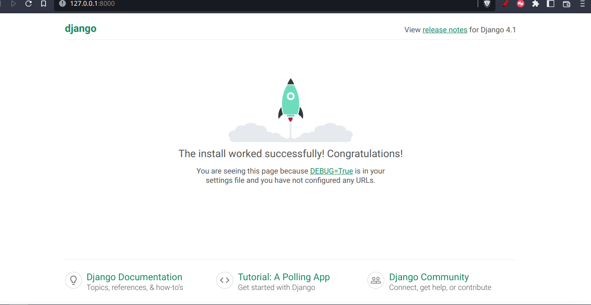
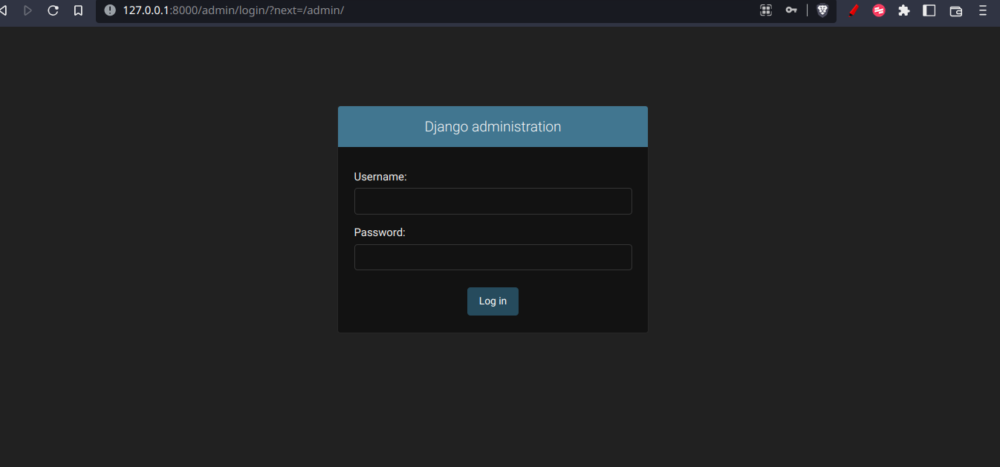
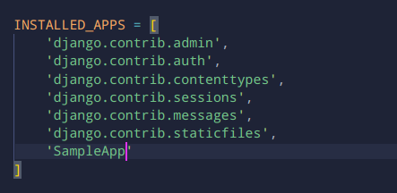
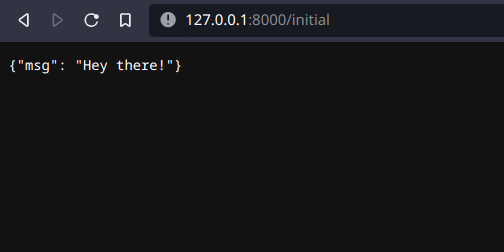

## Introduction
The microbyte targets to illustrate how to  create a simple backend project in Django.

## Pre-requisites
- Datastructures in Python
- Different types of HTTP request like (GET , POST , PATCH , etc)
- Running commands on the terminal

## Table of Contents
- [What is Django](#what-is-django)
- [How does Django Works?](#how-does-django-works)
- [Getting Started with Django](#installing-django)
- [Next Steps](#next-steps)
- [Conclusion](#conclusion)
- [References](#references)

## What is Django?
- Django is a Python framework that makes it easier to create web sites using Python.
- Django takes care of the difficult stuff so that you can concentrate on building your web applications.
- Django emphasizes reusability of components, also referred to as DRY (Don't Repeat Yourself), and comes with ready-to-use features like login system, database connection and CRUD operations (Create Read Update Delete).
## How does Django works?
- Django follows the MVT design pattern (Model View Template).
    - **Model** - The data you want to present, usually data from a database.
    - **View** - A request handler that returns the relevant template and content - based on the request from the user.
    - **Template** - A text file (like an HTML file) containing the layout of the web page, with logic on how to display the data.
## Getting Started with Django
### Installing Django 
- To install any python package one has to use `pip` which a package manager for Python.
- To install Django one can use the command `pip install Django`
- Once the installation is done one can check the version of Django by using the command : `python -m django --version`

#### Activity 1 
- Install Django 2.2 version using pip.

    
Click to see hint

    In order to install a particular version of any package one can run : <b>pip install <i>{package-name}</i>==<i>{version number}</i></b>

### Creating a project in Django
- There are two main terminologies when it comes to django : 
    - `Project` : The main directory which is created once the server starts successfully.
    - `App` : One or many Apps (or even zero) make a project in Django.
- So , the first step is to create a project.
- One can run the following command : \
`django-admin startproject <Project-name>`
- Refer to this `SampleProject` created : [Sample Project](SampleProject)

### Starting Django Server
- Once the project is created , we can start the server! (Django makes it all so easy 😊)
- The command to start the server is `python manage.py runserver`
- The default template provided by Django is rendered when the server starts : \

#### Activity 2 
- The default port that django uses for running the server is port `8000`. 
- Run the server on a different port `8080`

    
Click to see hint

    In order to change the server port provide as additional port argument when running the server.
    For example <code>python manage.py runserver <i>Port Number</i></code>

#### Activity 3 
- A super user is a special user in Django that can manage the database and all the social profiles in a particular project.
- The activity is to create a super user of your project in Django

    
Click to see hint

    manage.py is a very important file in a django project. One can pass a <b>createsuperuser</b> argument to the command <b>python manage.py</b>

### Django Admin panel
- Django provides a default django admin panel where a particular user can login and modify the `models` , `user data` , `social groups` of the project.    
- One can access the admin portal at : `http://127.0.0.1:8000/admin` uri. 

### Creating an APP in django
- Let's create an app in the `SampleProject`
- To create an app one can use the command `python manage.py startapp SampleApp` where **SampleApp** is the name of the app created.
- Once the app is created one has to add the app name in the `INSTALLED_APPS` list present in the **settings.py** file.

#### Activity 4 : Creating an API endpoint in Django
- Once the server is up and running lets create an API endpoint called `home`.
- To create APIs Django uses `views.py` file present in the app created.
- This API will return a hashmap containing the basic information of a student like : `first_name` , `last_name` , `age` , etc
- One can use `JSONRESPONSE` package to render a json response in django.
- For reference : [refer to the sample views.py](SampleProject/SampleApp/views.py)

#### Activity 5 : Defining URLS in the app
- Urls are defined in the `urls.py` file which is present in the base directory.
- Make a uri : `/initial` which will trigger the `home` API created in activity 4.
- One can refer to this sample `urls.py` file to understand how the api paths are defined : [urls.py](SampleProject/SampleProject/urls.py)

### Triggering the API
- Let's trigger the `home` API by sending a `GET` hit from the browser (one can also use POSTMAN): 

## Next Steps
Learning should never be stopped!
One can learn the following advanced concepts in Django
- Working with Migrations in Django
- Creating templates in Django
- Creating models in Django
- Adding Authentication in Django by : 
    - session-based authentication
    - token-based authentication
    - JWT authentication
    - Third party authentication (like : OAuth via Google , GitHub etc)

## Conclusion
In this microbyte learners learnt how to create a django project , how to start a server , how to create API endpoints in Django.

## References
- https://docs.djangoproject.com/en/4.1/