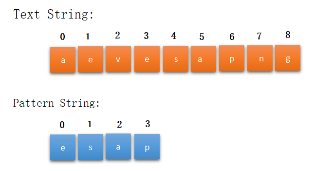

# Introduction
Welcome to the string search algorithm Byte! This Byte provides a variety of algorithms for efficiently searching for a pattern within a larger body of text. String search algorithms are an essential tool in computer science, with applications ranging from text editors and software development tools to data mining and information retrieval.

In this Byte, you will find a range of string search algorithms to suit different needs and trade-offs, including:

### What is Algorithm?
An algorithm is a set of step-by-step instructions for performing a task or solving a problem. In computer science, an algorithm is a set of instructions that a computer can follow to perform a specific task, such as searching a database, sorting a list, or evaluating a mathematical expression.

Algorithms are an essential part of computer science and are used to perform a wide range of tasks, from simple to complex. They are used in many different areas of computing, including data processing, software engineering, and artificial intelligence.

# Activities

# Activity 1: What is String Search Algorithm

In computer science, string search algorithms, also called string matching algorithms, are an important class of string algorithms that try to find a place where one or several strings (also called patterns) are found within a larger string or text. There are many different algorithms for performing string searches, each with its own trade-offs in terms of efficiency and the type of matching it can do.

Some common scenarios where string search algorithms are used include:

Searching a body of text for a specific word or phrase
Searching a database of strings for records that match a particular pattern
Searching source code for variable or function names that match a particular pattern
Searching log files for errors or other specific patterns of interest
There are many different factors that can influence the choice of a string search algorithm, including the size and characteristics of the text being searched, the length and complexity of the pattern, and the desired performance and efficiency of the search.

There are many different types of string search algorithms, including:

- ***Exact string matching algorithms***: These algorithms try to find an exact match between the pattern and the text. The most basic example of this is the brute-force string matching algorithm, which checks all possible substrings of the text to see if they match the pattern.
- ***Approximate string matching algorithms***: These algorithms allow for some degree of error or "fuzziness" in the matching process. They are used when an exact match is not required or when the text being searched may contain errors. Examples include the Levenshtein distance and the hamming distance.
- ***Regular expression matching algorithms***: These algorithms use a special syntax for representing patterns that allows for more flexible and powerful matching. They are used in applications such as text editors and programming languages.

### Micro-Challenge:

- What are some common uses of string search algorithms? 

Solution

    String search algorithms are used in a wide range of applications, including searching a body of text for a specific word or phrase, searching a database of strings for records that match a particular pattern, searching source code for variable or function names that match a particular pattern, and searching log files for errors or other specific patterns of interest.

- How do string search algorithms work? 

Solution

    
    The specific details of how a particular string search algorithm works can vary, but in general, they involve comparing the pattern to substrings of the text being searched and checking for a match. Some algorithms use specialized techniques such as hashing or a "failure" table to improve performance.

- What are some factors to consider when choosing a string search algorithm? 

Solution

    Some factors to consider when choosing a string search algorithm include the size and characteristics of the text being searched, the length and complexity of the pattern, and the desired performance and efficiency of the search. Other considerations may include the types of matching supported (e.g. exact, approximate, or regular expression matching) and the availability of libraries or other resources for implementing the algorithm.

&nbsp;

# Activity 2: KMP Algorithm

The Knuth-Morris-Pratt (KMP) algorithm is a string search algorithm that uses information about the pattern being searched for to avoid matching substrings that will ultimately fail. It was invented by Donald Knuth, James H. Morris, and Vaughan Pratt in 1977.

The basic idea behind the KMP algorithm is to preprocess the pattern to create a table of "failure" values, which tell the algorithm how to back up in the event of a mismatch. The algorithm then uses this table to skip over substrings that it knows will not match the pattern, reducing the number of comparisons that need to be made.

The KMP algorithm has a time complexity of O(n) in the worst case, where n is the length of the text being searched. This makes it more efficient than the brute-force string matching algorithm, which has a time complexity of O(nm) in the worst case. The space complexity of the KMP algorithm is O(m), where m is the length of the pattern, since it stores the failure table in an array.

The KMP algorithm is often used as a faster alternative to the brute-force string matching algorithm, especially in cases where the pattern is relatively long or the text being searched is very large. It is also used as a building block for other string search algorithms and data structures, such as the Aho-Corasick algorithm and the suffix array.

 Algorithm 

    
    LPS ← ComputeLPS(Pattern) {build LPS table function}
    i ← 0
    j ← 0
    n ← string length
    m ← pattern length
    while i < n do
        if pattern[j] = string[i] then  {if the characters are a match}
            i ← i + 1
            j ← j + 1
        if j = m then  {j pointer has reached end of pattern}
            return i - j {index of the match}
                j ← LPS[j - 1]
                
        else if i<n && pattern[j] != string[i] then {no match}
                if j > 0
                j ← LPS[j - 1]
            else
                i ← i + 1
    return -1 {no match}
    

### Advantages of the KMP algorithm
- A very obvious advantage of the KMP algorithm is it's time complexity. It's very fast as compared to any other exact string matching algorithm.
- No worse case or accidental inputs exist here.
### Disadvantage of the KMP algorithm
- The only disadvantage of the KMP algorithm is that it is very complex to understand.
### Applications of the KMP Algorithm
It's uses are :

- Checking for Plagiarism in documents etc
- Digital Forensics
- Bioinformatics and DNA sequencing
- Spelling checkers
- Spam filters
- Search engines, or for searching content in large databases
- Intrusion detection system

### Micro-Challenge:
- How does the KMP algorithm work, and how does it use a "failure" table to improve performance?

Solution

    The KMP algorithm works by preprocessing the pattern to create a table of "failure" values, which tell the algorithm how to back up in the event of a mismatch. The algorithm then uses this table to skip over substrings that it knows will not match the pattern, reducing the number of comparisons that need to be made.

- What is the time and space complexity of the KMP algorithm, and how does it compare to other string search algorithms?

Solution

    The time complexity of the KMP algorithm is O(n) in the worst case, where n is the length of the text being searched. This is more efficient than the brute-force string matching algorithm, which has a time complexity of O(nm) in the worst case. The space complexity of the KMP algorithm is O(m), where m is the length of the pattern, since it stores the failure table in an array.

- How can the KMP algorithm be implemented in a practical system, and what are the trade-offs involved in doing so?

Solution

    The KMP algorithm can be implemented in a practical system by using an efficient implementation of the failure table construction algorithm and by using an optimized version of the string matching loop. The trade-offs involved include the time and space required to build the failure table versus the time saved during the actual search.

- What are some common applications of the KMP algorithm in computer science and industry?

Solution

    The KMP algorithm has a wide range of applications in computer science and industry, including text editors, software development tools, and data mining. It is also used as a building block for other string search algorithms and data structures, such as the Aho-Corasick algorithm and the suffix array.

# Activity 3: Rabin Karp Algorithm

The Rabin-Karp algorithm is a string search algorithm that uses a hashing function to quickly search for a pattern within a body of text. It was invented by Michael O. Rabin and Richard M. Karp in 1987.

The basic idea behind the Rabin-Karp algorithm is to hash the pattern and each substring of the text being searched and then compare the hash values. If the hash values match, it is likely (but not certain) that the pattern and the substring are the same. If the hash values do not match, the algorithm can quickly move on to the next substring without having to perform a slower, character-by-character comparison.

The Rabin-Karp algorithm has a time complexity of O(n+m) in the worst case, where n is the length of the text and m is the length of the pattern. This makes it more efficient than the brute-force string matching algorithm, which has a time complexity of O(nm). However, the Rabin-Karp algorithm is more sensitive to the choice of the hashing function and may produce more false positives (i.e. false matches) than other algorithms.

Algorithm

    
    n = t.length
    m = p.length
    h = dm-1 mod q
    p = 0
    t0 = 0
    for i = 1 to m
        p = (dp + p[i]) mod q
        t0 = (dt0 + t[i]) mod q
    for s = 0 to n - m
        if p = ts
            if p[1.....m] = t[s + 1..... s + m]
                print "pattern found at position" s
        If s < n-m
            ts + 1 = (d (ts - t[s + 1]h) + t[s + m + 1]) mod q
    

### Micro-Challenge:
- How does the Rabin-Karp algorithm work, and how does it use a hashing function to improve performance?

Solution

    The Rabin-Karp algorithm works by first hashing the pattern and then sliding a window of text through the larger body of text, hashing each substring as it goes. If the hash values match, it performs a slower, character-by-character comparison to confirm the match.

- What are the time and space complexity of the Rabin-Karp algorithm, and how does it compare to other string search algorithms?

Solution

    The time complexity of the Rabin-Karp algorithm is O(n+m) in the worst case, where n is the length of the text and m is the length of the pattern. This is more efficient than the brute-force string matching algorithm, which has a time complexity of O(nm). The space complexity of the Rabin-Karp algorithm is O(m), since it only stores the hash values of the pattern and the substrings of the text.

- How does the Rabin-Karp algorithm handle issues such as Unicode characters, case sensitivity, and multilingual texts?

Solution

    The Rabin-Karp algorithm can handle Unicode characters, case sensitivity, and multilingual texts by using a suitable hashing function that takes these factors into account. For example, a hash function that treats uppercase and lowercase characters as distinct might be used for case-sensitive matching.

- What are some potential drawbacks or limitations of the Rabin-Karp algorithm, and how can they be addressed?

Solution

    Some potential drawbacks or limitations of the Rabin-Karp algorithm include its sensitivity to the choice of the hashing function (which can affect the number of false positives), its lack of support for regular expressions or other advanced pattern matching, and its inability to handle certain types of errors or insertions/deletions in the text. These limitations can be addressed by using a different string search algorithm or by modifying the Rabin-Karp algorithm to incorporate additional features.

# Activity 4: Difference between RabinKarp and KMP algorithm

- The Rabin-Karp algorithm and the Knuth-Morris-Pratt (KMP) algorithm are both string search algorithms that are used to find a pattern within a larger body of text. However, they work in different ways and have different trade-offs in terms of efficiency and performance.

- One key difference between the Rabin-Karp algorithm and the KMP algorithm is the way they handle mismatches. The Rabin-Karp algorithm uses a hashing function to quickly compare the pattern and the substrings of the text being searched. If the hash values do not match, the algorithm moves on to the next substring. The KMP algorithm, on the other hand, uses a "failure" table to back up in the event of a mismatch and skip over substrings that it knows will not match the pattern.

- Another difference is the time and space complexity of the algorithms. The Rabin-Karp algorithm has a time complexity of O(n+m) in the worst case, where n is the length of the text and m is the length of the pattern. The KMP algorithm has a time complexity of O(n) in the worst case. The space complexity of the Rabin-Karp algorithm is O(m), while the space complexity of the KMP algorithm is O(m) as well.

- Finally, the Rabin-Karp algorithm is more sensitive to the choice of the hashing function and may produce more false positives than the KMP algorithm. However, the KMP algorithm does not support advanced pattern matching features such as regular expressions.

| Property | Rabin-Karp Algorithm | KMP Algorithm |
| --- | --- | --- |
|Mismatch handling|Uses a hashing function to quickly compare substrings|Uses a "failure" table to back up and skip over substrings|
|Time complexity (worst case)|O(n+m)|O(n)|
|Space complexity|O(m)|O(m)|
|False positives (i.e. incorrect matches)|More likely|Less likely	|
|Support for advanced pattern matching (e.g. regex)	|No|No|

&nbsp;
### Micro-Challenge:
- How do these algorithms work? 

Solution

    
    The Rabin-Karp algorithm uses a hashing function to quickly compare the pattern and the substrings of the text being searched. If the hash values do not match, the algorithm moves on to the next substring. The KMP algorithm uses a "failure" table to back up in the event of a mismatch and skip over substrings that it knows will not match the pattern.

- What is the time complexity of these algorithms? 

Solution

    The Rabin-Karp algorithm has a time complexity of O(n+m) in the worst case, where n is the length of the text and m is the length of the pattern. The KMP algorithm has a time complexity of O(n) in the worst case.

- What is the space complexity of these algorithms? 

Solution

    The space complexity of the Rabin-Karp algorithm is O(m), where m is the length of the pattern. The space complexity of the KMP algorithm is also O(m).

- Are these algorithms more or less likely to produce false positives (i.e. incorrect matches)? 

Solution

    The Rabin-Karp algorithm is more likely to produce false positives than the KMP algorithm. However, the KMP algorithm does not support advanced pattern matching features such as regular expressions.

&nbsp;
# Conclusion 
In conclusion, string search algorithms are an important and widely-used class of algorithms in computer science, with applications ranging from text editors and software development tools to data mining and information retrieval. 
We hope you have found our Byte useful and appreciate your feedback. If you have any questions or suggestions for improvement, please don't hesitate to reach out.

&nbsp;

# Reference
- "Introduction to Algorithms" by Thomas H. Cormen, Charles E. Leiserson, Ronald L. Rivest, and Clifford Stein (MIT Press, 2009): This classic textbook provides an in-depth look at string search algorithms and other algorithms used in computer science.
- "String Matching: An Aid to Bibliographic Search" by M. O. Rabin and Richard M. Karp (Communications of the ACM, 1987): This paper introduces the Rabin-Karp algorithm, a widely-used string search algorithm.
- "A Fast String-Searching Algorithm" by Donald Knuth, James H. Morris, and Vaughan Pratt (SIAM Journal on Computing, 1977): This paper introduces the Knuth-Morris-Pratt (KMP) algorithm, another widely-used string search algorithm.

