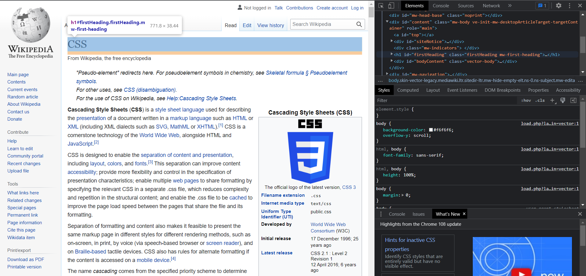
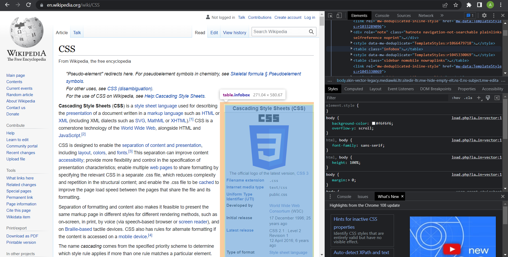
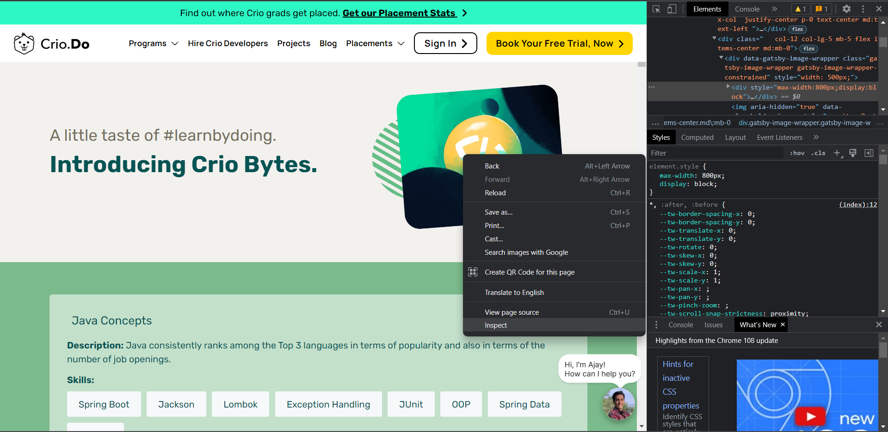
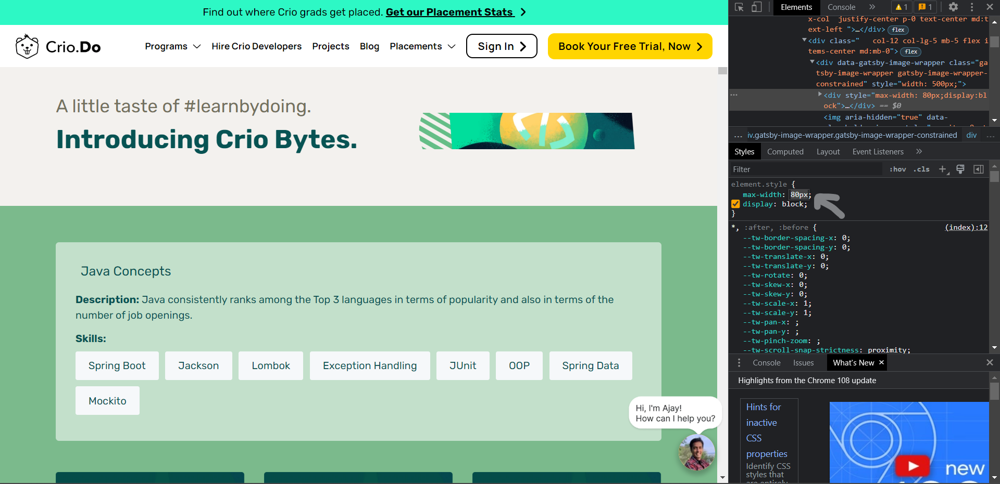
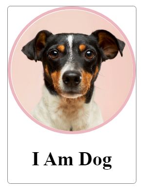

# Introduction
 This microbyte covers a very important CSS concept, The Box Model and with the help of different activities teaches you how to implement some useful properties to your elements.
   

# The CSS Box Model

We use the term 'Box Model' to describe styling,design and layout in CSS. Basically, everything in CSS is a box.
The box model wraps around in a rectangular structure around every HTML element.
  

## Box Model- Properties  
  
     
  Properties of the Box Model (source:geeksforgeeks)
   
    
### Content  
    Refers to the images,text etc. placed inside elements or boxes. They can be styled using width,height properties.
      

### Padding   

    Refers to the space around an element inside the border area. Padding is transparent.   
     
### Margin
    
    Refers to the space around an element around the border area.
   
### Border

    Refers to the border around the content. It covers element and relevant padding.

 

# Activities
 ## (a)Observe the box model with the help of Chrome Developer Tools

1. Open any of your favorite websites, for example https://en.wikipedia.org/wiki/CSS       

 2. Right click on the page and click on Inspect. A new window appears on your browser.  

 3. Go to elements tab and take a look at the various div elements on the page. You will notice that all respective elements are wrapped up inside rectangular boxes which have their own properties and margins.

 
 
 
    

## (b) Experimenting with various element properties inside the box model

1. Go to https://www.crio.do/bytes/ and right click on an element of your choice and click on Inspect Element.
This opens the chrome developer tools in reference to the code belonging to that particular element.

2. In the styles tab you can see various listed properties. You can actually modify these right from these tab and see how it affects the element and the page.

    For example,on changing the width of this image from 800 to 80
    

        We see that the image width changes  

3. You can explore a lot of other properties like margin,borders,padding etc. and see how each of them function.

Once you get an idea about the working behind these properties proceed to the next activity.

## Recreate the image using the box concept!

  
(source: The Web Developer bootcamp-Udemy)

Your task is to recreate the image given in this file using html and css properties.

1. Head to the src folder in this repo and browse through the index.html and style.css code. Download the src folder to work on it on your local machine.

2. Make required changes to the image.  
  
    Apply the following styles:

    The card div:
210px width  
1px grey border (solid border-style)  
5px border radius  
center text aligned  

    The image  
200px wide  
5px border with color of rgb(236, 183, 191) (solid border-style)  
50% border radius  
  

3. Once you are done with the code,open index.html on your local machine to view the results.
  
   
  
# Conclusion
You should now be familiar with the basic properties and the working of the CSS Box Model.   
# References
https://www.w3schools.com/css/css_boxmodel.asp  

https://developer.mozilla.org/en-US/docs/Web/CSS/CSS_Box_Model/Introduction_to_the_CSS_box_model  
  
https://www.geeksforgeeks.org/css-box-model/

https://www.w3.org/TR/CSS2/box.html
