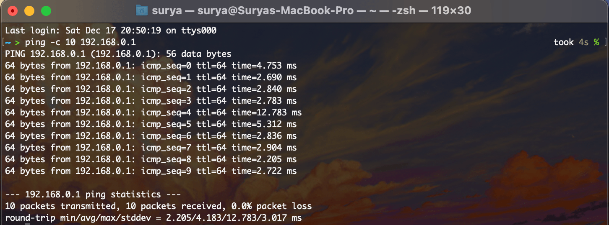
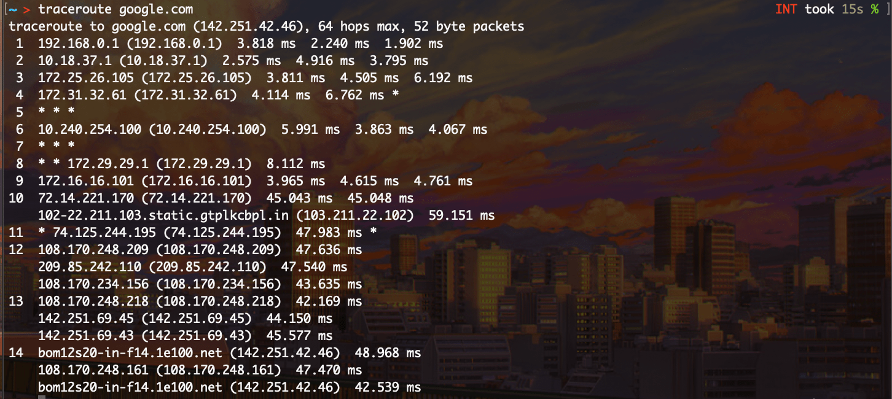
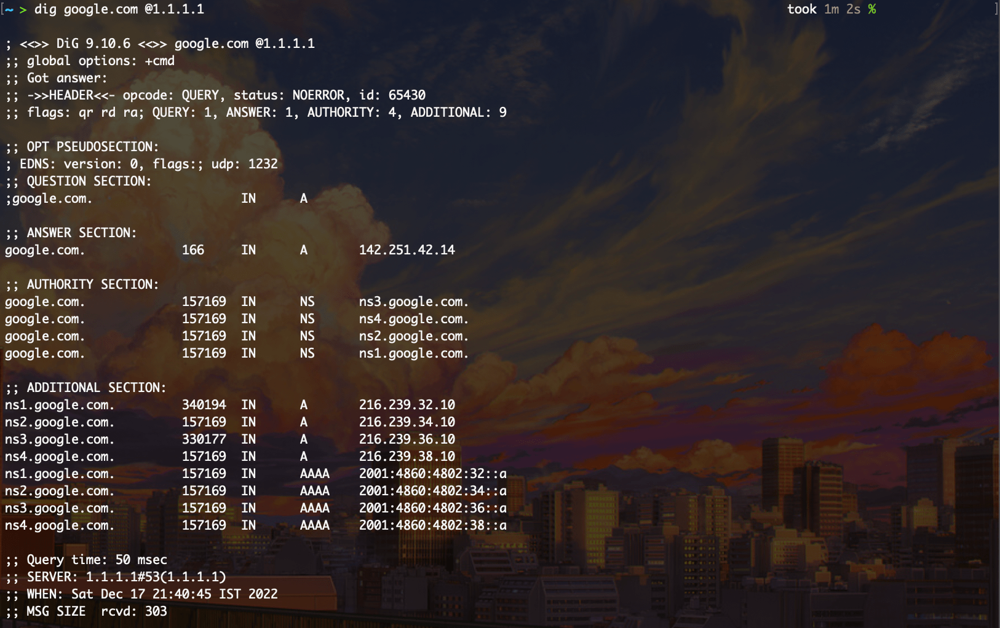
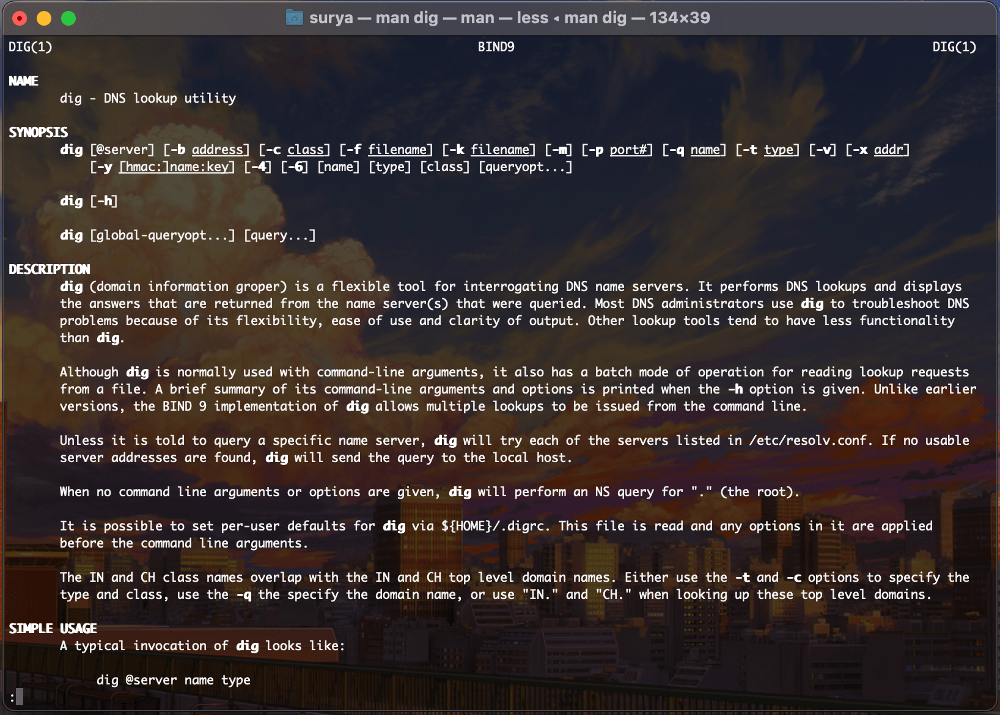

# Using common networking tools

## Table of Content
1. Introduction
2. What is the OSI Model?
3. What is DNS?
4. Setup
5. 'ping'
6. 'traceroute'
7. 'dig'
8. Summary & Further Reading

### 1. Introduction
Networking is a fundamental aspect of modern computing, and there are a variety of tools and technologies that are used to build and maintain networked systems. In this article, we will discuss some of the common networking tools and technologies, including the OSI Model, DNS, and several command-line utilities that are commonly used to troubleshoot and debug networks.

### 2. The OSI Model
The OSI (Open Systems Interconnection) Model is a framework that is used to understand and describe how different networking technologies and protocols fit together. It consists of seven layers, each of which performs a specific function in the process of sending and receiving data over a network. The OSI Model helps to standardize the way that different networking technologies and protocols interoperate and allows them to be developed and implemented independently.

The seven layers of the OSI Model are:

Layer 1 - Physical Layer: This layer is responsible for transmitting raw data over a physical connection, such as a copper or fiber-optic cable. It defines the electrical, mechanical, and functional characteristics of the connection, as well as the signaling method used to transmit data.

Layer 2 - Data Link Layer: This layer is responsible for establishing a link between two devices on the same network and providing reliable communication over that link. It handles error detection and correction, flow control, and media access control (MAC) to ensure that data is delivered reliably.

Layer 3 - Network Layer: This layer is responsible for routing data between devices on different networks. It uses logical addresses (e.g., IP addresses) to identify devices and routes data based on the destination address.

Layer 4 - Transport Layer: This layer is responsible for ensuring that data is delivered reliably between two devices. It handles error recovery, flow control, and segmentation and reassembly of data to ensure that it is delivered correctly.

Layer 5 - Session Layer: This layer is responsible for establishing, maintaining, and terminating connections between devices. It handles session management, including authentication and synchronization of data between devices.

Layer 6 - Presentation Layer: This layer is responsible for formatting and encoding data in a way that is understood by both the sender and receiver. It handles issues such as data compression, encryption, and character encoding.

Layer 7 - Application Layer: This layer is responsible for providing services to the user and enabling applications to access the network. It handles issues such as application-specific protocols, access to data and services, and user authentication.


### 3. What is DNS?
DNS is a system that is used to map human-readable domain names (e.g., www.example.com) to numerical IP addresses that are used by computers to communicate over the Internet. DNS servers act as a directory for the Internet, translating domain names into IP addresses and vice versa.

When you type a domain name into a web browser, the browser sends a request to a DNS server to resolve the domain name into an IP address. The DNS server looks up the IP address in its database and returns it to the browser, which can then use the IP address to establish a connection with the server hosting the website.

DNS is an essential part of the Internet infrastructure and is used by almost every device that connects to the Internet. It allows users to access websites and other resources using easy-to-remember domain names rather than having to remember complex numerical IP addresses.

Some famous DNS servers include Google's DNS (8.8.8.8) and Cloudflare DNS (1.1.1.1).

### 4. Setup
'ping' is installed by default in both Windows and Linux (MacOS can also be considered under Linux)

'traceroute' is also installed in Linux by default and known as 'tracert' in Windows.

'dig' can be installed in Linux by using the command 
``` sudo apt install dnsutils ```

For Windows, users need to install and setup the BIND App (https://www.isc.org/download/)

Once everything is done, the setup is now complete!

### 5. 'ping' Command
The 'ping' command is a command-line utility that is used to test the connectivity between two devices on a network. It works by sending a small packet of data (called an "ICMP echo request") to a specified destination device and waiting for a response (called an "ICMP echo reply").

To use the 'ping' command, you need to specify the destination device's IP address or domain name. For example, to ping a device with the IP address 192.168.0.1, you would enter the following command:
```ping 192.168.1.1```

You can also specify the number of times you want the 'ping' command to send an echo request by using the '-c' flag followed by the number of pings. For example, to ping a device 10 times, you would enter the following command:
```ping -c 10 192.168.0.1```

The 'ping' command will then send 10 echo requests to the specified destination and display the results. This includes the number of packets that were transmitted, the number of packets that were received, the round-trip time (RTT) for each packet, and any errors that occurred.

Here is an example of the output of the 'ping' command:


In this example, the 'ping' command was able to successfully send and receive 10 echo requests to the destination device with no packet loss. The RTT for each packet is shown in milliseconds, and the minimum, average, and maximum RTT are also displayed.

The 'ping' command is a useful tool for troubleshooting network connectivity issues and can help you determine whether a problem is due to a connectivity issue or a problem with the destination device.
  
### 6. 'traceroute' Command
The traceroute command is a network diagnostic tool that is used to trace the path taken by packets from a source host to a destination host. It can be used to troubleshoot network connectivity issues, identify the path taken by packets through the network, and measure the time it takes for packets to reach their destination.

To use the traceroute command, you need to specify the destination host or IP address as an argument. For example, to trace the route to www.example.com, you would enter the following command:
```traceroute google.com```

This will send a series of packets to the destination host and display the path taken by each packet, along with the time it took for the packet to reach each hop. The output will look something like this:



This is how many hops it took to reach from my router to Google's Servers where my request gets processed.

### 7. 'dig' Command
The dig command is a network utility that allows users to perform DNS lookups and retrieve DNS records. It is commonly used to troubleshoot DNS issues and to get detailed information about DNS configurations.

To use the dig command, you must specify the domain name that you want to look up, as well as the type of DNS record you want to retrieve. The basic syntax for the dig command is as follows:

```dig <domain name> <record type>```
For example, to look up the A record (IP address) for the domain name google.com, you can use the following command:

```dig google.com A```
To specify a specific DNS server to use for the lookup, you can use the @ symbol followed by the IP address of the DNS server. For example, to use the Google DNS server at 8.8.8.8, you can use the following command:

```dig @8.8.8.8 google.com A```
You can also use the dig command to look up other types of DNS records, such as MX records (mail exchange), NS records (name server), and TXT records (text). For example, to look up the MX records for a domain, you can use the following command:

```dig google.com MX```
To see all available DNS records for a domain, you can use the ANY record type. For example:

```dig google.com ANY```
The dig command provides a lot of detailed information about the DNS records that it retrieves. For example, the output of the dig command will include the names of the DNS servers that were used to resolve the DNS request, the time it took to resolve the request, and the actual DNS records that were returned.

Here is an example of the output of the dig command when looking up the A record for the domain name google.com via Cloudflare DNS (1.1.1.1):


We can see that we actually got multiple DNS servers in the answers section. This is because Google had DNS load balancing available. More on that later.

Overall, the dig command is a powerful tool for troubleshooting DNS issues and understanding how DNS works. It is an essential tool for anyone who works with networks or websites.

### 8. Summary & Further Reading
This was all about the basic networking tools. Here's how it can help you:
- [x]  Get you a job
- [x] Help you do more networking stuff
- [ ] Get you a Girlfriend 


To know more about any command, you can reffer to the man pages of the commands, using the 'man' command. For example, 
```man dig```

Will give an output similar to:



