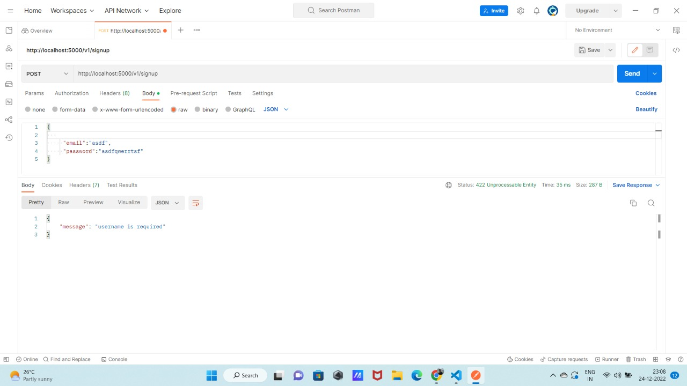
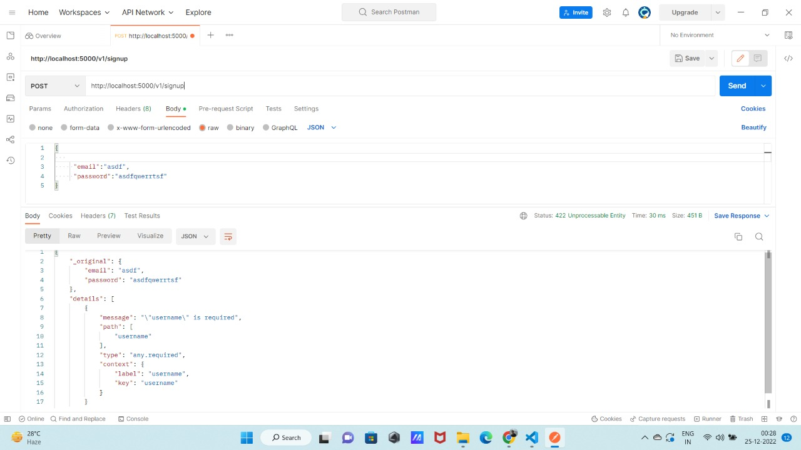
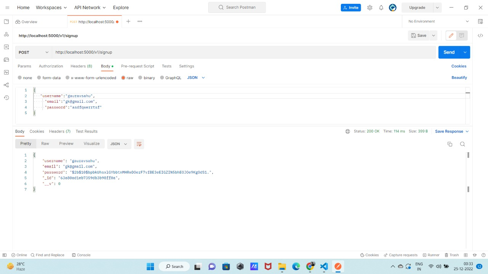
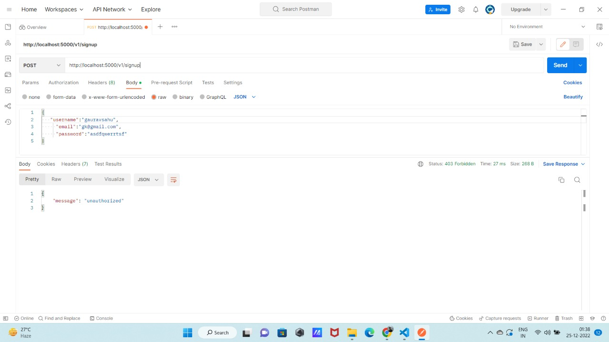
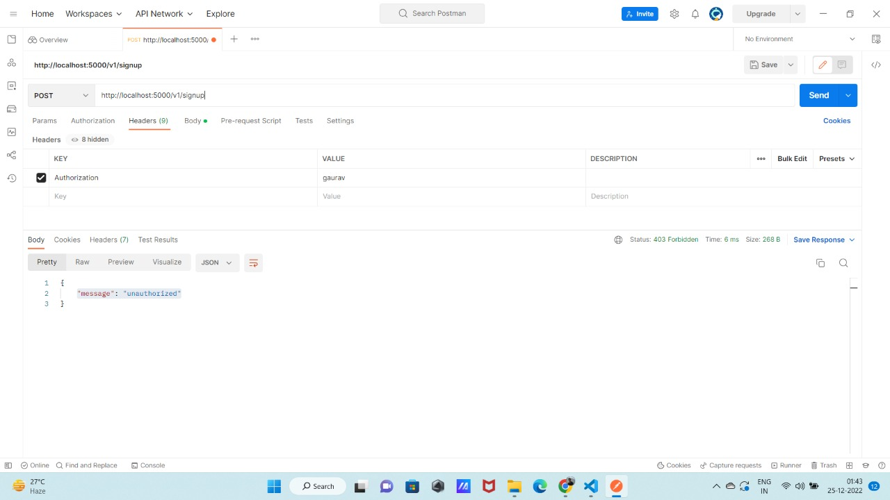
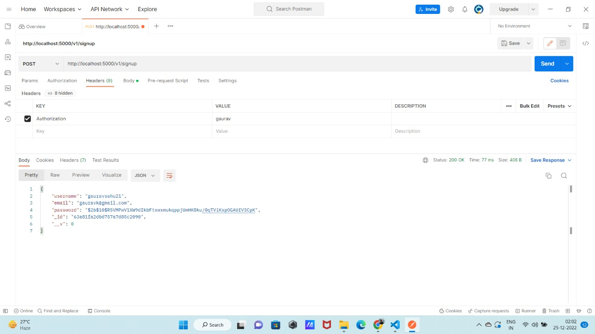

# Validating Routes and Adding Security to our Server in our express app
### Prerequisite : 
#### 1) NodeJS 
#### 2) ExpressJS
#### 3)MongoDB
#### 4)Postman
## Note-If you are new to Nodejs I highly recommend to read this ->[Micro-Byte: Creating signup, login routes, and how passwords are stored in the database using Hashing](https://github.com/gauravsahu21/IBD-2022-Master-Repository/tree/gauravsahu21/Creat[…]te%2Cand_how_passwords_are_stored_in_the_database_using_Hashing)

##  We already have signup,login routes are defined in our code and a model to store data.

## I have a question for you guys what happens when users send data that is not valid data.
```js
like- username:"gauravkumar",
         gmail:"asdfghj",//here you can see this is not a valid email
       password:"as"// password must be at least 6 characters if it is this small hacker ,third party can easily have the access of the users details 
``` 
    1.We need to validate the incoming requests before we process them
            This has some obvious advantages
             ->Prevents polluting our database with junk data values
             ->Helps save our processing (and computing) time (by discarding un-processable requests)
    2.We should apply the validations to as much incoming data as possible

## Activity 1: Adding Validations to our singup routes
    1. If there is no username, email, and password value provided → Return 422,   with the message “Missing  Parameters, please enter a username, email, and password”.
    2. If username and password are less than 6 characters ->Return 422, with the message "Password and Username should be at least of 6charcters".
    3. If an invalid email is provided -> Return the invalid email.
    
    Implement validation in "auth.controller.js file"
    Please try it yourself before looking at the answers.
 ### Step 1:Implement validation in "auth.controller.js" file   
  ```js
  
  const postSignup=async(req,res)=>{
    //validation the signup routes
    const {username,email,password}=req.body;

    if(!username)
    {
        res.status(422).json({message:"username is required"});

    }
    else if(!email)
    {
        res.status(422).json({message:"email is required"});
    }
    else if(!password)
    {
        res.status(422).json({message:"password is required"});
    }
    else if(username.length<6)
    {
        res.status(422).json({message:"username should be at least of 6 characters"});
    }
    else if(password.lengt<6)
    {
        
        res.status(422).json({message:"password should be at least of 6 characters"});
    }

    try{ console.log("yes");
        const result=await signup(req.body);
        console.log("result",result);
        res.status(200).json(result);
    }
    catch(err){
      res.status(422).json(err);
    }

}
```
### step 2: Call a signup API using Postman and in the body, don't give "username" and see the response the Postman receives.


         Here You can see that now if we don't pass the username in the request body we get a message like.
      {
     "message": "username is required"
       }
     You can check for the other feild also.

## Q.Now can you say validating the request this way is correct?
      No, because just see the code now we have only three fields to validate and for that, we have to write so much code. So what happens when we have 100s of fields then it becomes very hard to maintain those codes.
      In the activity 2 we will learn how to validate request in a right way using library.

 ## Activity 2:  Adding Validations to our singup routes using Joi
        Joi is a validation library that helps us define a schema for our data
        And validate a set of data against that schema.
        Open the termnal and install joi
 ```js
npm install joi
```
### Step 1: Creating a Joi Schema
  ```js 
       // The first step in Joi validation is to set a schema for the data object
       const Joi = require("joi");
       //Create a schema with the functions in the Joi object
       const schema = Joi.object()
   ```  
   Joi object supports method chaining, where you can call one method on the result of the previous one.
   
   Joi has a function called keys() that takes in an object schema.
   Here you can specify what keys need to be passed through what all checks.
   Like this
   ```js
    const schema = Joi.object().keys({
     username: Joi.string()
     })

   ```
### Step 2: Create Schema for singup route
    -> Create a folder "validate" and inside id create a file named as "auth.validate.js"
    ->Write a Joi Schema for the singup request body
```js
    const Joi=require('joi');
    const signupValidationSchema=Joi.object().keys({
    username:Joi.string().required().min(8).max(50),//username must be string then it must be required and max length is 50
    email:Joi.string().required().email({tlds:{allow:false}}),
    password:Joi.string().required().min(8)
    })

  module.exports={
    signupValidationSchema,
     }
 ``` 
 ### Step 3: Create a Validator function
    ->Create a folder "middleware" and inside it create a file "auth.middleware.js"
    ->create function to validate the req.body using "schema.validate".
    like this
 ```js
 const validateSchema=(schema)=>(req,res,next)=>{
    const {error}=schema.validate(req.body);//it validate the req.body against the schema 
    if(error)
    {
        res.status(422).json(error); //if error is found we return response here with the error
    }
    else
    {
        next();// if no error found we pass the control to next function
    }
 }
module.exports=validateSchema;
```
//Joi Documentation - https://joi.dev/api/?v=17.5.0

### Step 4:
    -> Import "signupValidationSchema" function from "auth.validation.js" file to "auth.route.js" file
    ->Import "validateSchema" function from "auth.middlewre.js" file to "auth.route.js" file.
```js
const router=require('express').Router();
const {postSignup,postLogin}=require('../controller/auth.controller.js');
const validateSchema=require('../middleware/validate.js');
const {signupValidationSchema}=require('../validate/auth.validate.js');
const validateSignup=validateSchema(signupValidationSchema);
router.post('/signup',validateSignup,postSignup);
router.post('/login',postLogin);
module.exports=router;
```
### Explanation- In "auth.route.js" file we pass our Schema "signupValidationSchema" to the validateSchema and then use like this in our "router.post('/signup',validateSignup,postSignup)". So What does it do that first validateSingup have a Schema to validate our request body against a schema which is "signupValidationSchema" and if every field is validated and no error occur then the control is being passed to the next function which is "postSingup". You can "validateSchema" function to understand it better.

### Step 5:Call a singup API from Postman and see the response if we give incorrect data 
     -> but first remove the code which we have written in activit 1 to validate our request body in  postSingup function in "auth.controller.js" file
  
  ## Here you can see that you don't pass the username in the request body so it gives us a response as the username is required even if you don't define any message like this this all happens beacuse of Joi library.

  ## Yo can check how it response when giveing correct data
  
  ## Here you can see that on giving correct body as request it saves the data  in DataBase and gave us the response back

  ## Now I want you guys to do the same for login request the only difference is that in login request body only require two fields that is username and password.
  If not able to do so pls look the code in src folder

## Activity 3:Adding Security to our Server in our express
 ### Q.Why it is necessary?
        Now anyone can send us a request at our server and gain access to the APIs so to secure out API we need to implement authorization using Environment variables.
### Environment variables
     We can use the system’s environment variables to mask and hide sensitive information like API keys or Server Endpoints    
 
 ### Step 1: Create a file name as ".env" and set variavle "route_password=gaurav"
   ```js
   route_password=gaurav
   ```
 ### Step 2: Create a vefiyAuth function in "auth.validate.js" file  and import it to the "express.js" file
 ```js
 const verifyAuth=(req,res,next)=>{
    const {authorization}=req.headers;//the req object has an object named ‘headers’ where it has key "authorization"

    if(!authorization)
    {
        return res.status(403).json({message:"unauthorized"})
    }
    if(authorization!==process.env.route_password)
    {
        return res.status(403).json({message:"unauthorized"})
    }
    next();
}
 ```
 ### Step 3: Now use "verifyAuth" function as global in "express.js" file
 ```js
 app.use(verifyAuth);
 ```
 ### Step 4:Now call the signup API from Postman and see the response
     ->You notice that we receive a message like "message": "unauthorized" because now our api is protected with "authorization" we need a key to access out API.
   

 ### Step 5: Now to solve the above problem we pass authorization in our header with the key and then call a singup API . Now again observe the response you might be surprissed.
 
     
       Q.Why resposne is same as before this time we have also pass the authroization key in the header?
       Please try to debug it with the code which we written  for the "verifyAuth" function .Try to console the "authorization" from header and "process.env.route_password"
  ```js
   const {authorization}=req.headers;
    console.log("authorization",authorization);
    console.log("env password",process.env.route_password);
  ```   
  You can see on the terminal we get somthing like this
  ```js
   (node:15364) [MONGOOSE] DeprecationWarning: Mongoose: the `strictQuery` option will be switched back to `false` by default in Mongoose 7. Use `mongoose.set('strictQuery', false);` if you want to prepare for this change. Or use `mongoose.set('strictQuery', true);` to suppress this warning.
(Use `node --trace-deprecation ...` to show where the warning was created)
connected to DB
listing... 5000
authorization gaurav
env password undefined
  ```  
 ### Here when we do console.log(process.env.route_password) it show us undefined because our express app is not abe to read the .env file.

 ### How to solve this problem?
    -> to make out .env file functional we need to install a package called  "dotenv"
    ->Then at the top of our express.js we just write
 ```js   
     require('dotenv').config()
  ```   
  ## Step 6:Now again call the singup API from Postman
  
  ### Finally we able to save our data in the DataBase and you can check without passing the "authorization" see what happens

  ## This is end of our Micro-Byte
  ### Note-All codes are in src folder
  ## THANK YOU

 


      
  


  
        
  
           

    

      


