Web authentication
==================

**Objective:** Adding Authentication to our web app using Firebase authentication

**Skill:** HTTP, HTML/CSS, Javascript.

**Overview:**

Web authentication is a way to verify the identity of a user who is trying to access a website or online application. It is a process that involves the user providing a set of credentials, such as a username and password, to the website or application. The website or application then checks these credentials against a database of authorized users to determine whether the user should be granted access.

There are several methods of web authentication, including:

-   Password-based authentication: This is the most common method of web authentication, where the user provides a username and password to the website or application. The website or application checks the credentials against a database of authorized users to determine whether the user should be granted access.
-   Two-factor authentication: This method of web authentication requires the user to provide an additional piece of information, such as a code sent to their phone or a fingerprint scan, in addition to their username and password. This adds an extra layer of security to the authentication process.
-   Single sign-on (SSO): This method allows a user to use a single set of credentials to access multiple websites or applications. For example, a user might use their Google login to access a variety of different websites or applications.

**Importance:** Web authentication is important because it helps to protect sensitive information and resources from unauthorized access. By requiring users to provide credentials before they can access a website or application, web authentication helps to ensure that only authorized users can access the resources they need.

**🚀Activity 1:** Let's see how web apps are using web authentication.

1.  Head over to **[crio.do](http://crio.do)** website.

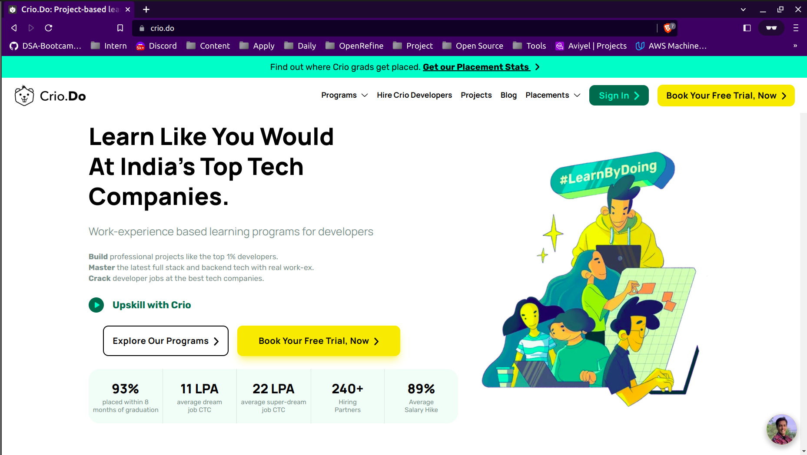

2.  On top right side you will see a "sign in" button click on that button.

Note: If you have signed in already, then open the the link in "incognito mode" 🕵️

3.  You will see a pop-up, which says "Sign in with Google".

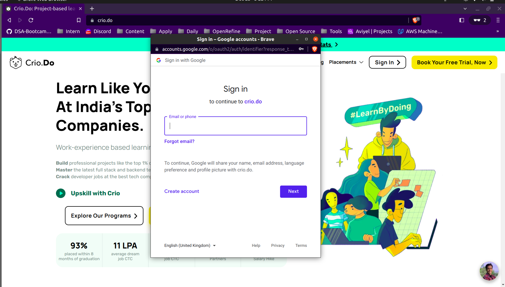

4.  Provide the credentials i.e your Email and Password.
5.  Voila, you are now signed in.

**🚀Activity 2:**

Out of three authentication methods mentioned above, which method we are using here?

### **How SSO system works?**

SSO systems allow users to log in to multiple applications with a single set of credentials, typically through the use of a third-party service such as Google or Facebook. This can simplify the process of logging in to different systems and can improve security by reducing the number of passwords that a user needs to remember and manage.

**Adding Authentication using Firebase:**

Now, if you want to enable such authentication functionality in your website, How can you do so?

there are different authentication service providers such as Firebase authentication, Okta etc. which allows you to enable authentication in your web application.

In this micro-byte we are going to see how to enable **SSO authentication** using **Firebase**.

**🚀Activity 3:**

To create a Firebase project, follow these steps:

1.  Go to the **[Firebase website](https://firebase.google.com/)** and click on the **Get started** button.

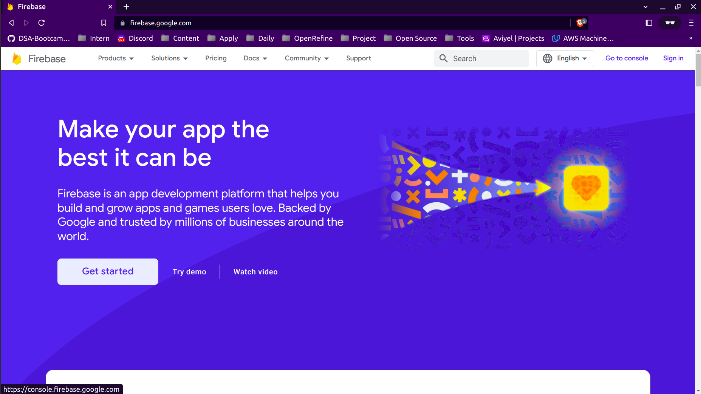

2.  Sign in with your Google account. If you don't have a Google account, you can create one for free.
3.  Click on the **Add project** button.

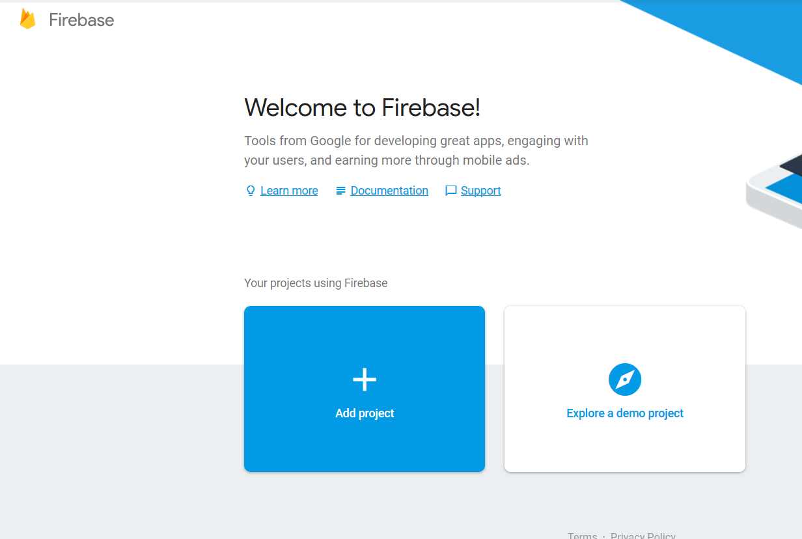

4.  Enter a name for your project and accept the terms and conditions. Click on the **Create project** button.

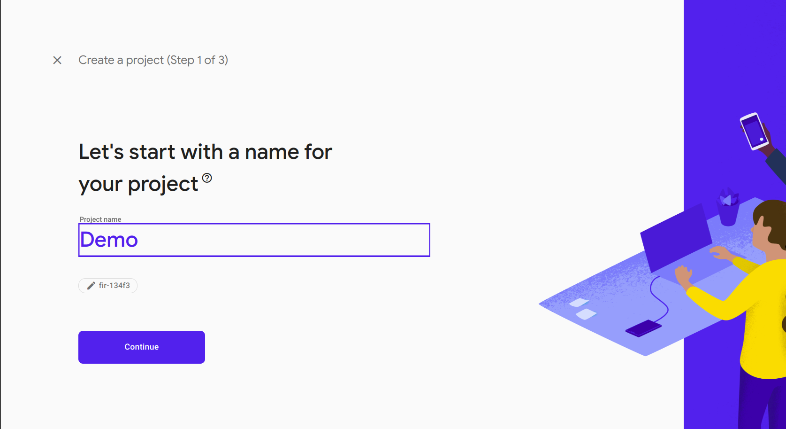

5.  On the next screen, you will be prompted to enable Google Analytics for your project. You can either enable it or skip this step by clicking on the **No thanks** button.
6.  You will be taken to the dashboard for your new Firebase project. From here, you can access various features and tools provided by Firebase, such as the Realtime Database, Firebase Authentication, Cloud Storage, and more.

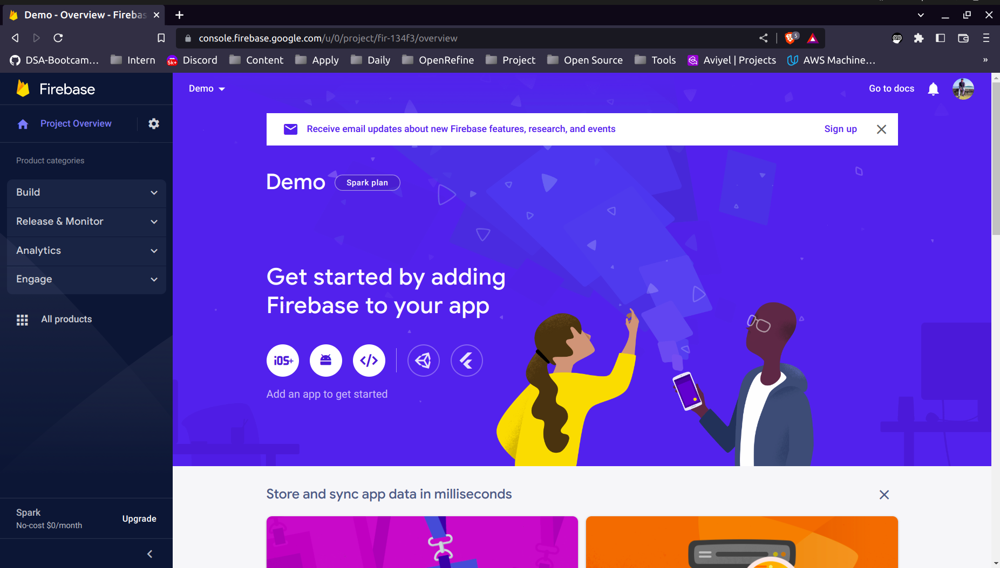


**🚀Activity 4:** 

Now that you’ve got the Firebase stuff out of the way, go ahead and create a web page, any web page! You can use an existing page, or can clone this repository and use the html and css file, or create one using the code provided below.


To use the one below, create a new folder "demo" and inside that create an `index.html` file and one folder "css" create `style.css` file  on your local system,

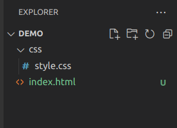

 copy/paste the HTML below into `index.html`.
```
<!doctype html>
<html lang="en">
<head>
    <title>Google Authentication</title>
    <link rel="stylesheet" href="css/style.css">
</head>
<body>
    <div id="login-box">
        <div class="left">
            <h1>Sign up</h1>
            <input type="text" id="email" name="email" placeholder="E-mail" />
            <input type="password" id="password" name="password" placeholder="Password" />
            <input type="submit" id="saveData" name="signup_submit" value="Sign in" />
        </div>
        <div class="right">
            <span class="loginwith">Sign in with<br />social network</span>
            <button class="social-signin google" id='login'>Log in with Google</button>
        </div>
        <div class="or">OR</div>
    </div>
</body>
</html>
```
copy/paste the css below into `style.css`.

```
/*@import url(https://fonts.googleapis.com/css?family=Roboto:400,300,500);*/
*:focus {
    outline: none;
  }
  
  body {
    margin: 0;
    padding: 0;
    background: #DDD;
    font-size: 16px;
    color: #222;
    font-family: 'Roboto', sans-serif;
    font-weight: 300;
  }
  
  #login-box {
    position: relative;
    margin: 5% auto;
    width: 600px;
    height: 400px;
    background: #FFF;
    border-radius: 2px;
    box-shadow: 0 2px 4px rgba(0, 0, 0, 0.4);
  }
  
  .left {
    position: absolute;
    top: 0;
    left: 0;
    box-sizing: border-box;
    padding: 40px;

    width: 300px;
    height: 400px;
  }
  
  h1 {
    margin: 0 0 20px 0;
    font-weight: 300;
    font-size: 28px;
  }
  
  input[type="text"],
  input[type="password"] {
    display: block;
    box-sizing: border-box;
    margin-bottom: 20px;
    padding: 4px;
    width: 220px;
    height: 32px;
    border: none;
    border-bottom: 1px solid #AAA;
    font-family: 'Roboto', sans-serif;
    font-weight: 400;
    font-size: 15px;
    transition: 0.2s ease;
  }
  
  input[type="text"]:focus,
  input[type="password"]:focus {
    border-bottom: 2px solid #16a085;
    color: #16a085;
    transition: 0.2s ease;
  }
  
  input[type="submit"] {
    margin-top: 28px;
    width: 120px;
    height: 32px;
    background: #16a085;
    border: none;
    border-radius: 2px;
    color: #FFF;
    font-family: 'Roboto', sans-serif;
    font-weight: 500;
    text-transform: uppercase;
    transition: 0.1s ease;
    cursor: pointer;
  }
  
  input[type="submit"]:hover,
  input[type="submit"]:focus {
    opacity: 0.8;
    box-shadow: 0 2px 4px rgba(0, 0, 0, 0.4);
    transition: 0.1s ease;
  }
  
  input[type="submit"]:active {
    opacity: 1;
    box-shadow: 0 1px 2px rgba(0, 0, 0, 0.4);
    transition: 0.1s ease;
  }
  
  .or {
    position: absolute;
    top: 180px;
    left: 280px;
    width: 40px;
    height: 40px;
    background: #DDD;
    border-radius: 50%;
    box-shadow: 0 2px 4px rgba(0, 0, 0, 0.4);
    line-height: 40px;
    text-align: center;
  }
  
  .right {
    position: absolute;
    top: 0;
    right: 0;
    box-sizing: border-box;
    padding: 40px;
    width: 300px;
    height: 400px;
    background: url('https://goo.gl/YbktSj');
    background-size: cover;
    background-position: center;
    border-radius: 0 2px 2px 0;
  }
  
  .right .loginwith {
    display: block;
    margin-bottom: 40px;
    font-size: 28px;
    color: #FFF;
    text-align: center;
  }
  
  button.social-signin {
    margin-bottom: 20px;
    width: 220px;
    height: 36px;
    border: none;
    border-radius: 2px;
    color: #FFF;
    font-family: 'Roboto', sans-serif;
    font-weight: 500;
    transition: 0.2s ease;
    cursor: pointer;
  }
  
  button.social-signin:hover,
  button.social-signin:focus {
    box-shadow: 0 2px 4px rgba(0, 0, 0, 0.4);
    transition: 0.2s ease;
  }
  
  button.social-signin:active {
    box-shadow: 0 1px 2px rgba(0, 0, 0, 0.4);
    transition: 0.2s ease;
  }
  
  button.social-signin.google {
    background: #DD4B39;
  }
```
Your App will look like this: 

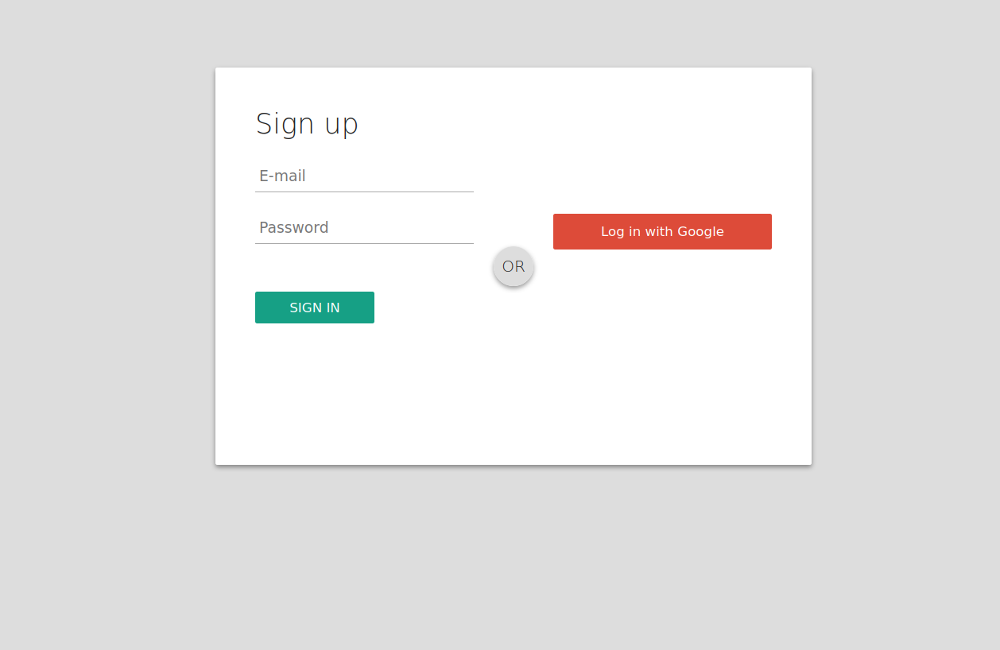

1. Now we are going to add firebase to our web application, head over to your Firebase project that you created in **Activity 3**, Get started by adding Firebase to your app.

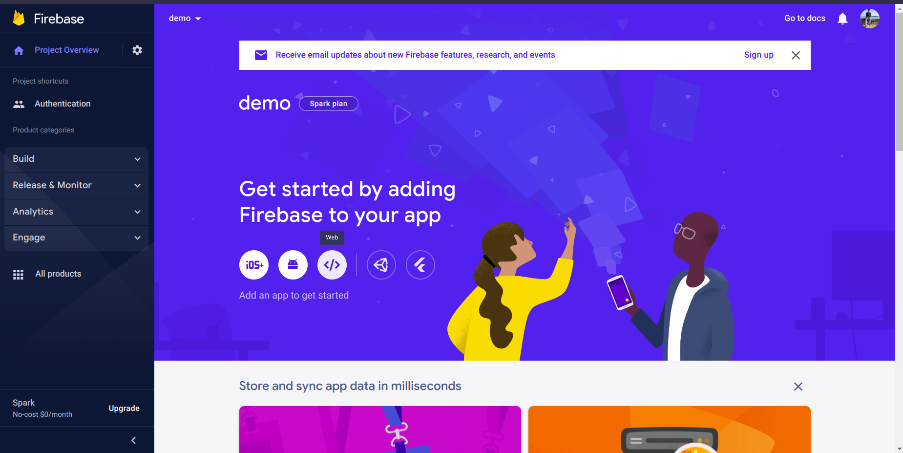

2. Click on the **Web </>** button to set up Firebase in your web application.

3. In the next screen, register your app.

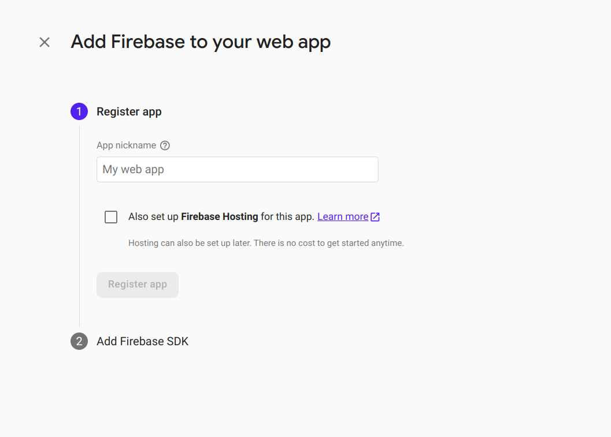

4. Add Firebase SDK either by using `npm` or by using `<script>` tag, for now choose "using `<script>` tag"

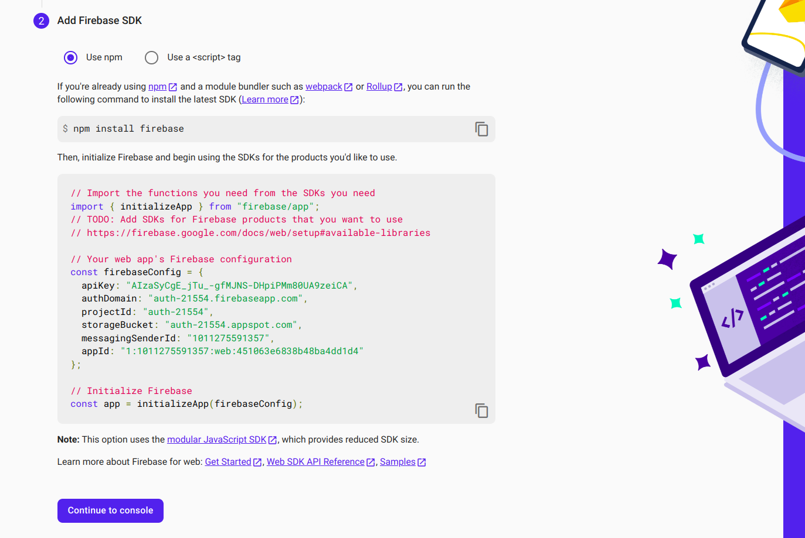

5. Click on **Continue** button.

Great👍 we have successfully added firebase in our web application.


**🚀Activity 5:**

Finally let's add authentication to our web application, follow this steps below.

1. In the Firebase console, navigate to the 
"Authentication" section and select "Sign-in Method". 

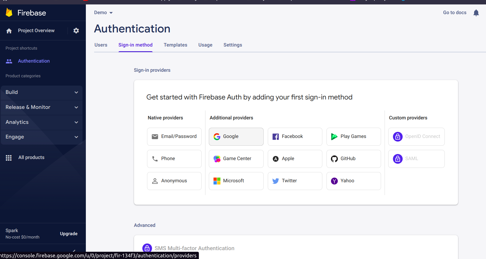

Enable the authentication methods that you want to use, such as email/password or social media providers like Google, Facebook, and so on. For now we will choose **Google**


2. In the next screen, click on enable and change your **project public-facing-name** (Optional) and provide one supporting email. 

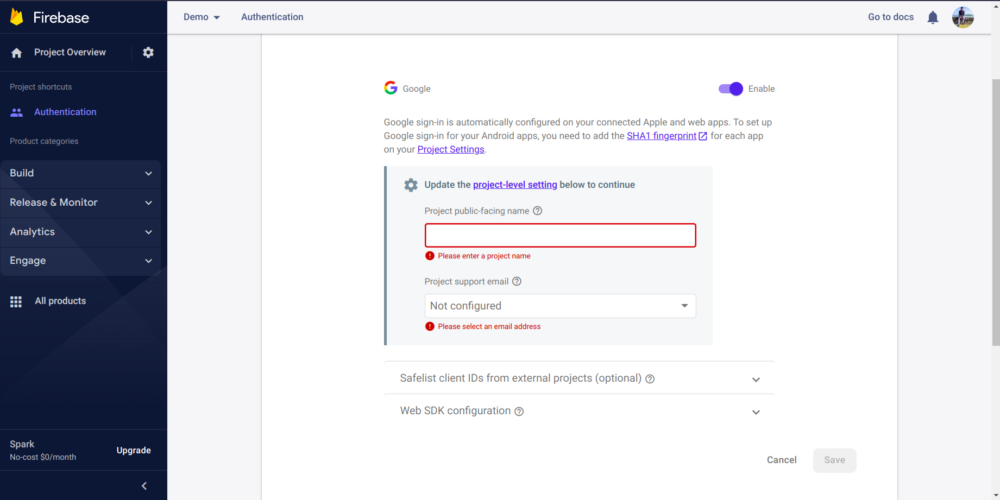

Awesome👍, google sign-in is now enabled in your project.

3. Now we go ahead with **[Firebase Web Documentation](https://firebase.google.com/)**, go to **[Google](https://firebase.google.com/docs/auth/web/google-signin)** sign-in tab.

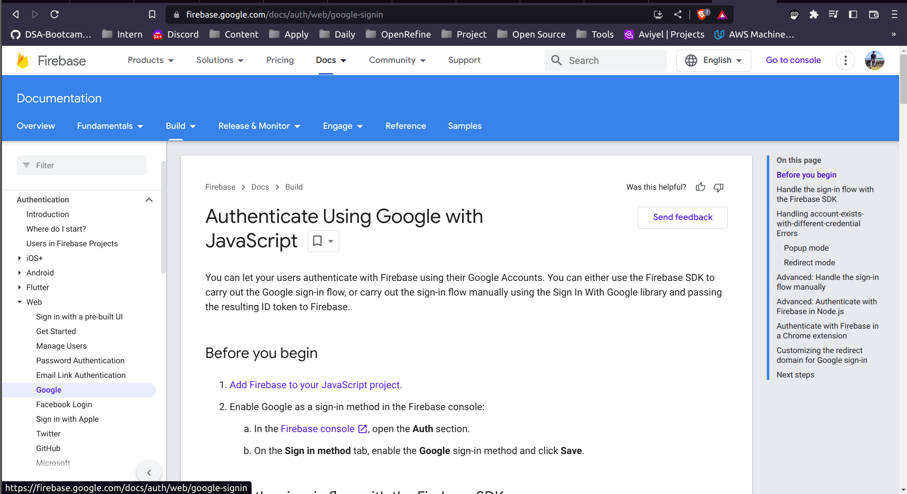

Now there are many ways to implementent Google Authentication, but we will see the pop-up window method.

## **To sign in with a pop-up window**
Add following code into our `<script>` inside `index.html` file.
```
import { getAuth, signInWithPopup, GoogleAuthProvider } from "firebase/auth";

const auth = getAuth();
const provider = new GoogleAuthProvider();

signInWithPopup(auth, provider)
  .then((result) => {
    // This gives you a Google Access Token. You can use it to access the Google API.
    const credential = GoogleAuthProvider.credentialFromResult(result);
    const token = credential.accessToken;
    // The signed-in user info.
    const user = result.user;
    // ...
  }).catch((error) => {
    // Handle Errors here.
    const errorCode = error.code;
    const errorMessage = error.message;
    // The email of the user's account used.
    const email = error.email;
    // The AuthCredential type that was used.
    const credential = GoogleAuthProvider.credentialFromError(error);
    // ...
  });
```

**Important:** Within the import statement (Line 1), change the link address from "firebase/auth" to one provided below:
```
https://www.gstatic.com/firebasejs/9.15.0/firebase-auth.js
```
In 2nd and 3rd Line add **"app"** as a paramter to `getAuth()` and `GoogleAuthProvider()` methods.

Also, Check out the Auth **[Reference Docs](https://firebase.google.com/docs/auth/web/google-signin)** for a complete list of error codes and other methods.

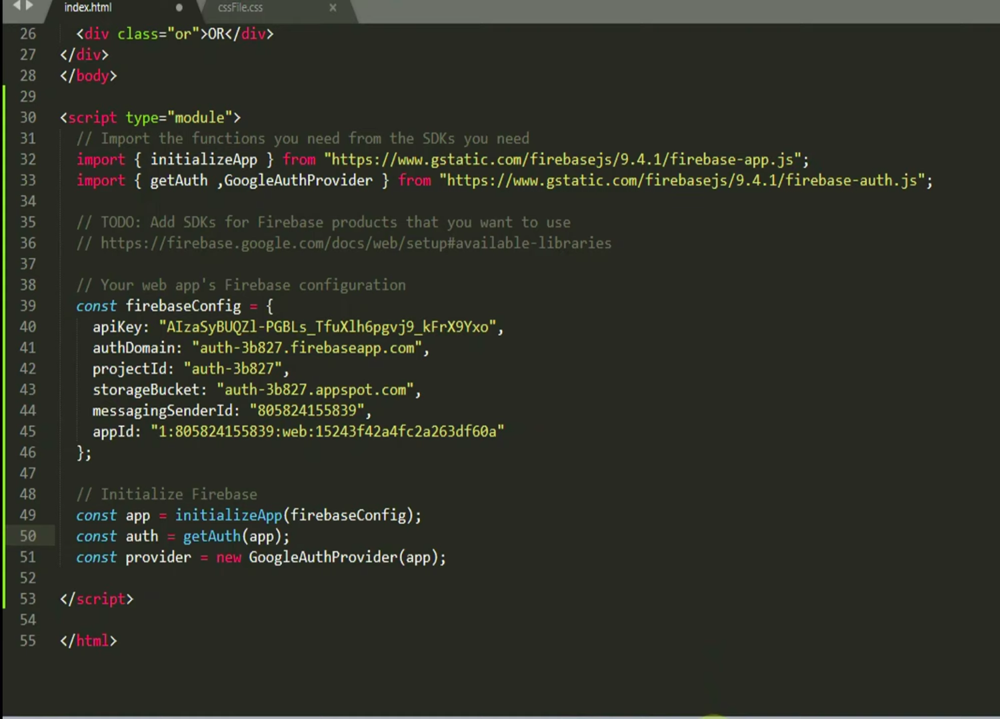

See the line number 33,50,51 where changes has been made.

5. Now if you haven't hosted your web app you can do that by going through this link **[Online Hosting](https://www.freecodecamp.org/news/publish-your-website-netlify-github/)** or if you want to run on a localhost, follow this link **[Localhost](https://devpractical.com/host-a-html-page-on-localhost/)**.

6. Once your web app is hosted or running on local server, we need to add our domain name into Firebase Authentication. Go to your **Authentication** section, in the top menu, click on the **Setting** tab, below you will see **Authorized Domain** section click on **add domain** button.

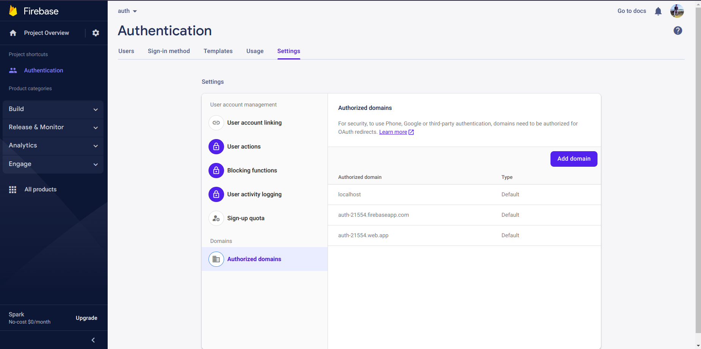

8. Copy the domain of your web app (e.g."demo.com" or "127.0.0.0") and paste it inside domain section. 

9. Finally, the Google Sign-in Authentication is enabled in your Web App, open your web app in browser and try to **login in with google** you will see a pop-up **sign in with google** log-in.

**Note:** you may need to enable pop-up in your browser for this app and reload.

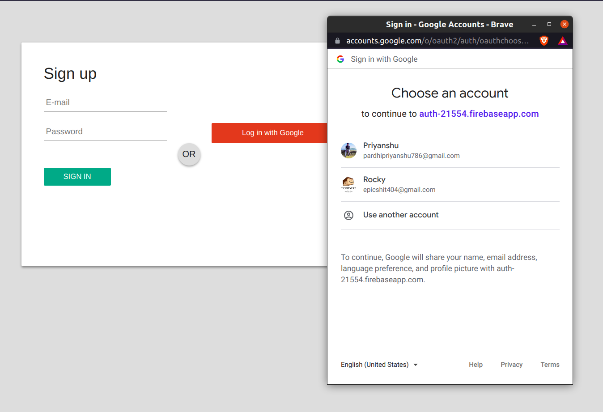

🥳🎉Congratulations you did it.


10. Once a user is logged-in, go to the **Authentication** section in the top menu, click on the **Users** tab. it will displays a list of users who have signed up for your Firebase project.

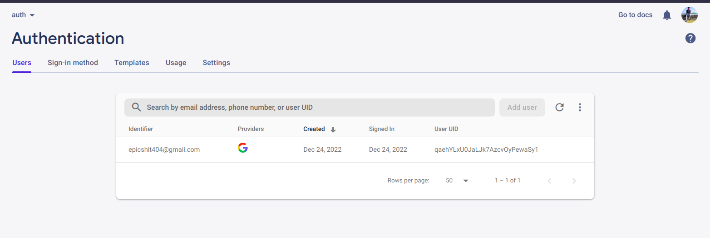

😊 Hope you enjoyed this micro-byte on **Web Authentication**